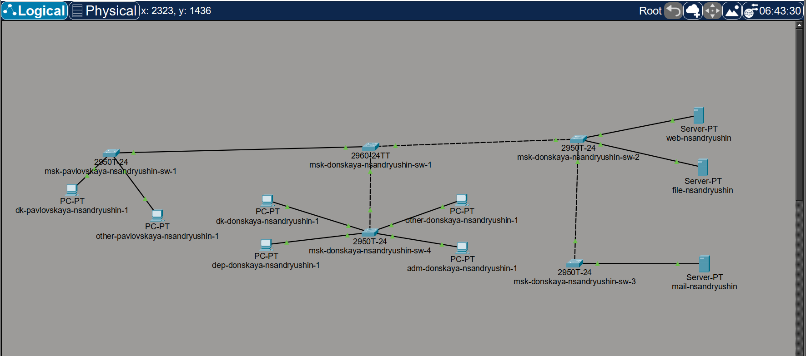
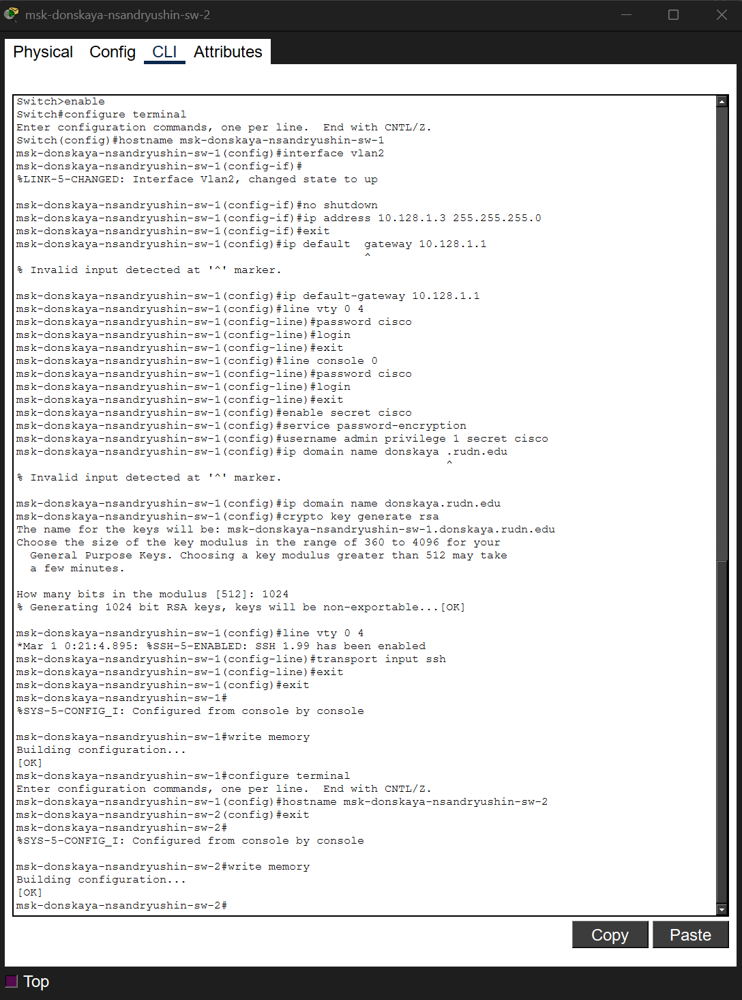

---
## Author
author:
  name: Андрюшин Никита Сергеевич
## Title
title: Лабораторная работа
subtitle: Номер 4
license: CC BY
date: today
date-format: "YYYY-MM-DD" # Example: 2025-09-06
---

# Информация

## Докладчик

:::::::::::::: {.columns align=center height=70%}
::: {.column width="70%" height=70%}

  * Андрюшин Никита Сергеевич
  * Студент
  * Российский университет дружбы народов им. П. Лумумбы

:::
::: {.column width="30%" height=70%}

:::
::::::::::::::

## Цель работы

Провести подготовительную работу по первоначальной настройке коммутаторов сети

# Выполнение лабораторной работы

## Логическая топология сети

{height=60%}

## Настройка коммутатора msk-donskaya-nsandryushin-sw-1

{height=60%}

## Настройка коммутатора msk-pavlovskaya-nsandryushin-sw-1

{height=60%}

## Настройка коммутатора msk-donskaya-nsandryushin-sw-2

{height=60%}

## Настройка коммутатора msk-donskaya-nsandryushin-sw-3

{height=60%}

## Настройка коммутатора msk-donskaya-nsandryushin-sw-4

{height=60%}

## Выводы

В результате выполнения лабораторной работы были получены навыки настройки vlan в локальной сети из коммутаторов. Была осуществлена первоначальная настройка сети