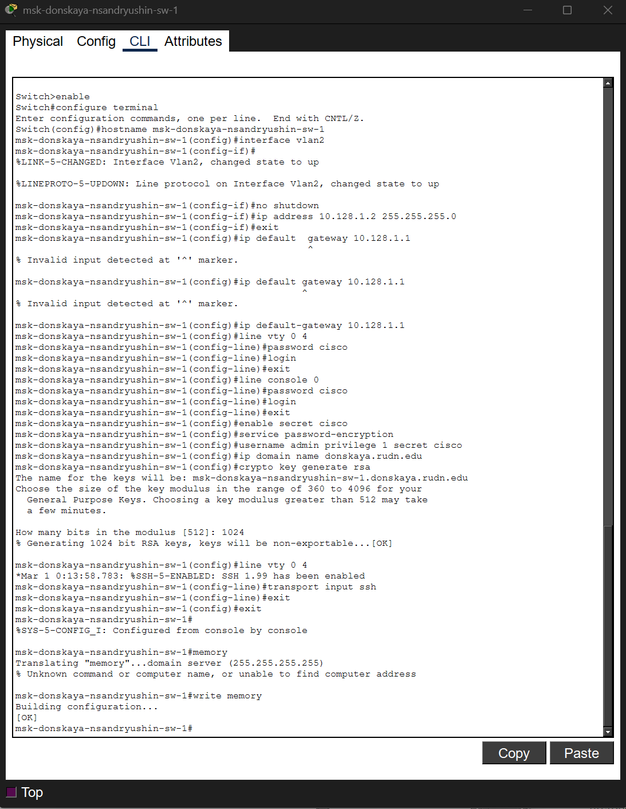
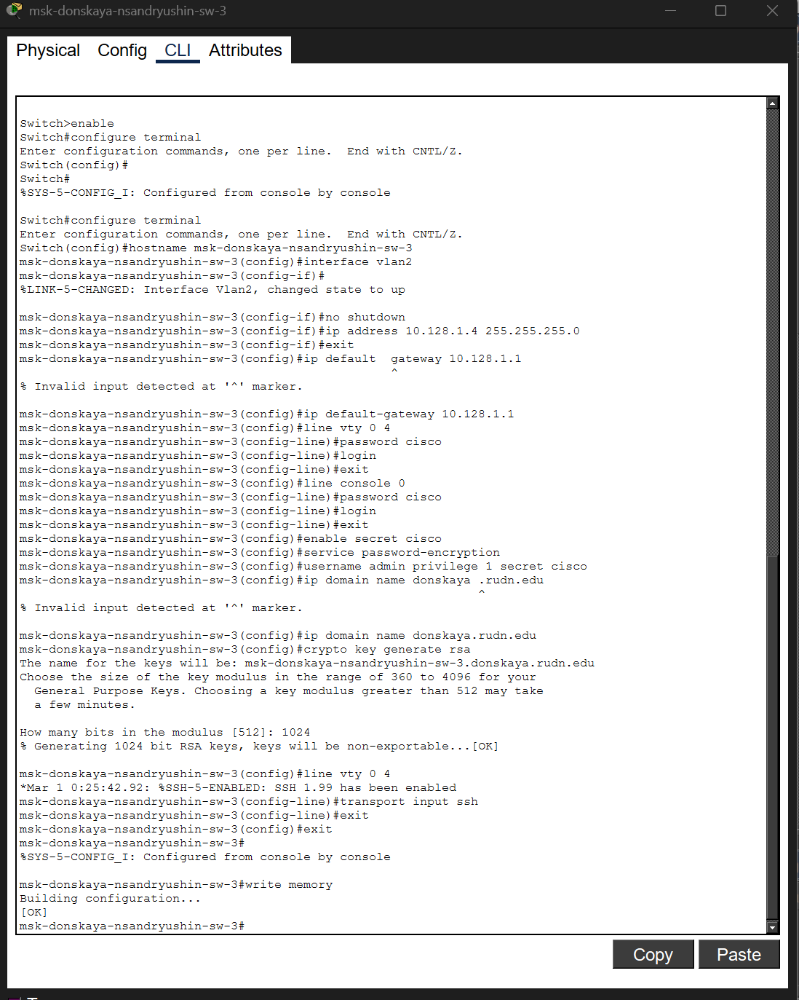
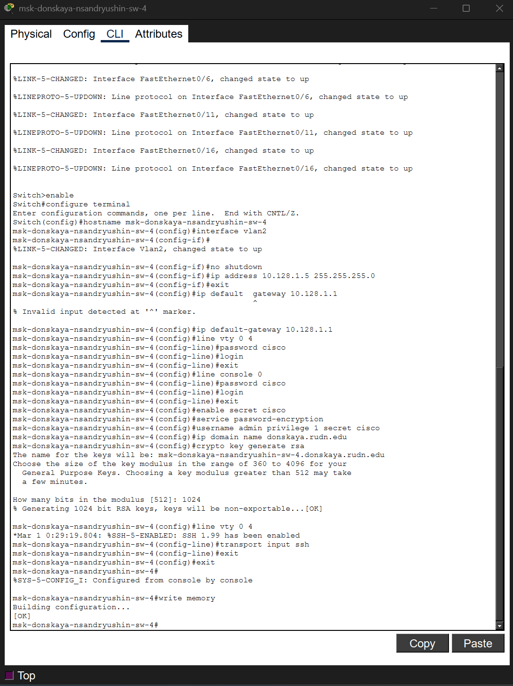

---
## Author
author:
  name: Андрюшин Никита Сергеевич

## Title
title: "Лабораторная работа"
subtitle: "Номер 4"
license: "CC BY"
---

# Цель работы

Провести подготовительную работу по первоначальной настройке коммутаторов сети

# Выполнение лабораторной работы

Посмотрим на собранную логическую топологию сети в программе Cisco Packet Tracer. На схеме мы расположили коммутаторы, персональные компьютеры и серверы, а также задали им имена в соответствии с требованиями задания (рис. [-@fig-001]).

{#fig-001}

Перейдем к базовой настройке коммутатора msk-donskaya-nsandryushin-sw-1. Зададим имя устройства, настроим управляющий интерфейс vlan2 с IP-адресом 10.128.1.2 и укажем шлюз по умолчанию. Также настроим пароли на консольный и виртуальные терминалы, зашифруем их, создадим пользователя admin и сгенерируем RSA-ключи для настройки SSH-доступа, после чего сохраним конфигурацию (рис. [-@fig-002]).

{#fig-002}

Выполним аналогичную базовую настройку для коммутатора msk-pavlovskaya-nsandryushin-sw-1. Установим имя хоста, назначим IP-адрес 10.128.1.6 для интерфейса vlan2, зададим шлюз по умолчанию и доменное имя pavlovskaya.rudn.edu. Завершим настройку генерацией ключей для SSH и сохранением параметров в память устройства (рис. [-@fig-003]).

{#fig-003}

Приступим к конфигурации коммутатора msk-donskaya-nsandryushin-sw-2. Назначим ему IP-адрес 10.128.1.3 в виртуальной локальной сети управления, настроим безопасность линий, зададим домен и активируем SSH. Убедимся, что корректное имя хоста применено, и запишем конфигурацию (рис. [-@fig-004]).

{#fig-004}

Откроем консоль командной строки коммутатора msk-donskaya-nsandryushin-sw-3. Пропишем ему IP-адрес 10.128.1.4 с маской подсети, укажем адрес шлюза и защитим доступ к устройству с помощью паролей и протокола SSH. Сохраним внесенные изменения (рис. [-@fig-005]).

{#fig-005}

Произведем настройку последнего коммутатора msk-donskaya-nsandryushin-sw-4. Активируем интерфейс управления vlan2 с адресом 10.128.1.5, установим пароли на доступ через консоль и удаленное подключение, создадим локального администратора и сгенерируем криптографические ключи. В конце зафиксируем настройки в энергонезависимой памяти (рис. [-@fig-006]).

{#fig-006}

# Выводы

В результате выполнения лабораторной работы были получены навыки настройки vlan в локальной сети из коммутаторов. Была осуществлена первоначальная настройка сети