---
## Author
author:
  name: Андрюшин Никита Сергеевич
## Title
title: Лабораторная работа
subtitle: Номер 5
license: CC BY
date: today
date-format: "YYYY-MM-DD" # Example: 2025-09-06
---

# Информация

## Докладчик

:::::::::::::: {.columns align=center height=70%}
::: {.column width="70%" height=70%}

  * Андрюшин Никита Сергеевич
  * Студент
  * Российский университет дружбы народов им. П. Лумумбы

:::
::: {.column width="30%" height=70%}

:::
::::::::::::::

# Цель работы

Получить основные навыки по настройке VLAN на коммутаторах сети

# Выполнение лабораторной работы

## Настройка Trunk-порта на коммутаторе msk-pavlovskaya-sw-1

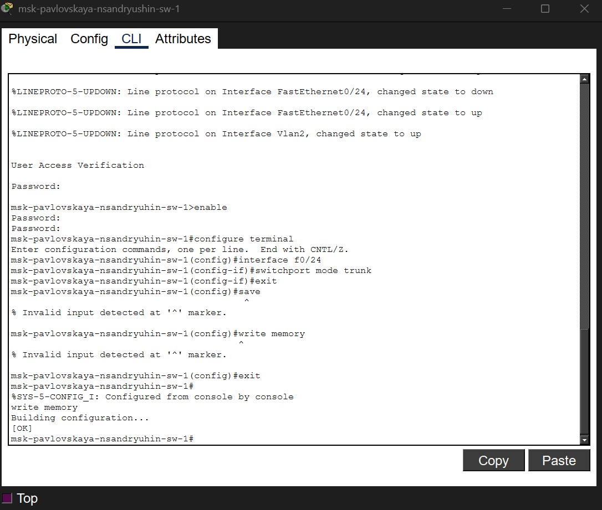{height=60%}

## Конфигурация Trunk-портов на центральном коммутаторе msk-donskaya-sw-1

{height=60%}

## Настройка Trunk-портов на коммутаторе msk-donskaya-sw-2

{height=60%}

## Настройка Trunk-порта на коммутаторе msk-donskaya-sw-3

{height=60%}

## Настройка Trunk-порта на коммутаторе msk-donskaya-sw-4

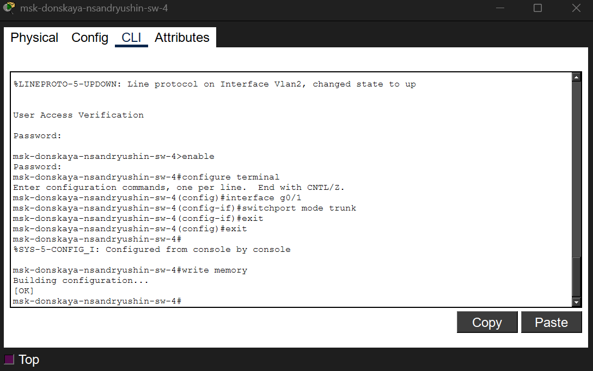{height=60%}

## Создание VLAN и настройка параметров VTP на сервере

{height=60%}

## Настройка VTP-клиента и портов доступа на msk-pavlovskaya-sw-1

{height=60%}

## Настройка VTP-клиента и портов доступа на msk-donskaya-sw-2

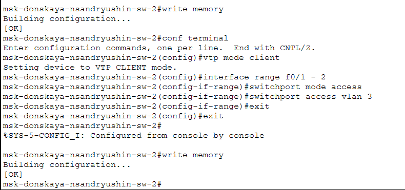{height=60%}

## Настройка VTP-клиента и портов доступа на msk-donskaya-sw-3

{height=60%}

## Массовое назначение портов доступа на коммутаторе msk-donskaya-sw-4

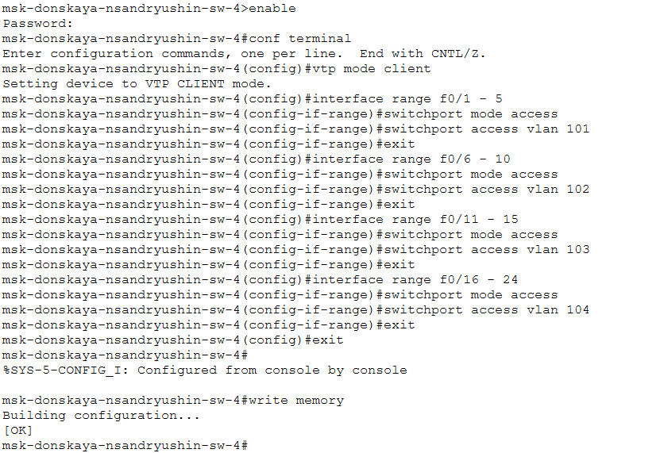{height=60%}

## Настройка IP-адреса для веб-сервера

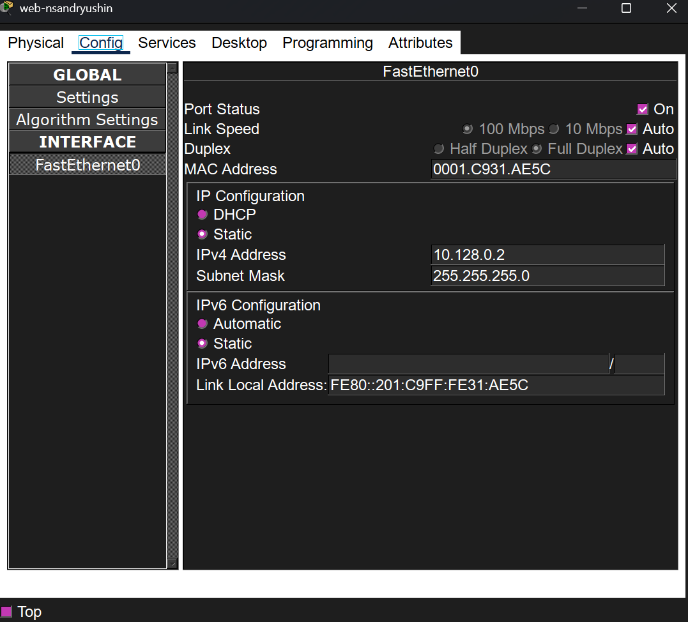{height=60%}

## Настройка IP-адреса для файлового сервера

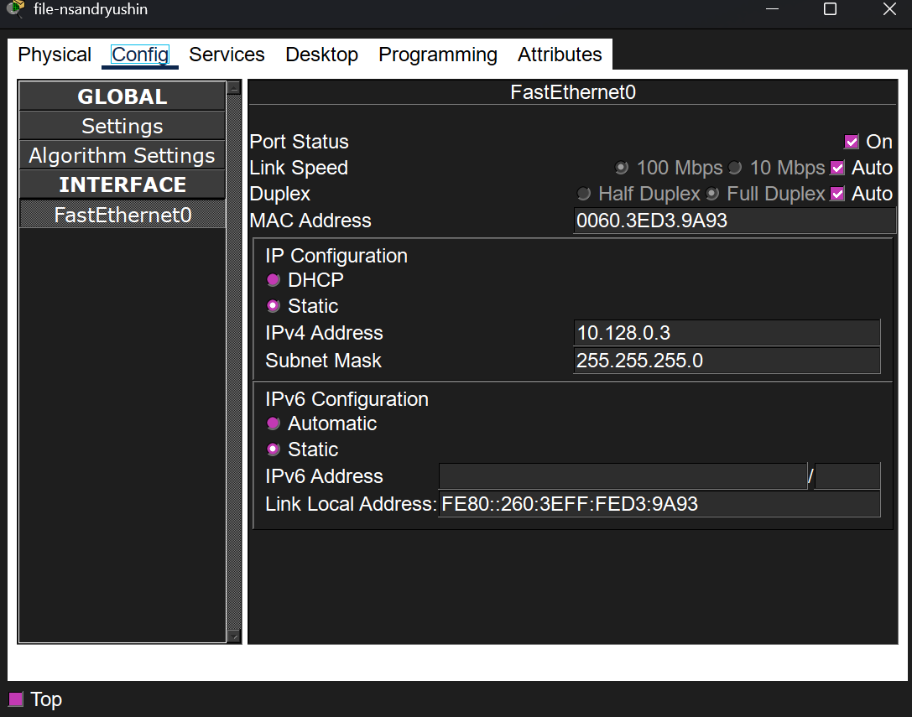{height=60%}

## Настройка IP-адреса для почтового сервера

{height=60%}

## Настройка IP-адреса устройства dk-pavlovskaya-nsandryushin-1

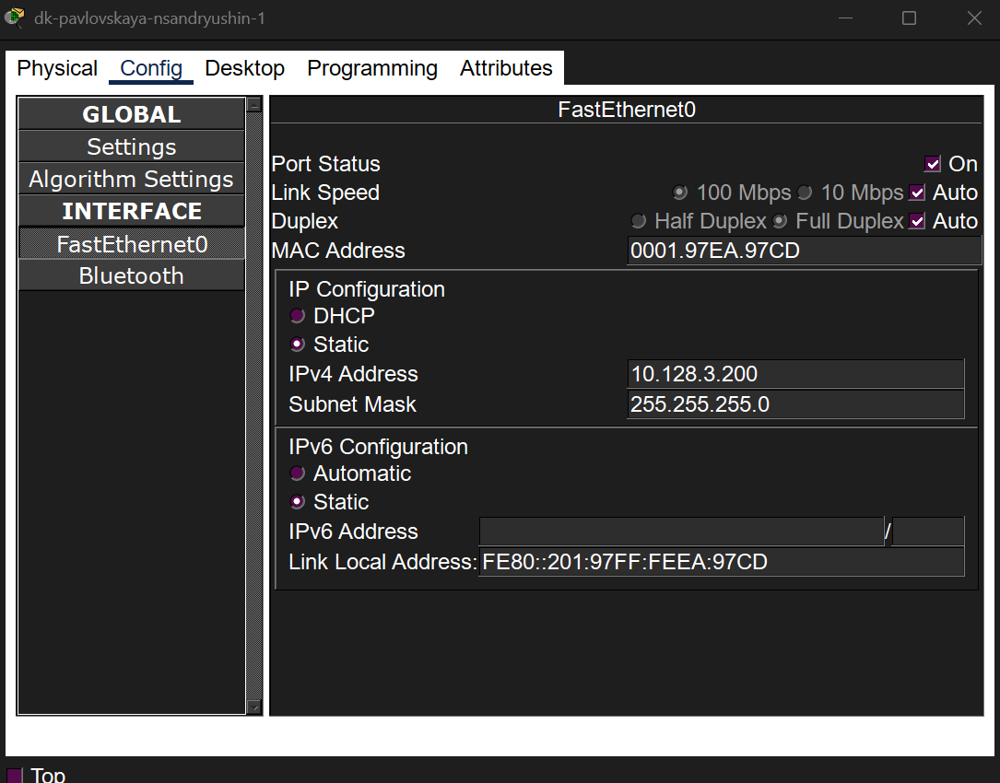{height=60%}

## Настройка IP-адреса устройства dk-donskaya-nsandryushin-1

{height=60%}

## Настройка IP-адреса устройства dep-donskaya-nsandryushin-1

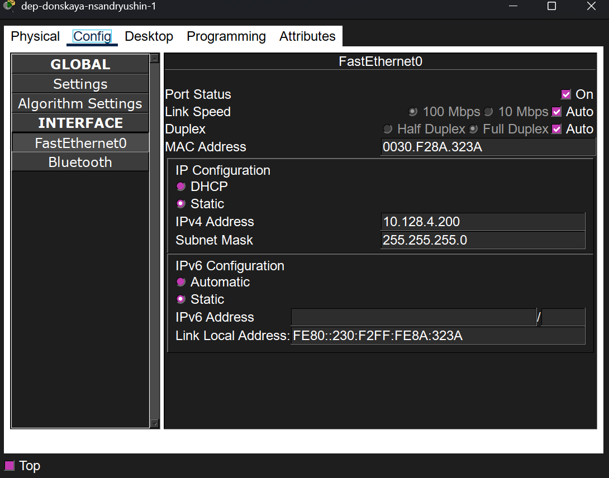{height=60%}

## Настройка IP-адреса устройства adm-donskaya-nsandryushin-1

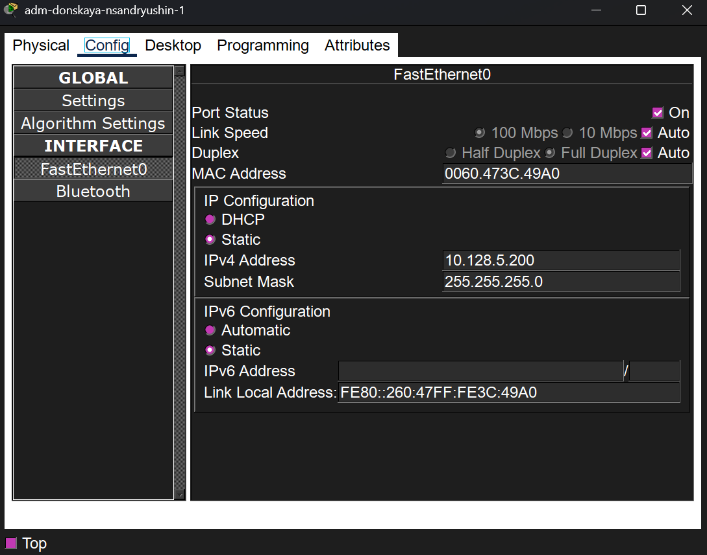{height=60%}

## Настройка IP-адреса устройства other-pavlovskaya-nsandryushin-1

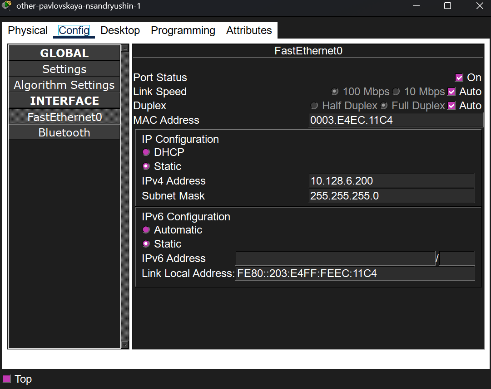{height=60%}

## Настройка IP-адреса устройства other-donskaya-nsandryushin-1

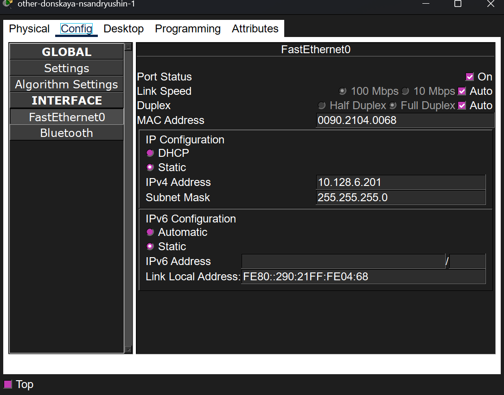{height=60%}

## Проверка доступности узлов с помощью утилиты ping

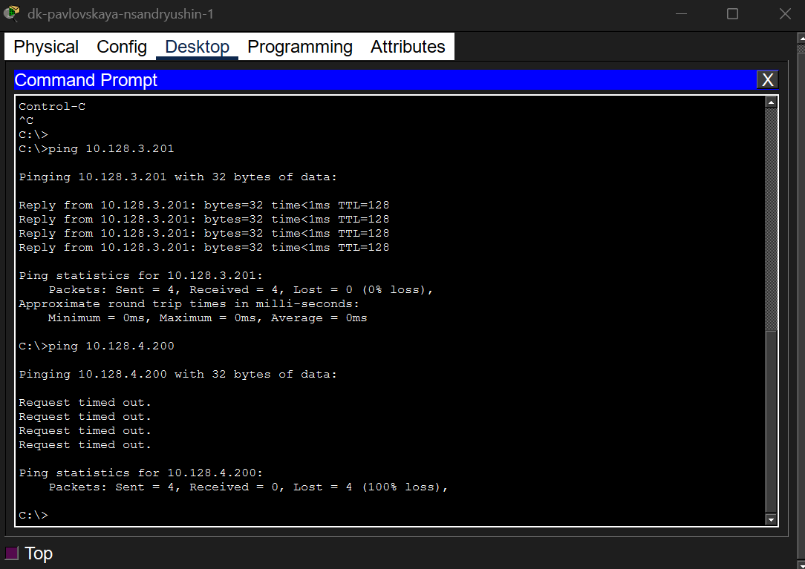{height=60%}

## Информация о PDU в модели OSI на промежуточном коммутаторе

{height=60%}

## Детальная информация о заголовках входящего PDU и протоколах

{height=60%}

# Выводы

В результате выполнения лабораторной работы были получены навыки конфигурирования VLAN на коммутаторах