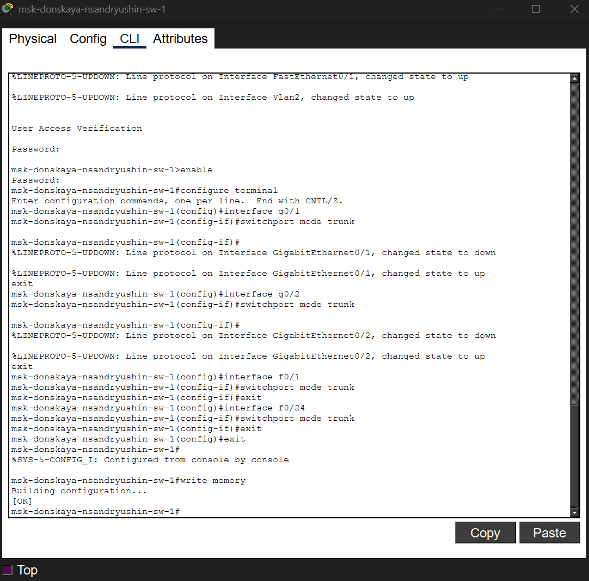
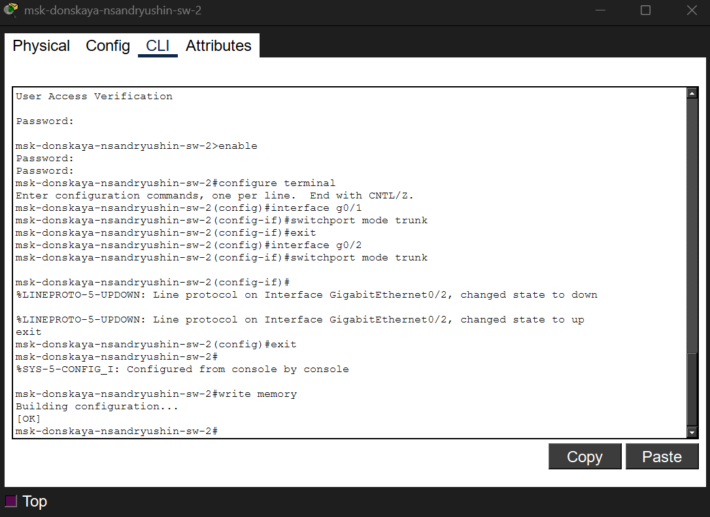
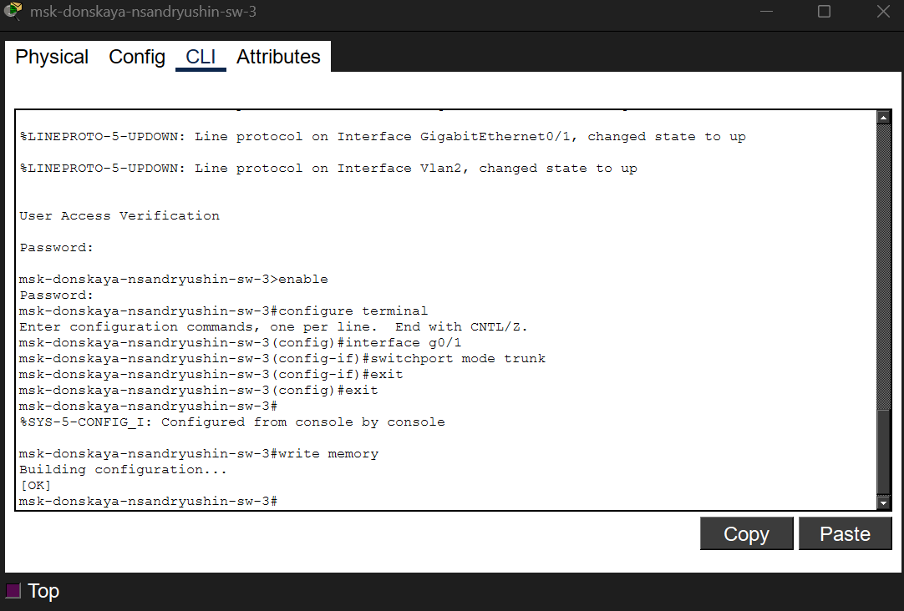
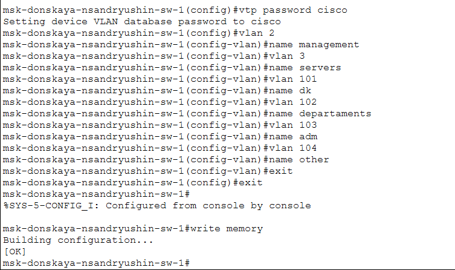
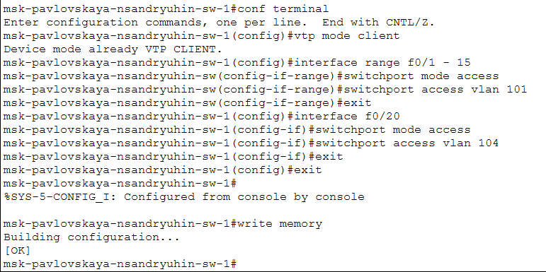
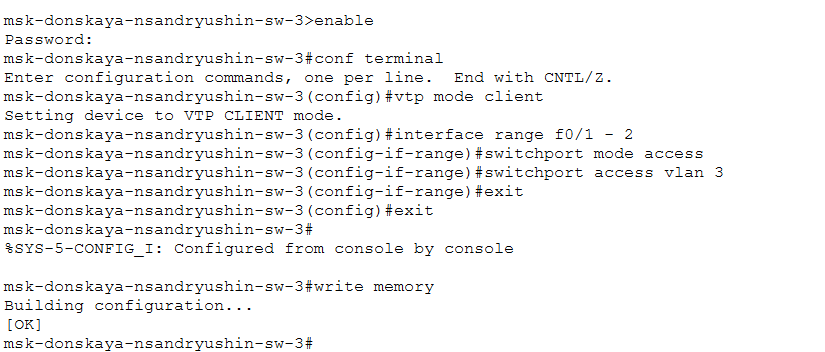
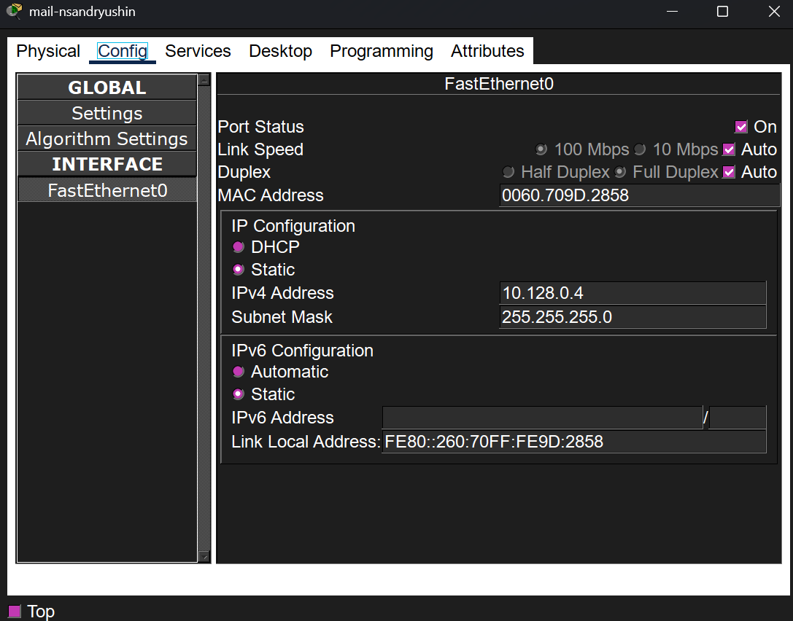
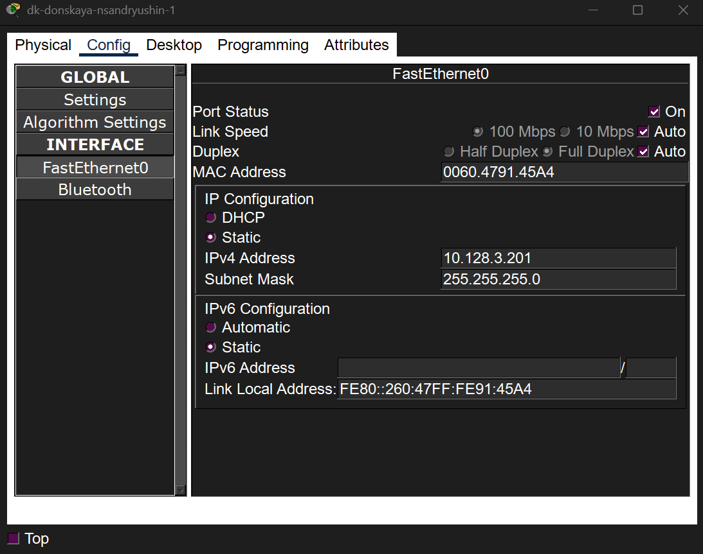
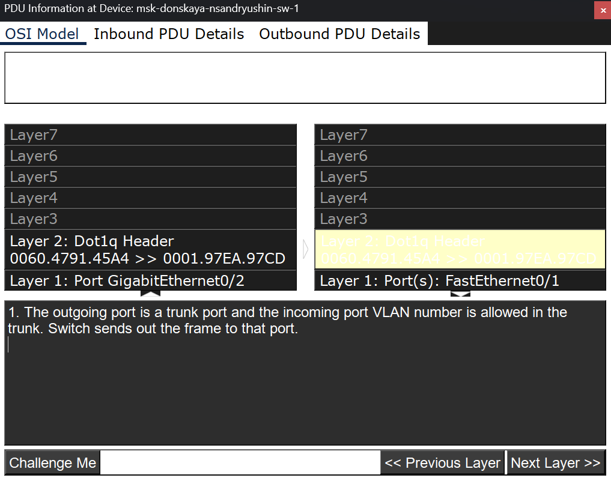
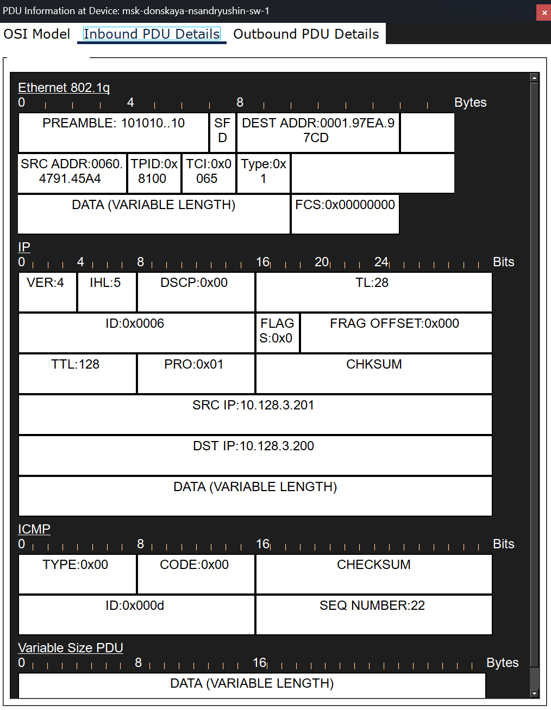

---
## Author
author:
  name: Андрюшин Никита Сергеевич

## Title
title: "Лабораторная работа"
subtitle: "Номер 5"
license: "CC BY"
---

# Цель работы

Получить основные навыки по настройке VLAN на коммутаторах сети

# Выполнение лабораторной работы

Начнем выполнение задания с настройки Trunk-портов на коммутаторах. Настроим интерфейс f0/24 коммутатора msk-pavlovskaya-nsandryushin-sw-1 в режим trunk и сохраним конфигурацию в память устройства (рис. [-@fig-001]).

{#fig-001}

Перейдем к главному коммутатору msk-donskaya-nsandryushin-sw-1. Переведем в режим trunk интерфейсы g0/1, g0/2, f0/1 и f0/24, которые связывают его с другими сетевыми устройствами, после чего выполним сохранение настроек (рис. [-@fig-002]).

{#fig-002}

Продолжим настройку магистральных каналов. Настроим Trunk-порты на интерфейсах g0/1 и g0/2 коммутатора msk-donskaya-nsandryushin-sw-2 и сохраним изменения (рис. [-@fig-003]).

{#fig-003}

Выполним аналогичные действия на коммутаторе msk-donskaya-nsandryushin-sw-3, переведя его интерфейс g0/1 в режим trunk и сохранив конфигурацию (рис. [-@fig-004]).

{#fig-004}

Завершим первый этап настройки переводом интерфейса g0/1 в магистральный режим на коммутаторе msk-donskaya-nsandryushin-sw-4. Также не забудем сохранить параметры в память (рис. [-@fig-005]).

{#fig-005}

Перейдем к настройке протокола VTP и виртуальных локальных сетей. На коммутаторе msk-donskaya-nsandryushin-sw-1, который выступает в роли VTP-сервера, зададим пароль cisco и создадим необходимые VLAN с соответствующими именами (management, servers, dk, departaments, adm, other) согласно заданию. Выполним сохранение (рис. [-@fig-006]).

{#fig-006}

Далее настроим остальные коммутаторы в качестве VTP-клиентов и распределим их порты. На коммутаторе msk-pavlovskaya-nsandryushin-sw-1 включим режим клиента, назначим порты доступа: диапазон f0/1 - 15 определим в VLAN 101, а порт f0/20 в VLAN 104. Сохраним конфигурацию (рис. [-@fig-007]).

{#fig-007}

На коммутаторе msk-donskaya-nsandryushin-sw-2 также зададим роль VTP-клиента и переведем порты f0/1 - 2 в режим доступа, назначив им принадлежность к VLAN 3. Сохраним настройки (рис. [-@fig-008]).

{#fig-008}

Выполним аналогичные шаги для коммутатора msk-donskaya-nsandryushin-sw-3: переведем его в режим VTP-клиента, настроим интерфейсы f0/1 - 2 как порты доступа для VLAN 3 и сохраним внесенные изменения (рис. [-@fig-009]).

{#fig-009}

В завершение этого этапа настроим коммутатор msk-donskaya-nsandryushin-sw-4 как VTP-клиент. Назначим соответствующие диапазоны портов в нужные виртуальные сети: порты с 1 по 5 в VLAN 101, с 6 по 10 в VLAN 102, с 11 по 15 в VLAN 103 и с 16 по 24 в VLAN 104. Выполним сохранение конфигурации (рис. [-@fig-010]).

{#fig-010}

Перейдем к настройке статических IP-адресов на серверах. Зададим адрес 10.128.0.2 и маску подсети для веб-сервера web-nsandryushin (рис. [-@fig-011]).

{#fig-011}

Аналогичным образом пропишем статический IP-адрес 10.128.0.3 для файлового сервера file-nsandryushin (рис. [-@fig-012]).

{#fig-012}

Далее укажем конфигурацию для почтового сервера mail-nsandryushin, присвоив ему адрес 10.128.0.4 (рис. [-@fig-013]).

{#fig-013}

Теперь приступим к настройке оконечных устройств. Для компьютера dk-pavlovskaya-nsandryushin-1 пропишем IP-адрес 10.128.3.200 из диапазона соответствующей сети (рис. [-@fig-014]).

{#fig-014}

Для второго устройства в этом же VLAN, dk-donskaya-nsandryushin-1, установим IP-адрес 10.128.3.201 (рис. [-@fig-015]).

{#fig-015}

Настроим компьютер dep-donskaya-nsandryushin-1, выделив ему статический адрес 10.128.4.200 (рис. [-@fig-016]).

{#fig-016}

Для ПК adm-donskaya-nsandryushin-1 зададим адрес 10.128.5.200 в соответствии с регламентом (рис. [-@fig-017]).

{#fig-017}

Перейдем к компьютерам из следующей группы. Пропишем адрес 10.128.6.200 для устройства other-pavlovskaya-nsandryushin-1 (рис. [-@fig-018]).

{#fig-018}

Для компьютера other-donskaya-nsandryushin-1 укажем IP-адрес 10.128.6.201 (рис. [-@fig-019]).

{#fig-019}

В завершение этого этапа проверим доступность устройств с помощью утилиты ping. Выполним эхо-запросы с компьютера dk-pavlovskaya-nsandryushin-1. Как мы видим, пинг до узла 10.128.3.201, находящегося в том же VLAN, проходит успешно. При этом попытка связаться с узлом 10.128.4.200 из другого VLAN завершается неудачей, что подтверждает корректную изоляцию сетей и выполнение поставленной задачи (рис. [-@fig-020]).

{#fig-020}

Перейдем в режим симуляции в Packet Tracer для изучения процесса передвижения пакета ICMP по сети. Открыв окно информации о PDU на одном из промежуточных коммутаторов, во вкладке модели OSI посмотрим, как обрабатывается кадр. Убедимся, что коммутатор успешно принимает кадр на интерфейсе доступа и перенаправляет его через исходящий Trunk-порт, сохраняя заголовок Dot1q с информацией о принадлежности к VLAN (рис. [-@fig-021]).

{#fig-021}

Далее перейдем во вкладку деталей входящего PDU, чтобы изучить содержимое передаваемого пакета и заголовки задействованных протоколов. Наблюдаем наличие дополнительного заголовка стандарта Ethernet 802.1q, который вставляет тег VLAN в кадр, а также посмотрим на подробную структуру вложенных заголовков протоколов IP и ICMP с соответствующими адресами источника и назначения (рис. [-@fig-022]).

{#fig-022}

# Выводы

В результате выполнения лабораторной работы были получены навыки конфигурирования VLAN на коммутаторах