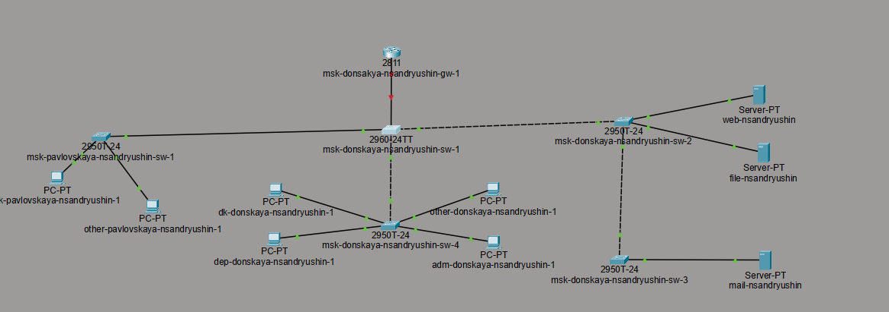
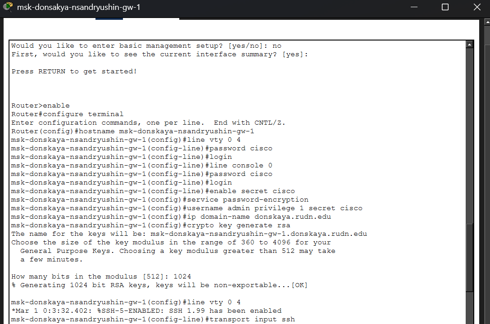
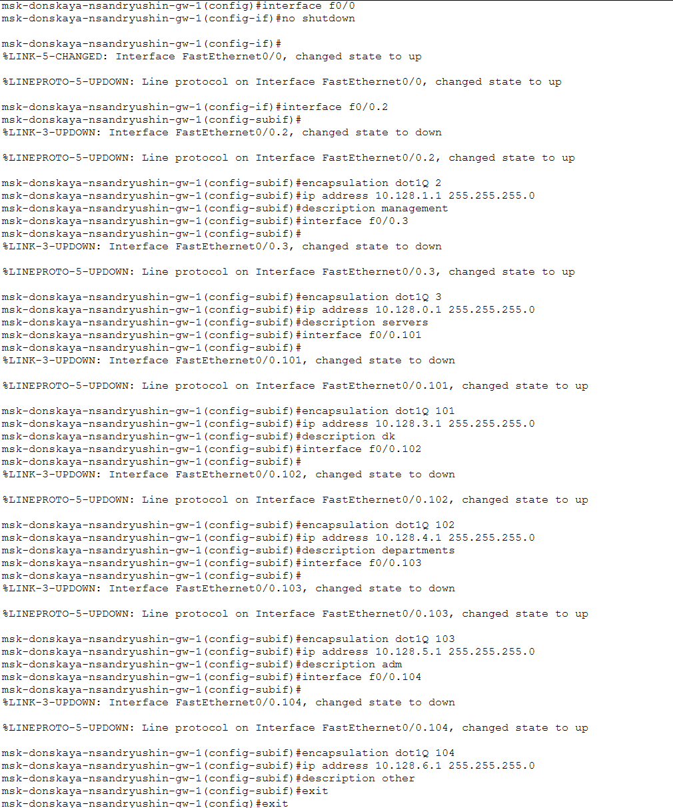
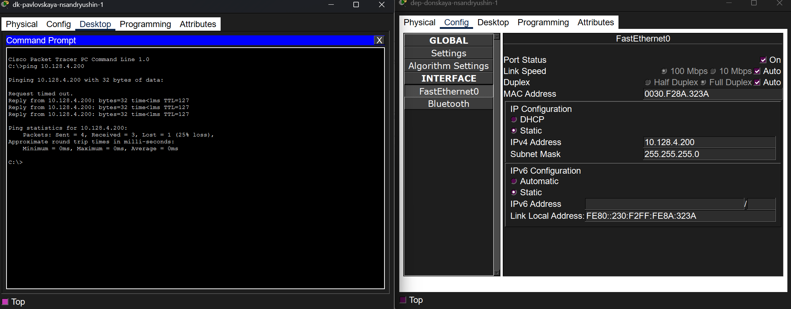
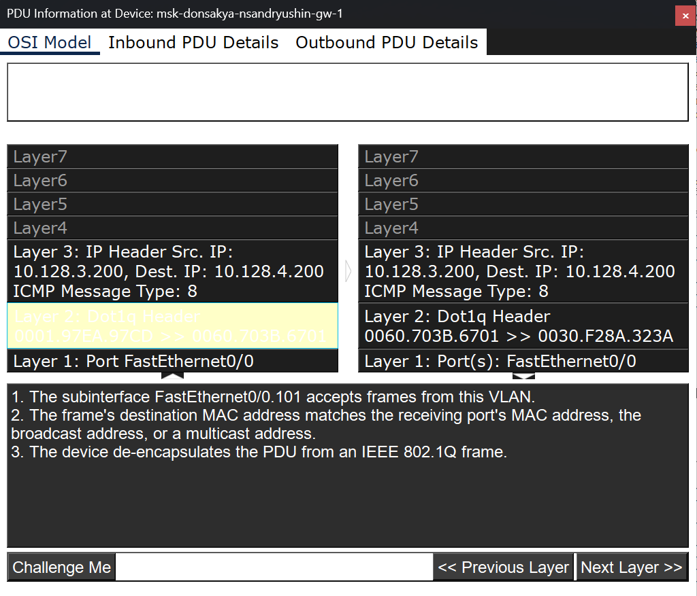

---
## Author
author:
  name: Андрюшин Никита Сергеевич
## Title
title: Лабораторная работа
subtitle: Номер 6
license: CC BY
date: today
date-format: "YYYY-MM-DD" # Example: 2025-09-06
---

# Информация

## Докладчик

:::::::::::::: {.columns align=center height=70%}
::: {.column width="70%" height=70%}

  * Андрюшин Никита Сергеевич
  * Студент
  * Российский университет дружбы народов им. П. Лумумбы

:::
::: {.column width="30%" height=70%}

:::
::::::::::::::

## Цель работы

Настроить статическую маршрутизацию VLAN в сети

# Выполнение лабораторной работы

## Топология сети с добавленным маршрутизатором

{height=60%}

## Первичная конфигурация маршрутизатора msk-donskaya-nsandryushin-gw-1

{height=60%}

## Настройка trunk-порта на коммутаторе

{height=60%}

## Конфигурация VLAN-подынтерфейсов на маршрутизаторе

{height=60%}

## Проверка доступности устройств из разных VLAN командой ping

{height=60%}

## Отслеживание пакета в режиме симуляции

{height=60%}

## Информация о PDU в модели OSI на маршрутизаторе

{height=60%}

## Детальное содержимое заголовков протоколов входящего пакета

{height=60%}

## Выводы

В результате выполнения лабораторной работы были получены навыки по настройке статической маршрутизации VLAN 