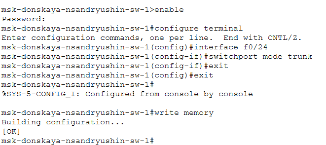
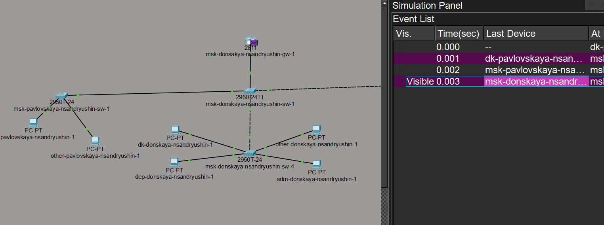
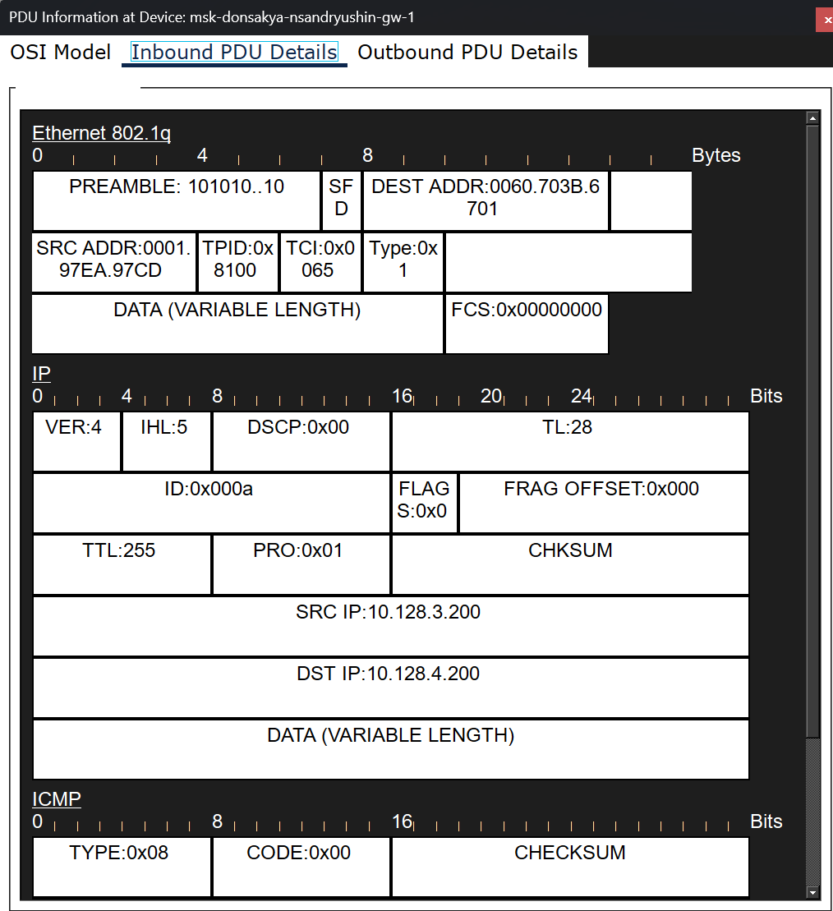

---
## Author
author:
  name: Андрюшин Никита Сергеевич

## Title
title: "Лабораторная работа"
subtitle: "Номер 6"
license: "CC BY"
---

# Цель работы

Настроить статическую маршрутизацию VLAN в сети

# Выполнение лабораторной работы

В логической области проекта разместим маршрутизатор Cisco 2811 и подключим его интерфейс к двадцать четвертому порту центрального коммутатора уровня доступа (рис. [-@fig-001]).

{#fig-001}

Выполним первичную конфигурацию маршрутизатора msk-donskaya-nsandryushin-gw-1. Зададим имя устройства командой hostname, настроим пароль для удалённого доступа через линии vty 0 4, пароль для консольного подключения через line console 0, установим привилегированный пароль командой enable secret, включим шифрование паролей командой service password-encryption, создадим пользователя admin, зададим доменное имя donskaya.rudn.edu, сгенерируем RSA-ключи длиной 1024 бит для SSH и настроим удалённое подключение по протоколу SSH (рис. [-@fig-002]).

{#fig-002}

Перейдем к настройке коммутатора, к которому подключен маршрутизатор. Настроим порт FastEthernet0/24 в режим транка для пропускания трафика от разных виртуальных локальных сетей (рис. [-@fig-003]).

{#fig-003}

На интерфейсе f0/0 маршрутизатора msk-donskaya-nsandryushin-gw-1 настроим виртуальные подынтерфейсы, соответствующие номерам VLAN. Сначала активируем физический интерфейс f0/0 командой no shutdown, затем создадим подынтерфейсы: f0/0.2 (VLAN 2, management, IP 10.128.1.1/24), f0/0.3 (VLAN 3, servers, IP 10.128.0.1/24), f0/0.101 (VLAN 101, dk, IP 10.128.3.1/24), f0/0.102 (VLAN 102, departments, IP 10.128.4.1/24), f0/0.103 (VLAN 103, adm, IP 10.128.5.1/24), f0/0.104 (VLAN 104, other, IP 10.128.6.1/24). Для каждого подынтерфейса зададим инкапсуляцию dot1Q с соответствующим номером VLAN, IP-адрес и описание (рис. [-@fig-004]).

{#fig-004}

Проверим доступность оконечных устройств из разных VLAN. С компьютера dk-pavlovskaya-nsandryushin-1 выполним команду ping на адрес 10.128.4.200, принадлежащий компьютеру dep-donskaya-nsandryushin-1 из другой VLAN. Убедимся, что после первого потерянного пакета (связано с ARP-разрешением) остальные три пакета успешно доставлены. Справа видим сетевые настройки компьютера dep-donskaya-nsandryushin-1 с IP-адресом 10.128.4.200 (рис. [-@fig-005]).

{#fig-005}

Для более детального понимания процесса передачи данных перейдем в режим симуляции в Packet Tracer. Отследим процесс передвижения ICMP-пакета по сети от отправителя до маршрутизатора. Путь проходит через роутер (рис. [-@fig-006]).

{#fig-006}

Изучим информацию о PDU на маршрутизаторе на уровнях модели OSI. Посмотрим на процесс обработки кадра: на втором уровне маршрутизатор принимает кадр с заголовком Dot1q, определяет соответствующий подынтерфейс и декапсулирует пакет для его дальнейшей маршрутизации (рис. [-@fig-007]).

{#fig-007}

Подробно рассмотрим структуру заголовков входящего пакета. В заголовке кадра Ethernet явно присутствует поле 802.1q, содержащее информацию о теге VLAN, что подтверждает корректную работу транкового соединения и маркировки трафика (рис. [-@fig-008]).

{#fig-008}

# Выводы

В результате выполнения лабораторной работы были получены навыки по настройке статической маршрутизации VLAN 