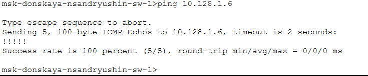
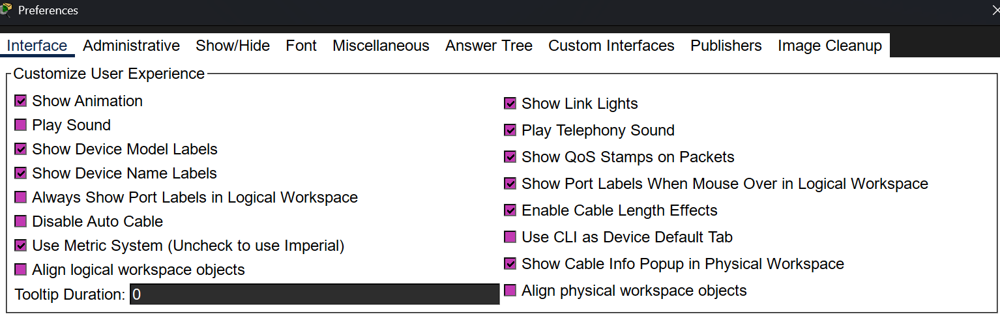
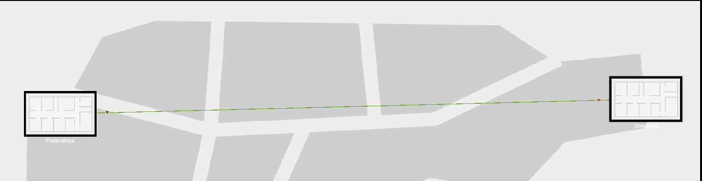
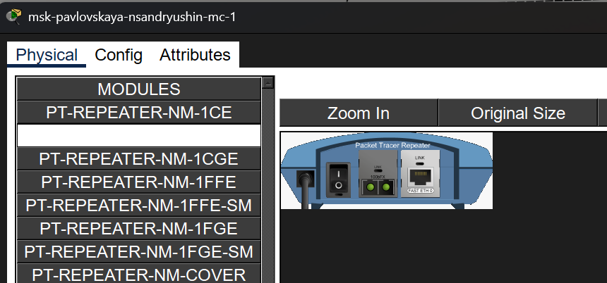
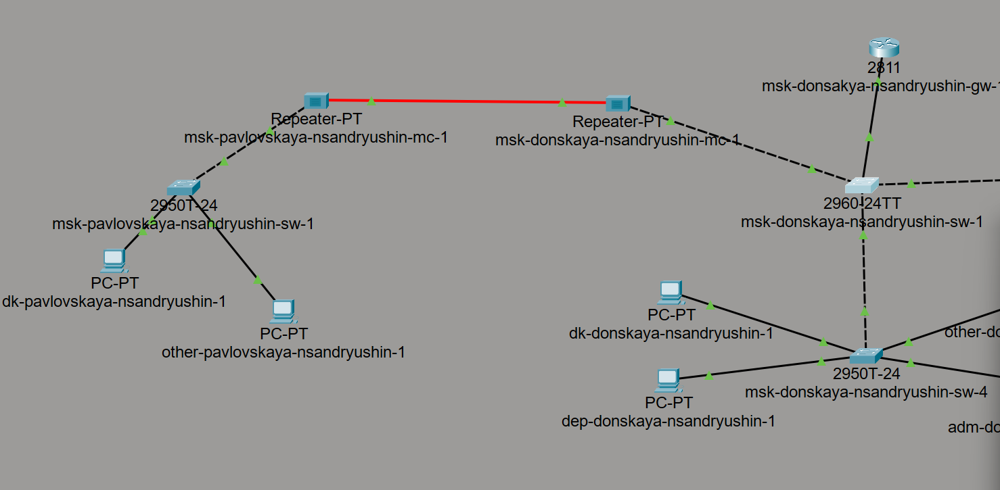

---
## Author
author:
  name: Андрюшин Никита Сергеевич
## Title
title: Лабораторная работа
subtitle: Номер 7
license: CC BY
date: today
date-format: "YYYY-MM-DD" # Example: 2025-09-06
---

# Информация

## Докладчик

:::::::::::::: {.columns align=center height=70%}
::: {.column width="70%" height=70%}

  * Андрюшин Никита Сергеевич
  * Студент
  * Российский университет дружбы народов им. П. Лумумбы

:::
::: {.column width="30%" height=70%}

:::
::::::::::::::

## Цель работы

Получить навыки работы с физической рабочей областью Packet Tracer, а также учесть физические параметры сети.

# Выполнение лабораторной работы

## Физическая рабочая область, город Moscow

{height=60%}

## Изображения зданий на территории города

{height=60%}

## Размещение серверной комнаты внутри здания

{height=60%}

## Перемещение устройств на территорию Pavlovskaya через меню Move

{height=60%}

## Успешный ping между коммутаторами до включения учёта длины кабеля

{height=60%}

## Активация параметра Enable Cable Length Effects в настройках Preferences

{height=60%}

## Размещение территорий на значительном расстоянии друг от друга

{height=60%}

## Неуспешный ping между коммутаторами после учёта длины кабеля

{height=60%}

## Схема сети с добавленными повторителями в логической рабочей области

{height=60%}

## Настройка модулей повторителя msk-pavlovskaya-nsandryushin-mc-1

{height=60%}

## Перемещение оборудования на территорию Pavlovskaya

{height=60%}

## Схема сети с подключенными повторителями и оптоволокном

{height=60%}

## Проверка работоспособности соединения с помощью команды ping

{height=60%}

## Выводы

В результате выполнения лабораторной работы были получены навыки работы с физической областью Packet Tracer, а также был освоен принцип построения сети, учитывающий расстояние между узлами