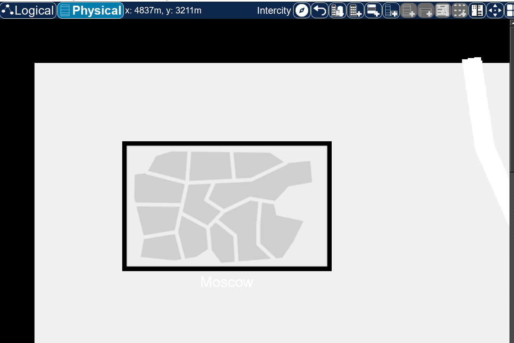
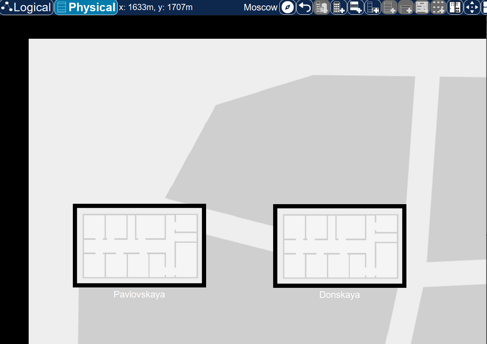
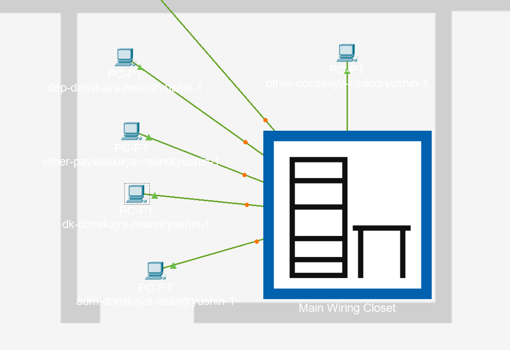
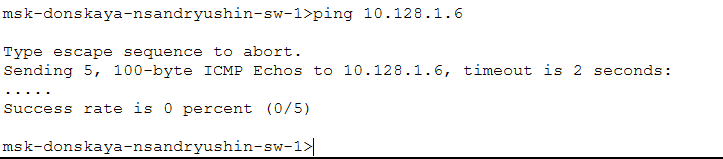
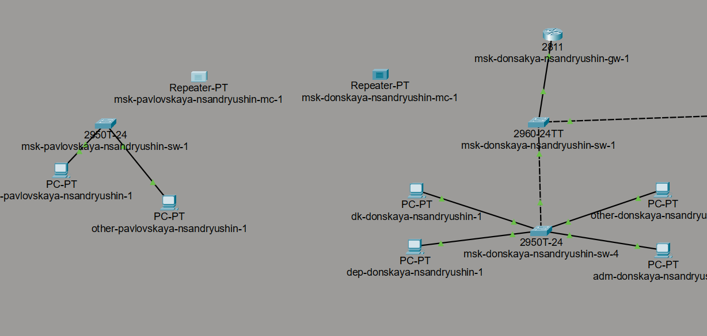
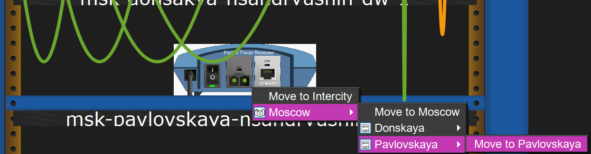
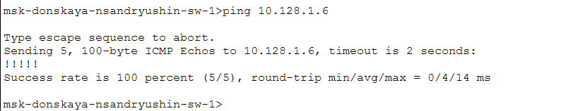

---
## Author
author:
  name: Андрюшин Никита Сергеевич

## Title
title: "Лабораторная работа"
subtitle: "Номер 7"
license: "CC BY"
---

# Цель работы

Получить навыки работы с физической рабочей областью Packet Tracer, а также учесть физические параметры сети.

# Выполнение лабораторной работы

Перейдем в физическую рабочую область Packet Tracer и присвоим название городу — Moscow (рис. [-@fig-001]).

{#fig-001}

Щелкнув на изображении города, перейдем внутрь. Присвоим существующему зданию название Donskaya, а также добавим новое здание для территории Pavlovskaya (рис. [-@fig-002]).

{#fig-002}

Щелкнув на изображении здания Donskaya, переместим изображение, обозначающее серверное помещение (Main Wiring Closet), внутрь него (рис. [-@fig-003]).

{#fig-003}

Переместим коммутатор msk-pavlovskaya-nsandryushin-sw-1 и оконечные устройства dk-pavlovskaya-nsandryushin-1 и other-pavlovskaya-nsandryushin-1 на территорию Pavlovskaya, используя контекстное меню Move физической рабочей области Packet Tracer (рис. [-@fig-004]).

{#fig-004}

Вернувшись в логическую рабочую область Packet Tracer, пропингуем с коммутатора msk-donskaya-nsandryushin-sw-1 коммутатор msk-pavlovskaya-nsandryushin-sw-1. Убедимся в работоспособности соединения — все 5 пакетов успешно доставлены (Success rate is 100 percent) (рис. [-@fig-005]).

{#fig-005}

В меню Options, Preferences во вкладке Interface активируем разрешение на учёт физических характеристик среды передачи — установим флажок Enable Cable Length Effects (рис. [-@fig-006]).

{#fig-006}

В физической рабочей области Packet Tracer разместим две территории Pavlovskaya и Donskaya на расстоянии более 100 м друг от друга (около 1500 метров) (рис. [-@fig-007]).

{#fig-007}

Вернувшись в логическую рабочую область Packet Tracer, повторно пропингуем с коммутатора msk-donskaya-nsandryushin-sw-1 коммутатор msk-pavlovskaya-nsandryushin-sw-1. Убедимся в неработоспособности соединения — все 5 пакетов потеряны (Success rate is 0 percent), что связано с превышением допустимой длины кабеля витой пары (рис. [-@fig-008]).

{#fig-008}

Удалим соединение между msk-donskaya-nsandryushin-sw-1 и msk-pavlovskaya-nsandryushin-sw-1. Добавим в логическую рабочую область два повторителя (Repeater-PT) с именами msk-donskaya-nsandryushin-mc-1 и msk-pavlovskaya-nsandryushin-mc-1. Подключим коммутаторы к повторителям по витой паре, а повторители между собой — по оптоволокну (рис. [-@fig-009]).

{#fig-009}

Заменим имеющиеся модули повторителей на PT-REPEATER-NM-1FFE (для подключения оптоволокна) и PT-REPEATER-NM-1CFE (для подключения витой пары) по технологии Fast Ethernet (рис. [-@fig-010]).

{#fig-010}

Переместим добавленный повторитель для территории Pavlovskaya в соответствующее здание в физической рабочей области Packet Tracer, используя контекстное меню перемещения оборудования (рис. [-@fig-011]).

{#fig-011}

Подключим коммутаторы к соответствующим повторителям с помощью витой пары, а сами повторители соединим между собой оптоволоконным кабелем. Посмотрим на обновленную схему сети с учетом добавленного оборудования в логической рабочей области (рис. [-@fig-012]).

{#fig-012}

Убедимся в работоспособности созданного соединения между территориями. Для этого пропингуем с коммутатора msk-donskaya-nsandryushin-sw-1 удаленный коммутатор msk-pavlovskaya-nsandryushin-sw-1 по его IP-адресу. Видим, что пакеты успешно доходят и связь работает (рис. [-@fig-013]).

{#fig-013}

# Выводы

В результате выполнения лабораторной работы были получены навыки работы с физической областью Packet Tracer, а также был освоен принцип построения сети, учитывающий расстояние между узлами