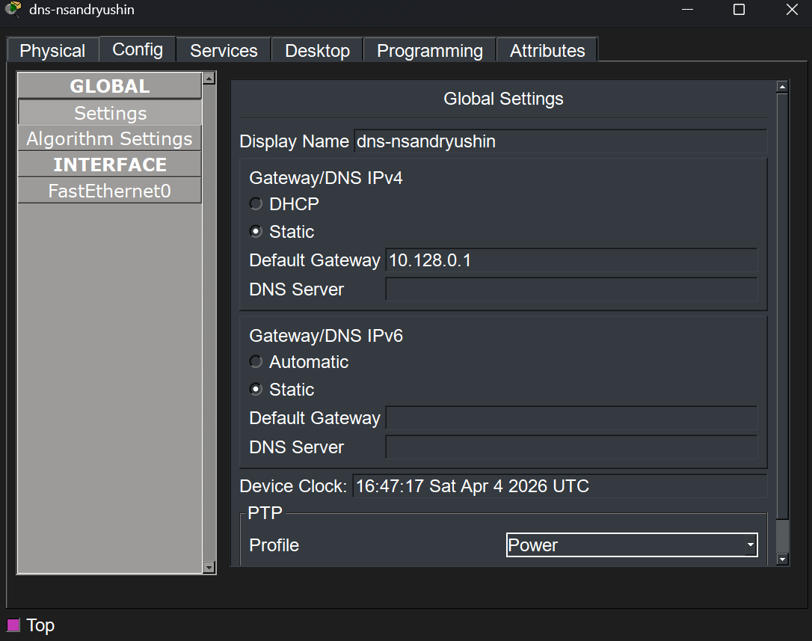
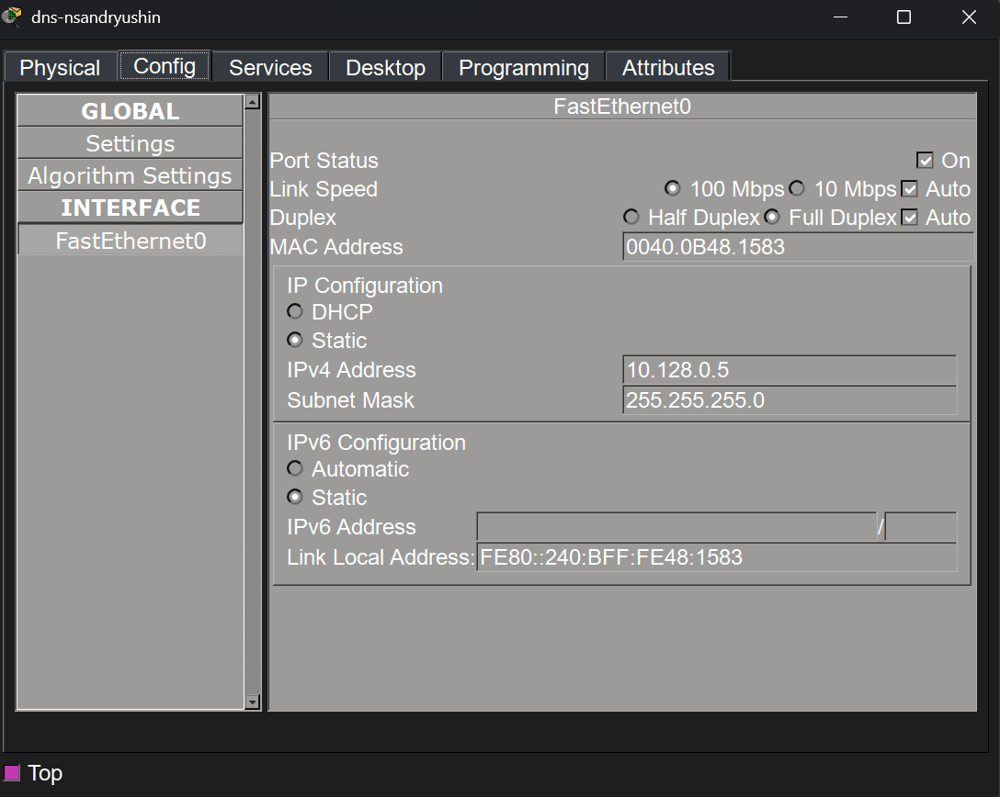
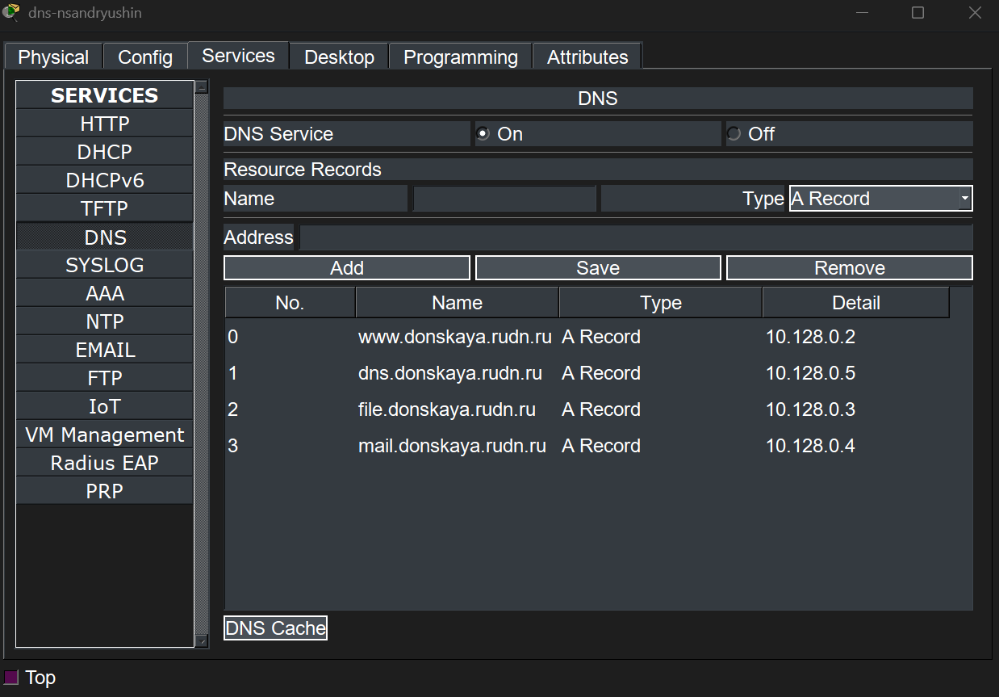
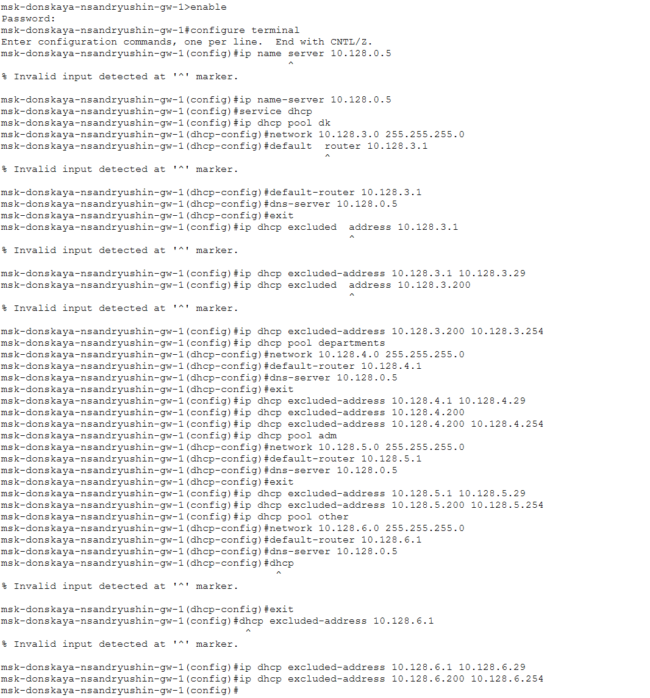
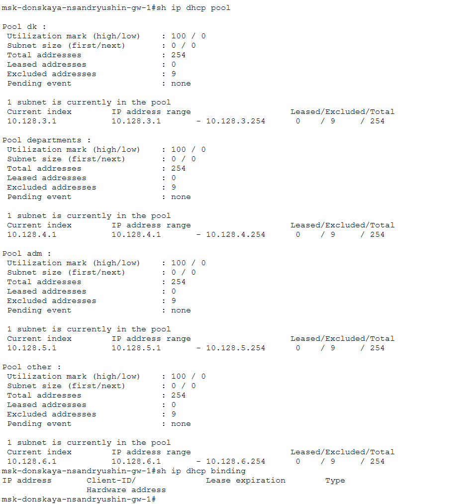
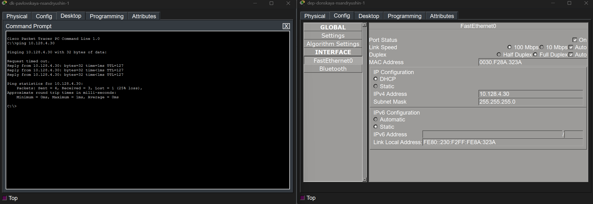

---
## Author
author:
  name: Андрюшин Никита Сергеевич
## Title
title: Лабораторная работа
subtitle: Номер 8
license: CC BY
date: today
date-format: "YYYY-MM-DD" # Example: 2025-09-06
---

# Информация

## Докладчик

:::::::::::::: {.columns align=center height=70%}
::: {.column width="70%" height=70%}

  * Андрюшин Никита Сергеевич
  * Студент
  * Российский университет дружбы народов им. П. Лумумбы

:::
::: {.column width="30%" height=70%}

:::
::::::::::::::

## Цель работы

Приобретение практических навыков по настройке динамического распределения IP-адресов посредством протокола DHCP 

# Выполнение лабораторной работы

## Подключение DNS-сервера к коммутатору уровня распределения

{height=60%}

## Настройка адреса шлюза по умолчанию на DNS-сервере

{height=60%}

## Настройка статического IP-адреса на интерфейсе DNS-сервера

{height=60%}

## Создание ресурсных A-записей в службе DNS

{height=60%}

## Настройка пулов DHCP и исключаемых диапазонов адресов на маршрутизаторе

{height=60%}

## Проверка информации о созданных пулах DHCP

{height=60%}

## Получение динамического IP-адреса первым ПК из подсети

{height=60%}

## Получение динамического IP-адреса вторым ПК из подсети

{height=60%}

## Проверка доступности узлов из разных подсетей с помощью утилиты ping

{height=60%}

## Анализ обмена сообщениями протокола DHCP в режиме симуляции

{height=60%}

## Выводы

В результате выполнения лабораторной работы были получены навыки настройки dns/dhcp сервера в сети