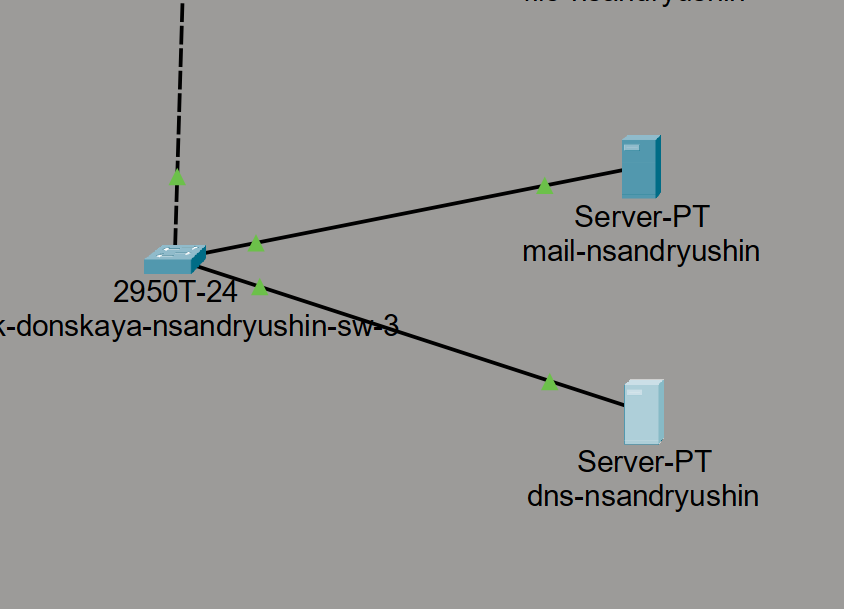
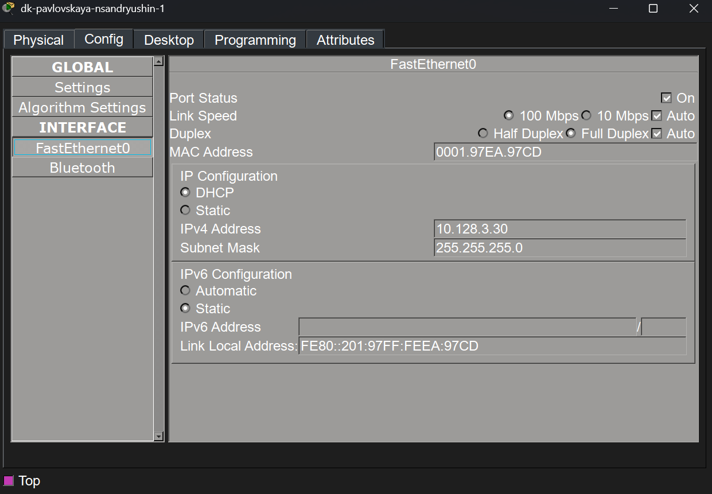
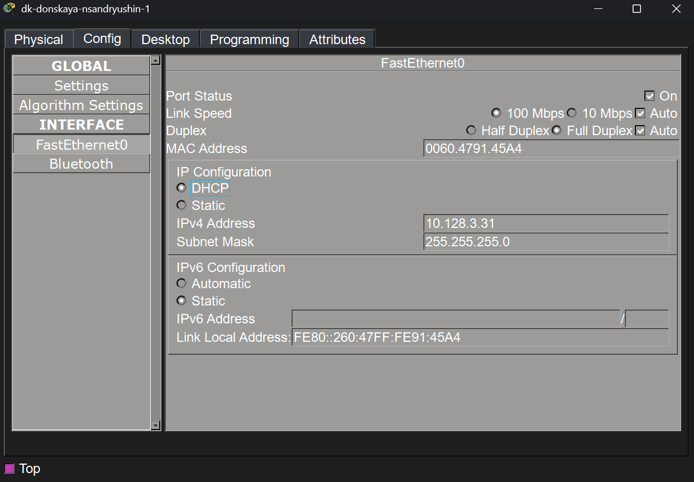
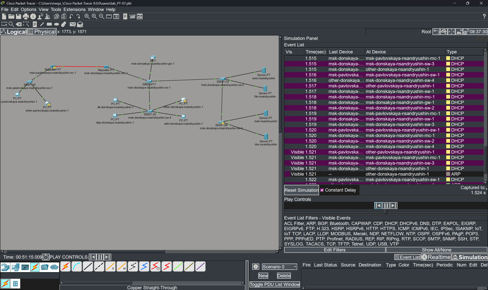

---
## Author
author:
  name: Андрюшин Никита Сергеевич

## Title
title: "Лабораторная работа"
subtitle: "Номер 8"
license: "CC BY"
---

# Цель работы

Приобретение практических навыков по настройке динамического распределения IP-адресов посредством протокола DHCP 

# Выполнение лабораторной работы

В логическую рабочую область проекта добавим новый сервер, который будет выполнять роль DNS-сервера. Подключим его кабелем к свободному порту коммутатора msk-donskaya-nsandryushin-sw-3. Убедимся, что линк поднялся и индикаторы портов загорелись зеленым цветом, что свидетельствует о наличии физического подключения (рис. [-@fig-001]).

{#fig-001}

Откроем настройки добавленного сервера и перейдем во вкладку конфигурации глобальных параметров (Global Settings). В поле шлюза по умолчанию (Default Gateway) статически пропишем IP-адрес шлюза для данной подсети — 10.128.0.1. Это необходимо для того, чтобы DNS-сервер мог корректно отвечать на запросы от устройств, находящихся в других маршрутизируемых сетях (рис. [-@fig-002]).

{#fig-002}

Далее перейдем в настройки интерфейса FastEthernet0 этого же сервера. Зададим статический IPv4-адрес самого DNS-сервера — 10.128.0.5, а также укажем стандартную маску подсети 255.255.255.0. Обязательно проверим, что порт включен (стоит галочка On в поле Port Status) (рис. [-@fig-003]).

{#fig-003}

Перейдем во вкладку сервисов (Services) и выберем раздел DNS. Включим саму службу, переведя переключатель в положение On. Затем последовательно создадим ресурсные записи типа A (A Record) для всех серверов нашей локальной сети согласно заданию: добавим доменные имена для веб-сервера, самого DNS-сервера, файлового и почтового серверов, привязав к ним их соответствующие статические IP-адреса (рис. [-@fig-004]).

{#fig-004}

Откроем интерфейс командной строки (CLI) маршрутизатора msk-donskaya-nsandryushin-gw-1 и перейдем в режим глобальной конфигурации. Включим службу DHCP и поочередно настроим пулы адресов для различных подсетей (dk, departments, adm, other). Для каждого пула укажем сеть, шлюз по умолчанию и адрес ранее настроенного DNS-сервера. Также обязательно зададим диапазоны исключаемых IP-адресов (excluded-address), чтобы предотвратить конфликты с адресами оборудования, которое настраивается статически (рис. [-@fig-005]).

{#fig-005}

Для проверки корректности введенных настроек выйдем в привилегированный режим и выполним команду show ip dhcp pool. В выводе команды внимательно изучим информацию о созданных пулах: проверим общее количество адресов, количество исключенных адресов и диапазоны сетей. Убедимся, что все запланированные пулы созданы успешно и имеют верные параметры (рис. [-@fig-006]).

{#fig-006}

Перейдем к настройке оконечных устройств. Откроем настройки сетевого интерфейса одного из компьютеров (dk-pavlovskaya-nsandryushin-1) и переключим метод получения IP-адреса со статического на динамический (DHCP). Подождем несколько секунд и убедимся, что ПК успешно получил первый доступный IP-адрес (10.128.3.30) с учетом заданных нами исключений и корректную маску подсети от маршрутизатора (рис. [-@fig-007]).

{#fig-007}

Выполним аналогичные действия на следующем компьютере из этой же подсети (dk-donskaya-nsandryushin-1). Переведем получение IP-конфигурации в режим DHCP и посмотрим на результат. Видим, что процесс прошел успешно: устройство автоматически получило следующий свободный IP-адрес из настроенного пула (10.128.3.31) (рис. [-@fig-008]).

{#fig-008}

Проверим сетевую связность и корректность маршрутизации между узлами, получившими адреса динамически. С компьютера dk-pavlovskaya-nsandryushin-1 откроем командную строку и запустим эхо-запрос (ping) до ПК, находящегося в другой подсети. Увидим, что после первого потерянного пакета (из-за задержки на отработку протокола ARP) остальные запросы успешно проходят, что подтверждает работоспособность настроенной сети (рис. [-@fig-009]).

{#fig-009}

Переключим Packet Tracer в режим симуляции, чтобы детально изучить работу протокола DHCP на сетевом уровне. Отфильтруем отображаемые события, оставив только пакеты DHCP. Понаблюдаем за процессом получения адреса: мы наглядно увидим обмен сообщениями между клиентами и сервером, образующими классическую последовательность получения адреса DORA (Discover, Offer, Request, Acknowledge) (рис. [-@fig-010]).

{#fig-010}

# Выводы

В результате выполнения лабораторной работы были получены навыки настройки dns/dhcp сервера в сети