---
## Author
author:
  name: Андрюшин Никита Сергеевич
## Title
title: Лабораторная работа
subtitle: Номер 9
license: CC BY
date: today
date-format: "YYYY-MM-DD" # Example: 2025-09-06
---

# Информация

## Докладчик

:::::::::::::: {.columns align=center height=70%}
::: {.column width="70%" height=70%}

  * Андрюшин Никита Сергеевич
  * Студент
  * Российский университет дружбы народов им. П. Лумумбы

:::
::: {.column width="30%" height=70%}

:::
::::::::::::::

## Цель работы

Изучение возможностей протокола STP и его модификаций по обеспечению отказоустойчивости сети, агрегированию интерфейсов и перераспределению нагрузки между ними

# Выполнение лабораторной работы

## Исходная топология сети

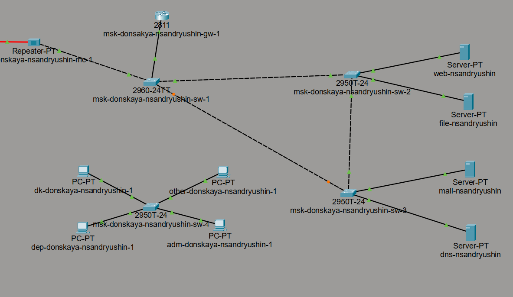{height=70%}

## Настройка транкового порта на sw-3

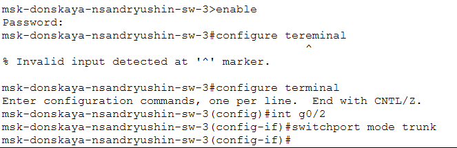{height=70%}

## Топология сети с резервным соединением

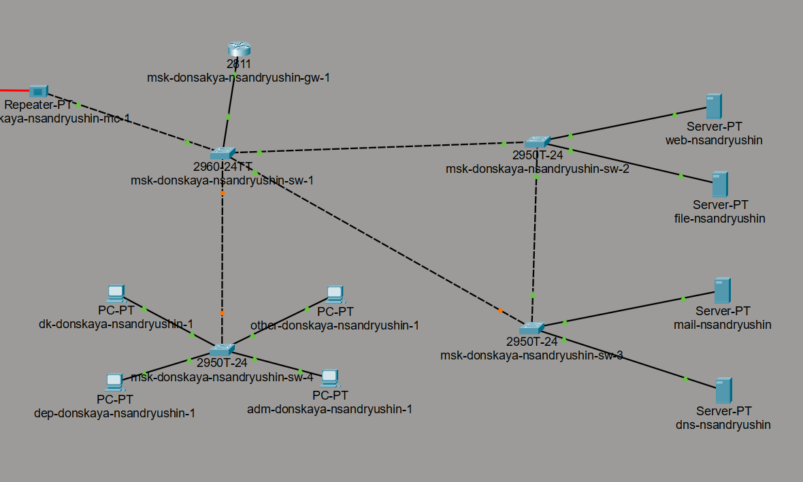{height=70%}

## Настройка транкового соединения между sw-1 и sw-4

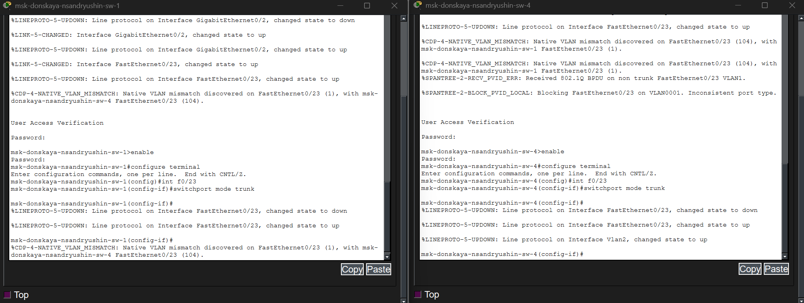{height=70%}

## Проверка доступности серверов

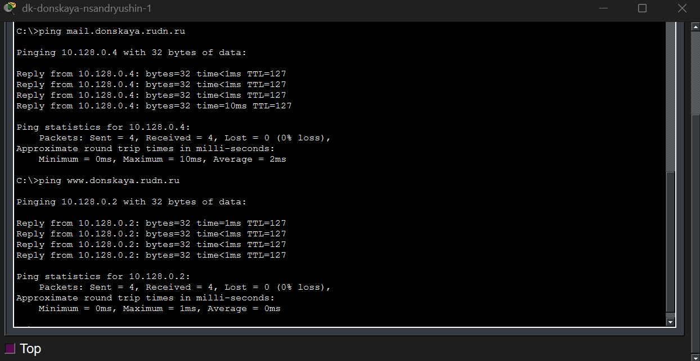{height=70%}

## Отслеживание пути ICMP-пакета

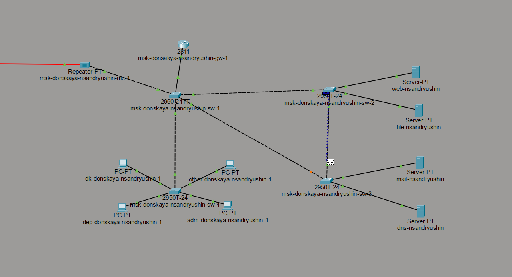{height=70%}

## Просмотр состояния STP на sw-2

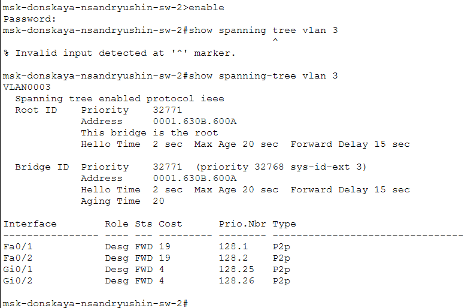{height=70%}

## Назначение sw-1 корневым коммутатором

{height=70%}

## Путь пакета к серверу mail после смены root bridge

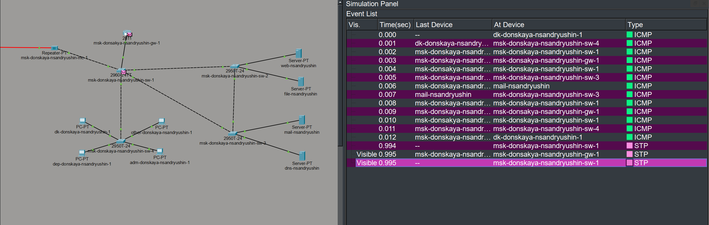{height=70%}

## Путь пакета к серверу web после смены root bridge

{height=70%}

## Настройка режима Portfast на коммутаторах sw-2 и sw-3

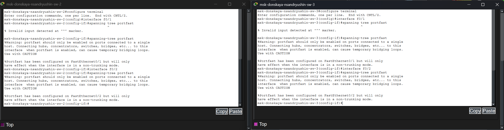{height=70%}

## Проверка отказоустойчивости STP с помощью ping на хосте dk-donskaya-1

{height=70%}

## Переключение коммутатора sw-1 в режим Rapid PVST+

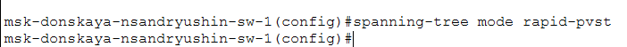{height=70%}

## Проверка отказоустойчивости Rapid PVST+ с помощью ping на хосте dk-donskaya-1

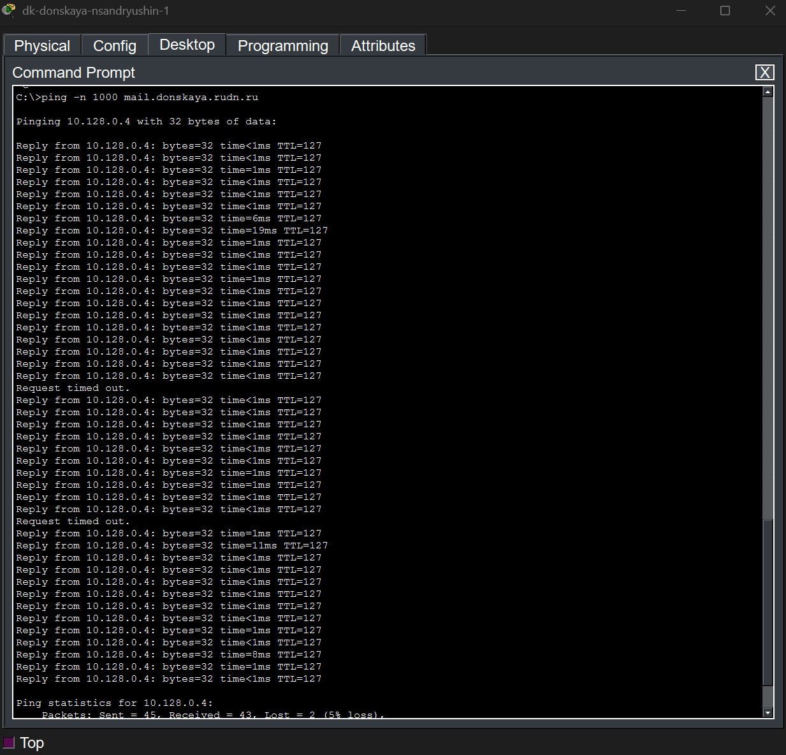{height=70%}

## Логическая схема сети с агрегированным соединением между sw-1 и sw-4

{height=70%}

## Настройка EtherChannel на коммутаторе sw-1

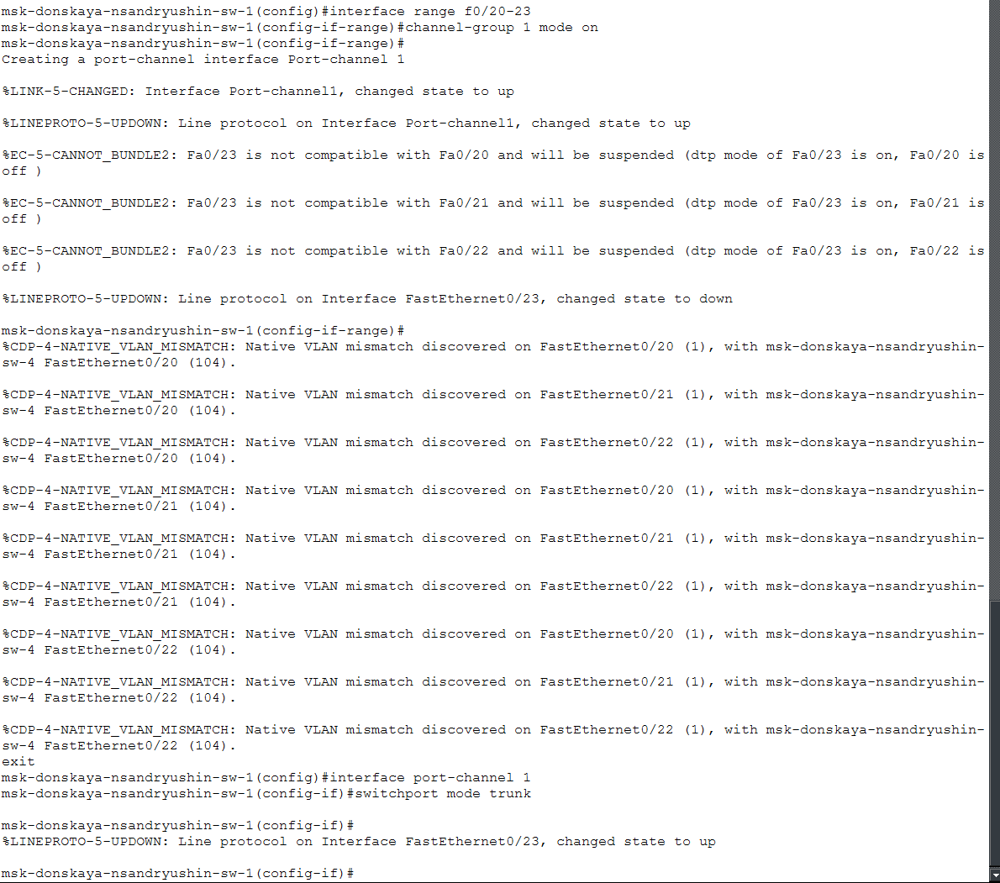{height=70%}

## Настройка EtherChannel на коммутаторе sw-4

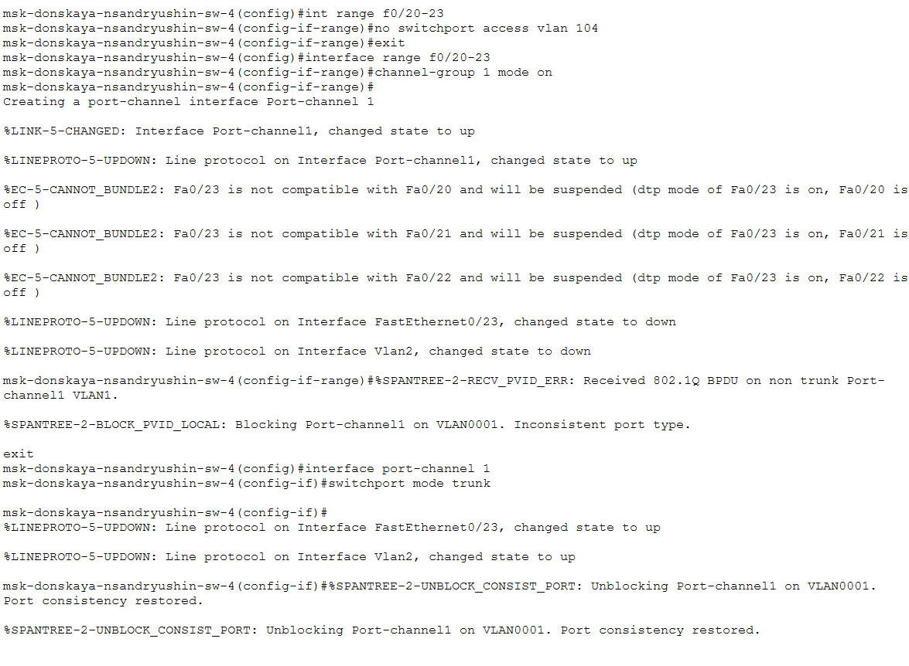{height=70%}

## Выводы

В результате выполнения работы были получены навыки работы с протоколом stp, а также в настройке локальной сети для достижения оптимальной нагрузки между узлами
