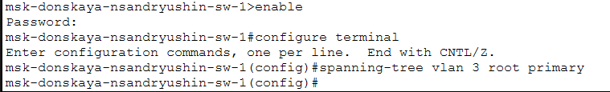
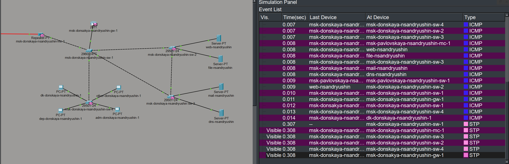
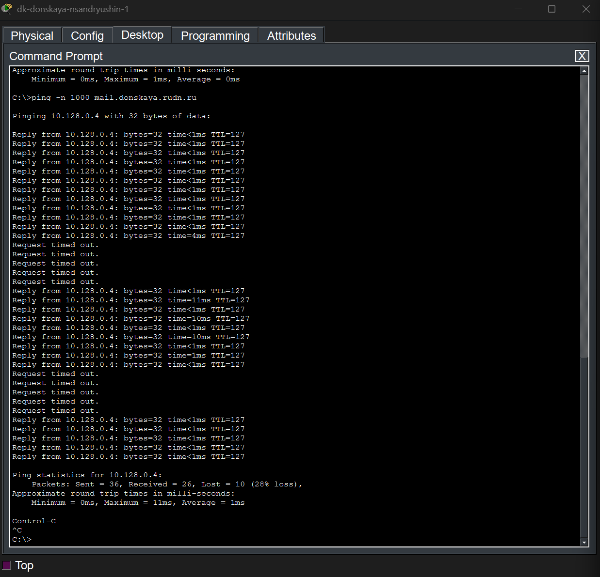
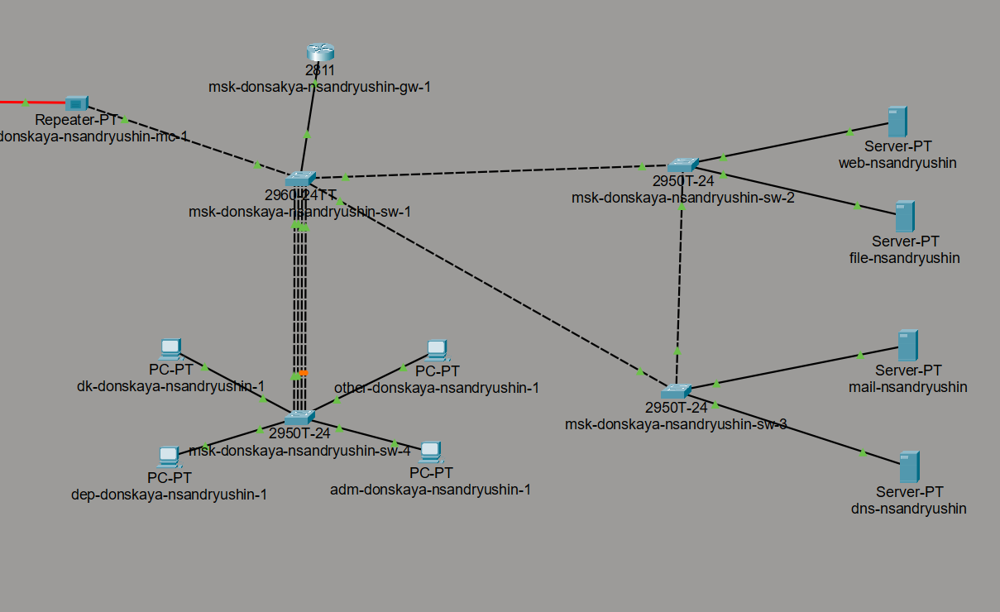

---
## Author
author:
  name: Андрюшин Никита Сергеевич

## Title
title: "Лабораторная работа"
subtitle: "Номер 9"
license: "CC BY"
---

# Цель работы

Изучение возможностей протокола STP и его модификаций по обеспечению отказоустойчивости сети, агрегированию интерфейсов и перераспределению нагрузки между ними

# Выполнение лабораторной работы

В соответствии с заданием, формируем резервное соединение (рис. -@fig-001).

{#fig-001}

Для создания резервного канала между msk-donskaya-nsandryushin-sw-1 и msk-donskaya-nsandryushin-sw-3, сначала настроим порт Gig0/2 на коммутаторе sw-3 в транковый режим (рис. -@fig-002).

{#fig-002}

После изменения соединений в топологии, протокол STP автоматически определил избыточный путь и заблокировал порт на коммутаторе msk-donskaya-nsandryushin-sw-3, чтобы предотвратить образование петли коммутации (рис. -@fig-003).

{#fig-003}

Далее, создаем соединение между коммутаторами msk-donskaya-nsandryushin-sw-1 и msk-donskaya-nsandryushin-sw-4, настроив интерфейсы Fa0/23 на обоих устройствах в транковый режим (рис. -@fig-004).

{#fig-004}

Проверяем связность сети с оконечного устройства dk-donskaya-nsandryushin-1. Пингуем серверы mail и web и убеждаемся, что они доступны (рис. -@fig-005).

{#fig-005}

В режиме симуляции проследим движение пакетов ICMP. Видим, что трафик от хоста к серверам идет через коммутатор msk-donskaya-nsandryushin-sw-2, так как альтернативный путь заблокирован (рис. -@fig-006).

{#fig-006}

С помощью команды show spanning-tree vlan 3 на коммутаторе msk-donskaya-nsandryushin-sw-2 убедимся, что он является корневым мостом (Root Bridge) для VLAN 3 (рис. -@fig-007).

{#fig-007}

Для балансировки нагрузки принудительно назначим коммутатор msk-donskaya-nsandryushin-sw-1 корневым мостом для VLAN 3 с помощью соответствующей команды (рис. -@fig-008).

{#fig-008}

После смены корневого моста снова проследим путь пакетов в режиме симуляции. Теперь трафик к серверу mail идет по новому маршруту, через коммутаторы sw-4, sw-1 и sw-3 (рис. -@fig-009).

{#fig-009}

Одновременно с этим, путь пакетов к web-серверу теперь пролегает через коммутаторы sw-4, sw-1 и sw-2. Это демонстрирует, как изменение корневого моста STP позволило нам выполнить балансировку нагрузки между двумя соединениями (рис. -@fig-010).

{#fig-010}

Настроим режим Portfast на интерфейсах f0/1 и f0/2 коммутаторов msk-donskaya-nsandryushin-sw-2 и msk-donskaya-nsandryushin-sw-3, к которым подключены серверы. Система выводит предупреждение о том, что Portfast следует включать только на портах, подключённых к одному хосту, и подтверждает успешную настройку на интерфейсах FastEthernet0/1 и FastEthernet0/2 (рис. [-@fig-011]).

{#fig-011}

Для изучения отказоустойчивости протокола STP выполним команду ping -n 1000 mail.donskaya.rudn.ru на хосте dk-donskaya-nsandryushin-1, одновременно переведя соответствующий интерфейс коммутатора в состояние shutdown для имитации разрыва соединения. Наблюдаем, что в момент переключения на резервный канал часть пакетов теряется (Request timed out), после чего соединение восстанавливается. При разрыве теряется в среднем 5 пакетов (рис. [-@fig-012]).

{#fig-012}

Переключим все коммутаторы в режим работы по протоколу Rapid PVST+ командой spanning-tree mode rapid-pvst. На скриншоте показан пример выполнения этой команды на коммутаторе msk-donskaya-nsandryushin-sw-1 (рис. [-@fig-013]).

{#fig-013}

Повторим проверку отказоустойчивости уже с включённым протоколом Rapid PVST+, снова выполнив команду ping -n 1000 mail.donskaya.rudn.ru на хосте dk-donskaya-nsandryushin-1. Убедимся, что время восстановления соединения при переключении на резервный канал значительно сократилось по сравнению с обычным STP: при разрыве теряется от 0 до 1 пакета, что наглядно демонстрирует преимущество Rapid PVST+ (рис. [-@fig-014]).

{#fig-014}

Сформируем агрегированное соединение интерфейсов Fa0/20 - Fa0/23 между коммутаторами msk-donskaya-nsandryushin-sw-1 и msk-donskaya-nsandryushin-sw-4. На логической схеме сети видно агрегированное соединение между sw-1 и sw-4, обозначенное несколькими параллельными линиями (рис. [-@fig-015]).

{#fig-015}

Настроим агрегирование каналов на коммутаторе msk-donskaya-nsandryushin-sw-1: выберем диапазон интерфейсов f0/20-23, добавим их в channel-group 1 с режимом on, после чего переведём логический интерфейс port-channel 1 в транковый режим. Система сообщает о создании интерфейса Port-channel1 и его переходе в состояние up, а также выводит предупреждения о несовместимости DTP-режимов и несоответствии native VLAN между sw-1 и sw-4, которые устраняются после установки транкового режима на port-channel (рис. [-@fig-016]).

{#fig-016}

Настроим агрегирование каналов на коммутаторе msk-donskaya-nsandryushin-sw-4: сначала удалим назначение access vlan 104 с интерфейсов f0/20-23, затем добавим их в channel-group 1 с режимом on и переведём port-channel 1 в транковый режим. После установки транкового режима система подтверждает восстановление согласованности порта и разблокировку Port-channel1 на VLAN0001 (рис. [-@fig-017]).

{#fig-017}

# Выводы

В результате выполнения работы были получены навыки работы с протоколом stp, а также в настройке локальной сети для достижения оптимальной нагрузки между узлами
