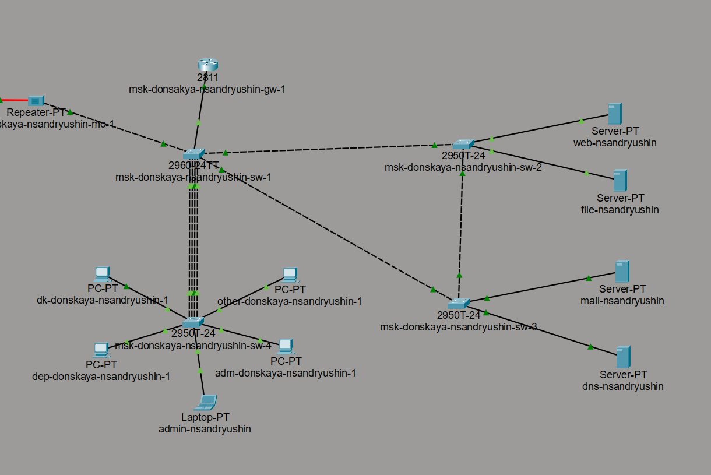
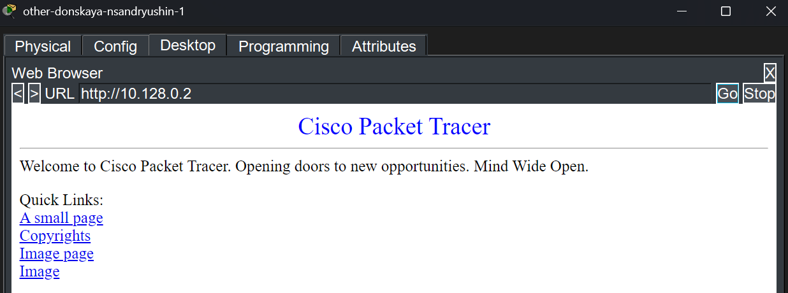
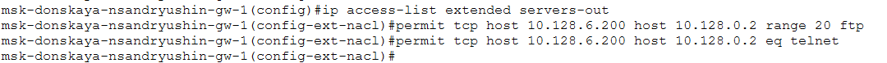
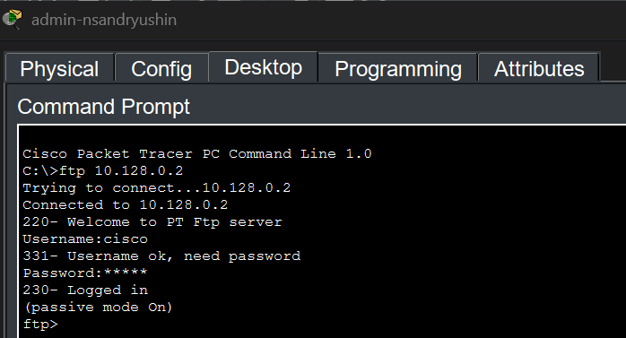
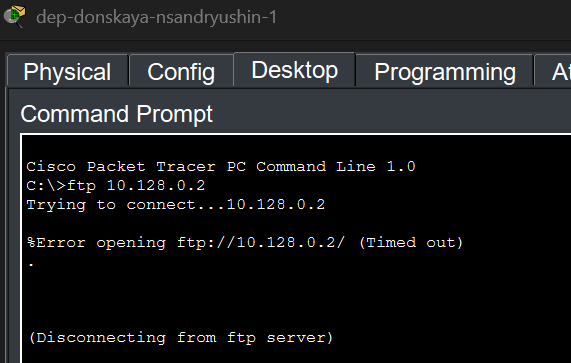
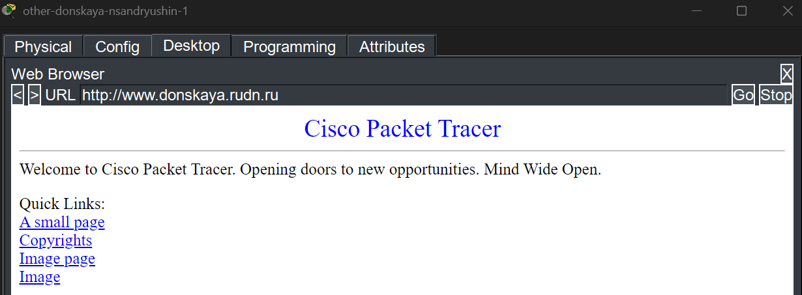
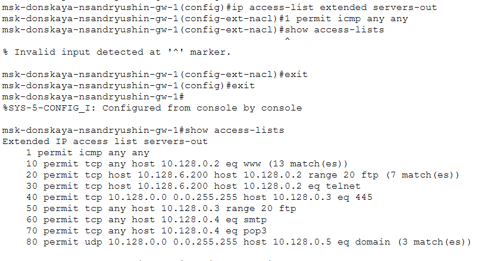
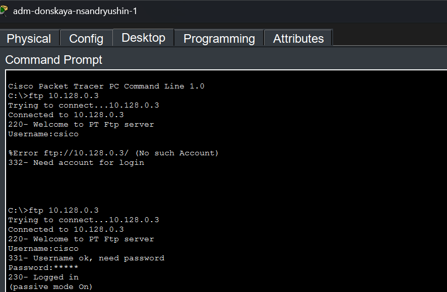
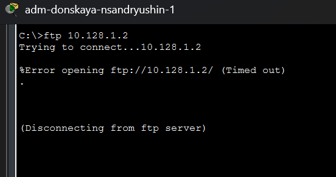
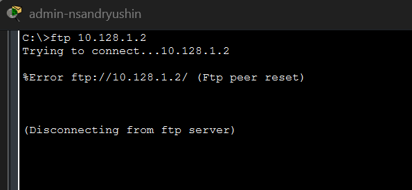

---
## Author
author:
  name: Андрюшин Никита Сергеевич
## Title
title: Лабораторная работа
subtitle: Номер 10
license: CC BY
date: today
date-format: "YYYY-MM-DD" # Example: 2025-09-06
---

# Информация

## Докладчик

:::::::::::::: {.columns align=center height=70%}
::: {.column width="70%" height=70%}

  * Андрюшин Никита Сергеевич
  * Студент
  * Российский университет дружбы народов им. П. Лумумбы

:::
::: {.column width="30%" height=70%}

:::
::::::::::::::

## Цель работы

Освоить настройку прав доступа пользователей к ресурсам сети

# Выполнение лабораторной работы

## Схема сети

{height=60%}

## Настройка IP-адреса администратора

{height=60%}

## Настройка шлюза и DNS для администратора

{height=60%}

## Создание ACL для web-сервера

{height=60%}

## Проверка доступа к web-серверу по HTTP

{height=60%}

## Проверка блокировки ICMP для web-сервера

{height=60%}

## Настройка доступа для администратора к web-серверу

{height=60%}

## Проверка FTP-доступа администратора к web-серверу

{height=60%}

## Проверка блокировки FTP для других пользователей

{#fig-009}

## Настройка ACL для файлового, почтового и DNS-серверов

{height=60%}

## Доступ к web-серверу по имени с узла other-donskaya-nsandryushin-1

{height=60%}

## Просмотр списка доступа servers-out на msk-donskaya-nsandryushin-gw-1

{height=60%}

## Настройка ACL other-in и management-out

{height=60%}

## Проверка FTP-доступа к 10.128.0.3 с adm-donskaya-nsandryushin-1

{height=60%}

## Отсутствие HTTP-доступа к 10.128.0.3

{height=60%}

## Попытка FTP-доступа к 10.128.1.2 с adm-donskaya-nsandryushin-1

{height=60%}

## Запрет FTP-доступа к 10.128.0.3 с other-donskaya-nsandryushin-1

{height=60%}

## Попытка FTP-доступа к 10.128.1.2 с admin-nsandryushin

{height=60%}

## Добавление правил для администратора 10.128.6.201

{height=60%}

## Выводы

В результате выполнения лабораторной работы были получены навыки составления и работы с ACL в сети