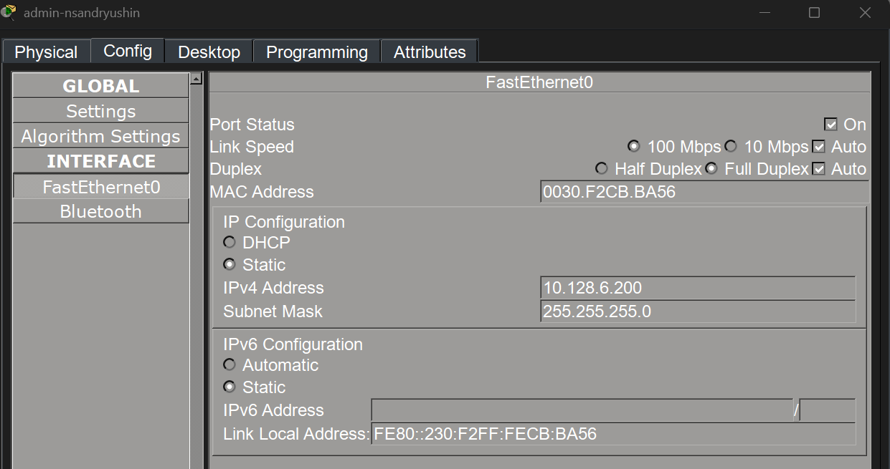
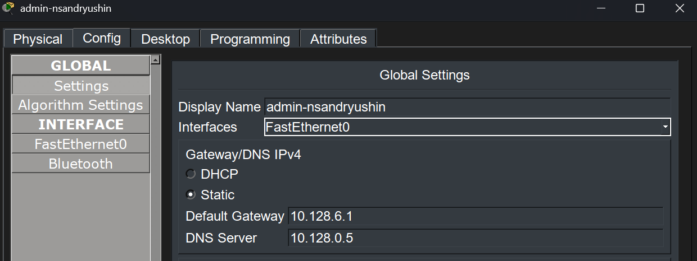
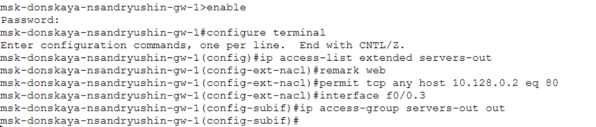
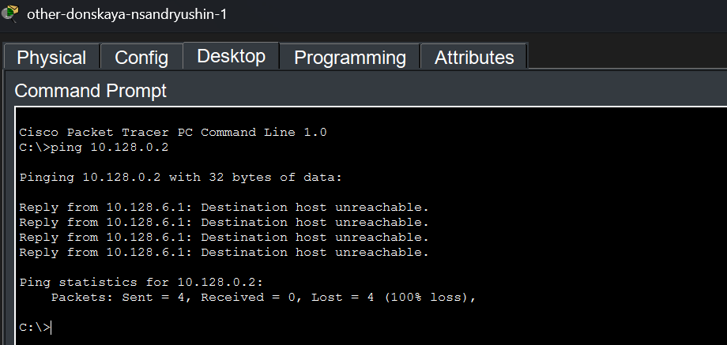
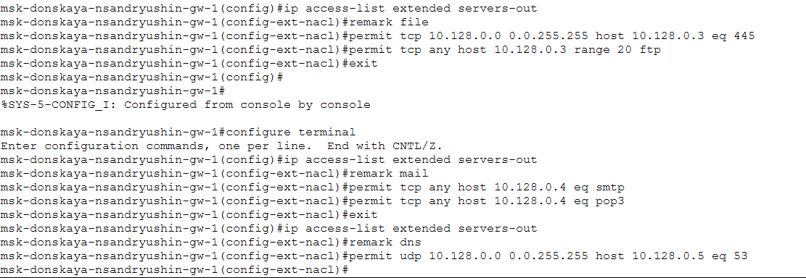
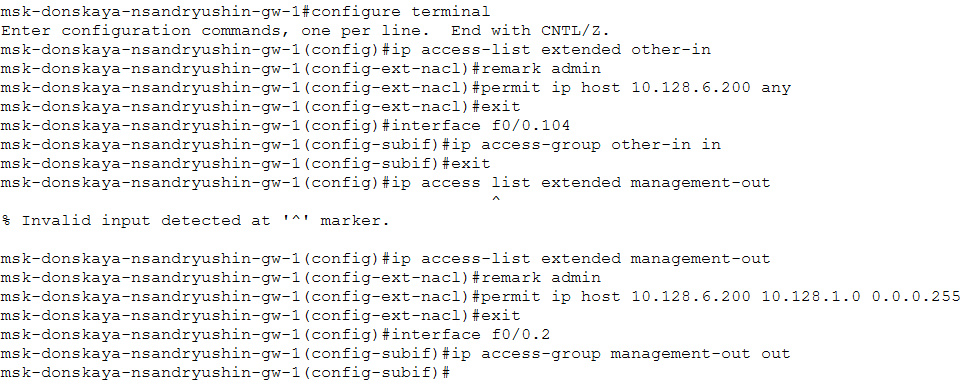
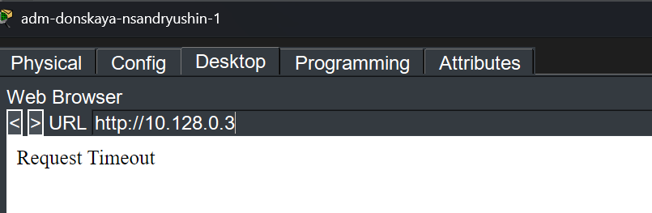
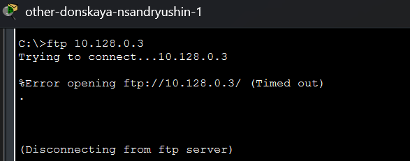
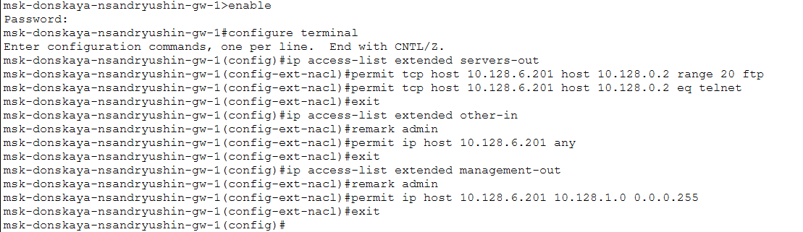

---
## Author
author:
  name: Андрюшин Никита Сергеевич

## Title
title: "Лабораторная работа"
subtitle: "Номер 10"
license: "CC BY"
---

# Цель работы

Освоить настройку прав доступа пользователей к ресурсам сети

# Выполнение лабораторной работы

В соответствии с заданием, вначале мы подключаем ноутбук администратора к сети, как показано на схеме (рис. -@fig-001).

{#fig-001}

Далее мы настраиваем для ноутбука администратора `admin-nsandryushin` статический IP-адрес `10.128.6.200` (рис. -@fig-002).

{#fig-002}

Затем мы указываем адрес шлюза по умолчанию `10.128.6.1` и адрес DNS-сервера `10.128.0.5` (рис. -@fig-003).

{#fig-003}

После этого мы переходим к настройке списков контроля доступа (ACL) на маршрутизаторе `msk-donskaya-nsandryushin-gw-1`. Мы создаём расширенный ACL с именем `servers-out` и добавляем правило, разрешающее всем пользователям доступ по протоколу HTTP (порт 80) к web-серверу с адресом `10.128.0.2`. Данный список доступа мы применяем к исходящему трафику на подинтерфейсе `f0/0.3` (рис. -@fig-004).

{#fig-004}

Чтобы проверить корректность созданного правила, мы с компьютера `other-donskaya-nsandryushin-1` открываем в браузере страницу web-сервера по его IP-адресу `10.128.0.2`. Убеждаемся, что доступ есть (рис. -@fig-005).

{#fig-005}

При этом, из-за неявного правила `deny ip any any` в конце списка доступа, другие протоколы, например ICMP, должны блокироваться. Мы проверяем это, выполнив команду `ping` на адрес web-сервера `10.128.0.2`. Команда завершается неудачно, что подтверждает наши предположения (рис. -@fig-006).

{#fig-006}

Далее мы дополняем список `servers-out` правилами, разрешающими доступ для администратора (`10.128.6.200`) к web-серверу (`10.128.0.2`) по протоколам FTP и Telnet (рис. -@fig-007).

{#fig-007}

Проверяем работу добавленных правил. С ноутбука администратора `admin-nsandryushin` мы успешно подключаемся к web-серверу по протоколу FTP (рис. -@fig-008).

{#fig-008}

Чтобы убедиться, что доступ по FTP есть только у администратора, мы пробуем подключиться к серверу с другого компьютера, `dep-donskaya-nsandryushin-1`. Как и ожидалось, попытка подключения не удаётся (рис. -@fig-009).

{#fig-009}

В завершение мы добавляем в список `servers-out` остальные необходимые правила: разрешаем доступ к файловому серверу (`10.128.0.3`) по SMB из внутренней сети и по FTP для всех; разрешаем доступ к почтовому серверу (`10.128.0.4`) по POP3 и SMTP для всех; разрешаем доступ к DNS-серверу (`10.128.0.5`) по UDP из внутренней сети (рис. -@fig-010).

{#fig-010}

На узле other-donskaya-nsandryushin-1 откроем Web Browser и проверим доступ к web-серверу по доменному имени http://www.donskaya.rudn.ru. Убедимся, что страница Cisco Packet Tracer успешно загружается. Это подтверждает корректную настройку ACL servers-out на маршрутизаторе msk-donskaya-nsandryushin-gw-1 и разрешение доступа к web-серверу 10.128.0.2 по протоколу HTTP (TCP-порт 80), а также корректную работу DNS-сервера 10.128.0.5 (рис. [-@fig-011])

{#fig-011}

На маршрутизаторе msk-donskaya-nsandryushin-gw-1 выполним команду show access-lists и посмотрим содержимое расширенного списка доступа servers-out. Убедимся, что в начале списка добавлено правило 1 permit icmp any any, далее разрешения для web-сервера 10.128.0.2 (eq www), FTP и Telnet для администратора 10.128.6.200, правила для файлового сервера 10.128.0.3 (порт 445 и FTP), почтового сервера 10.128.0.4 (SMTP и POP3) и DNS-сервера 10.128.0.5 (UDP 53). По счётчикам совпадений проверим, что правила действительно отрабатывают (рис. [-@fig-012])

{#fig-012}

Далее настроим список доступа other-in и management-out на маршрутизаторе msk-donskaya-nsandryushin-gw-1. В ACL other-in разрешим узлу администратора 10.128.6.200 любые действия (permit ip host 10.128.6.200 any) и применим список к интерфейсу f0/0.104 во входящем направлении. Затем создадим ACL management-out, разрешающий администратору доступ к сети управления 10.128.1.0/24, и применим его к интерфейсу f0/0.2 в исходящем направлении (рис. [-@fig-013])

{#fig-013}

С узла adm-donskaya-nsandryushin-1 проверим доступ к файловому серверу 10.128.0.3 по протоколу FTP. Выполним команду ftp 10.128.0.3, введём имя пользователя cisco и пароль cisco и убедимся, что соединение установлено (код 230 Logged in). Это подтверждает корректность правила permit tcp any host 10.128.0.3 range 20 ftp в списке servers-out (рис. [-@fig-014])

{#fig-014}

Попробуем с того же узла adm-donskaya-nsandryushin-1 открыть в браузере адрес http://10.128.0.3. Получим сообщение Request Timeout, что подтверждает отсутствие разрешения HTTP-доступа к файловому серверу 10.128.0.3 и корректную фильтрацию трафика ACL (рис. [-@fig-015])

{#fig-015}

Далее с узла adm-donskaya-nsandryushin-1 попробуем подключиться по FTP к устройству в сети управления 10.128.1.2. Соединение не устанавливается (Timed out), что подтверждает, что доступ к сети 10.128.1.0/24 ограничен и разрешён только в соответствии с правилами management-out (рис. [-@fig-016])

{#fig-016}

С узла other-donskaya-nsandryushin-1 выполним попытку FTP-подключения к файловому серверу 10.128.0.3. Получим сообщение Timed out, что подтверждает действие ограничений для сети Other и корректную работу ACL other-in, запрещающего любые обращения за пределы сети, кроме узла администратора (рис. [-@fig-017])

{#fig-017}

С ноутбука администратора admin-nsandryushin (IP-адрес 10.128.6.200) проверим доступ к устройству сети управления 10.128.1.2 по FTP. Соединение устанавливается на уровне протокола (Ftp peer reset), что подтверждает, что трафик от администратора не блокируется ACL management-out и достигает узла назначения (рис. [-@fig-018])

{#fig-018}

В рамках самостоятельной работы добавим правила для администратора на Павловской с IP-адресом 10.128.6.201. На маршрутизаторе msk-donskaya-nsandryushin-gw-1 расширим ACL servers-out, other-in и management-out, разрешив хосту 10.128.6.201 доступ по FTP и Telnet к серверу 10.128.0.2, любые действия в ACL other-in и доступ к сети управления 10.128.1.0/24. Тем самым обеспечим аналогичные права администратора для узла на Павловской (рис. [-@fig-019])

{#fig-019}

# Выводы

В результате выполнения лабораторной работы были получены навыки составления и работы с ACL в сети