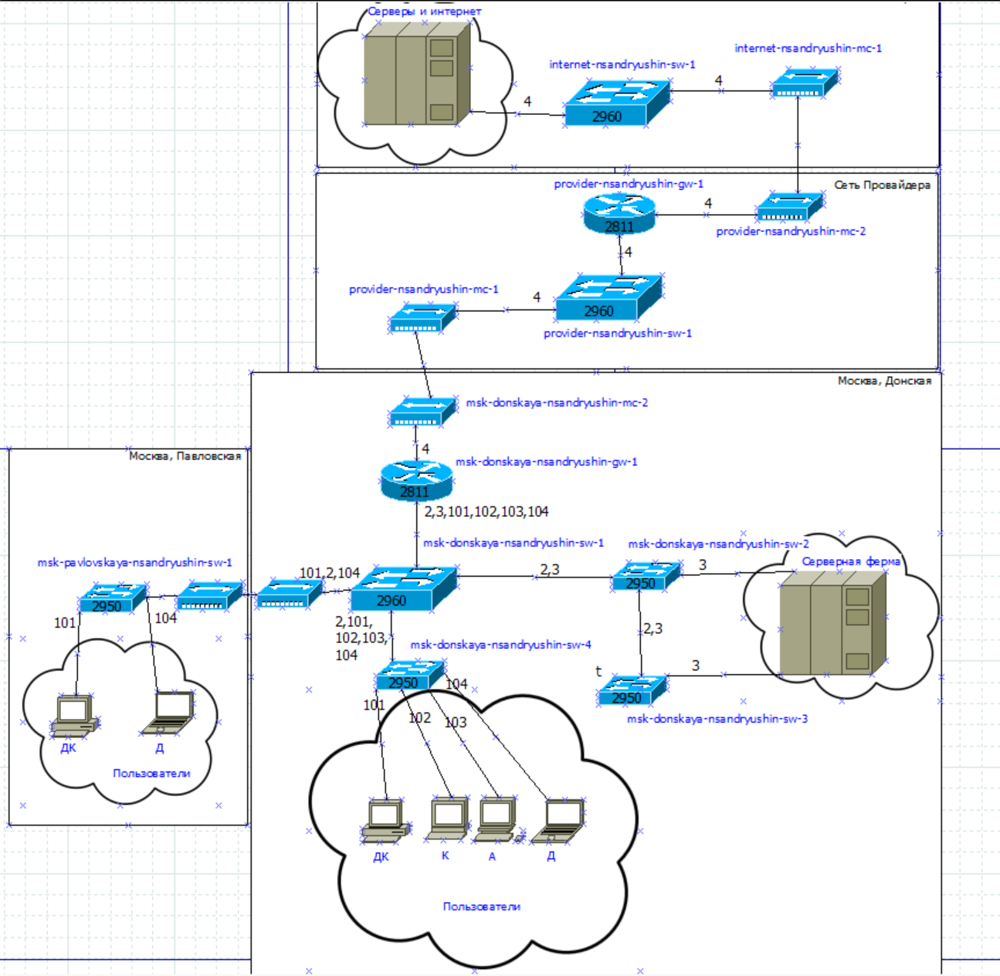
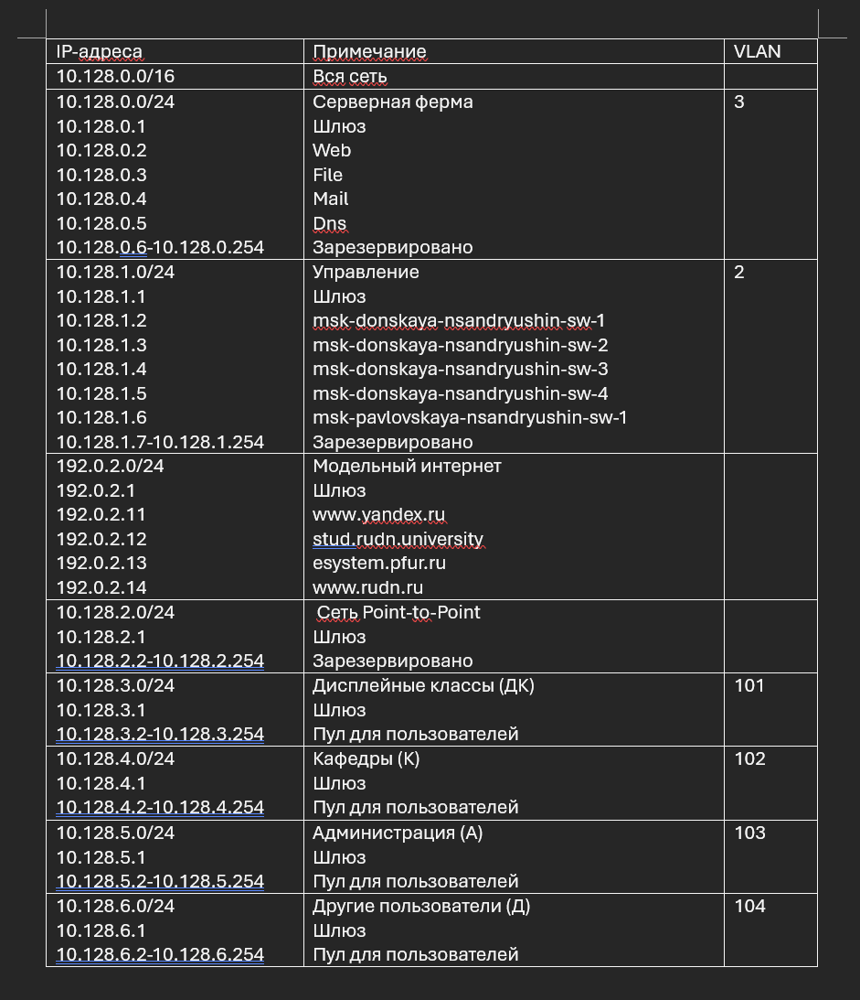
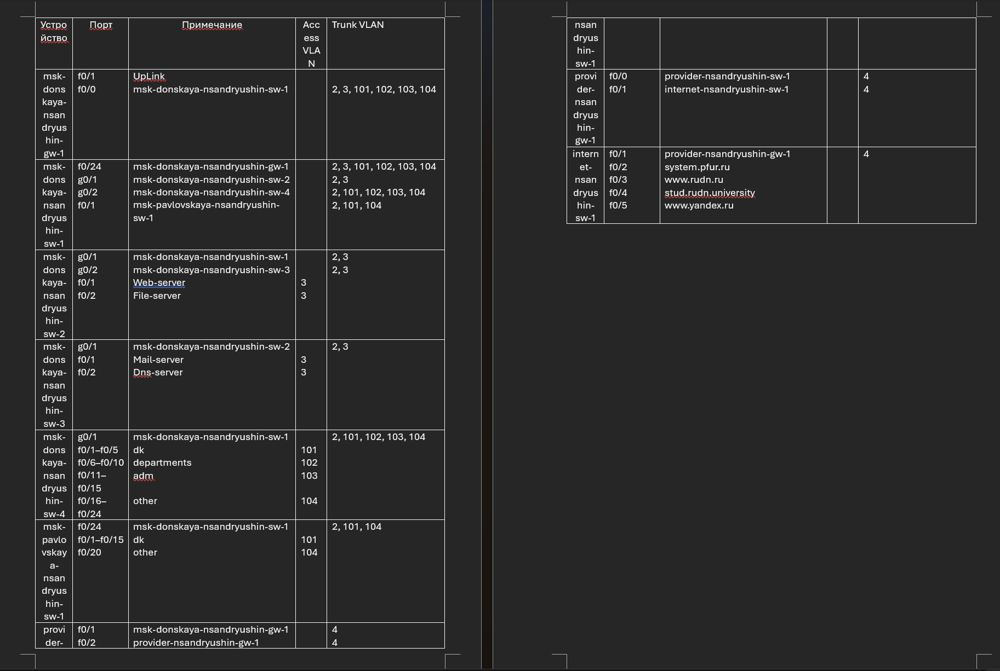
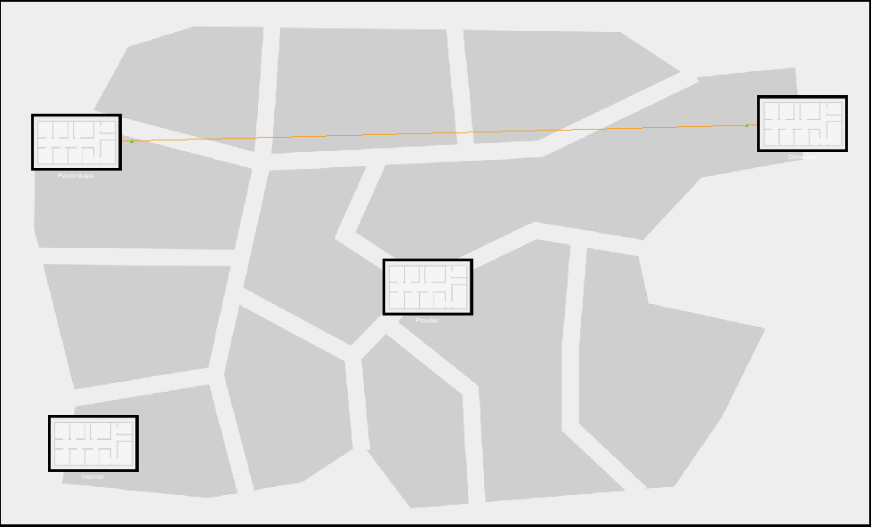
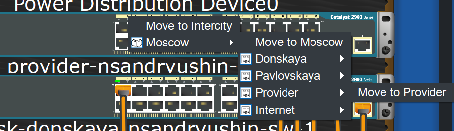
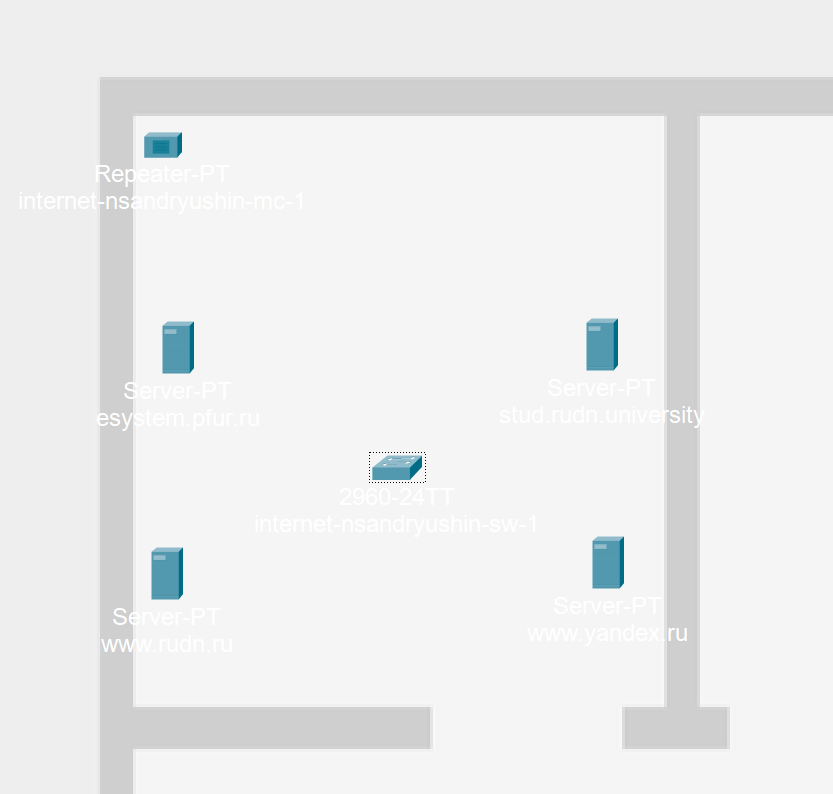
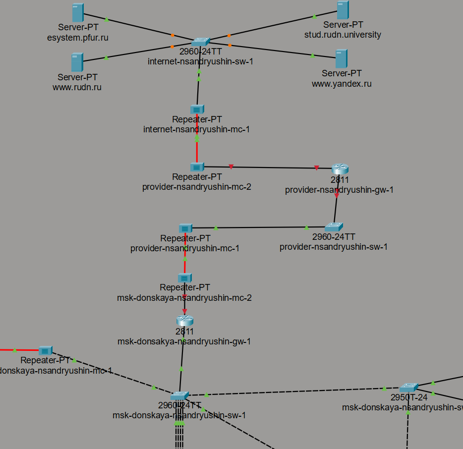
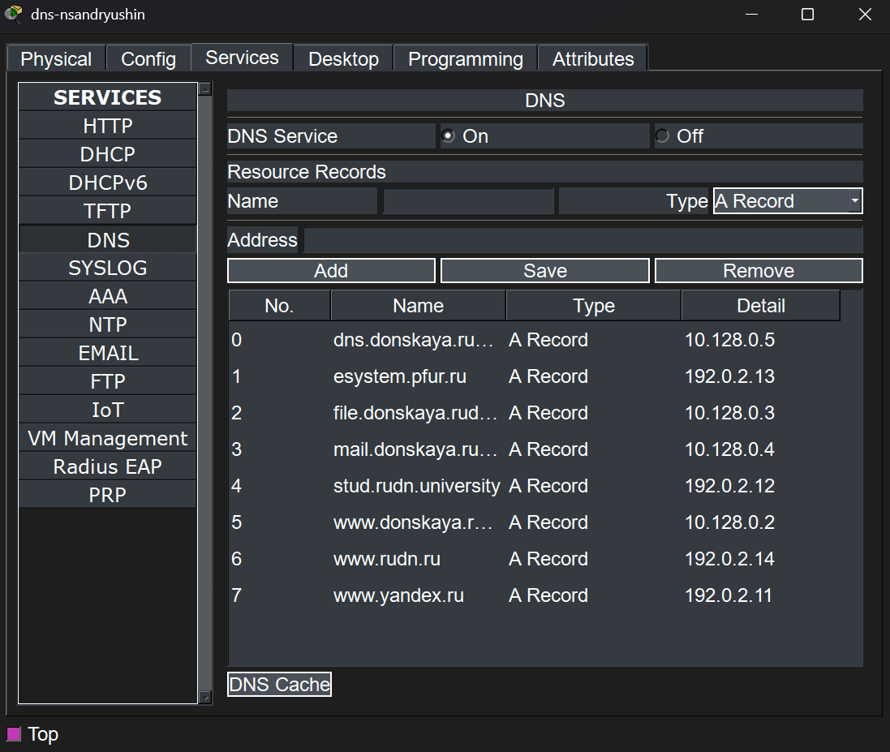

---
## Author
author:
  name: Андрюшин Никита Сергеевич
## Title
title: Лабораторная работа
subtitle: Номер 11
license: CC BY
date: today
date-format: "YYYY-MM-DD" # Example: 2025-09-06
---

# Информация

## Докладчик

:::::::::::::: {.columns align=center height=70%}
::: {.column width="70%" height=70%}

  * Андрюшин Никита Сергеевич
  * Студент
  * Российский университет дружбы народов им. П. Лумумбы

:::
::: {.column width="30%" height=70%}

:::
::::::::::::::

## Цель работы

Провести подготовительные мероприятия по подключению локальной сети организации к Интернету

# Выполнение лабораторной работы

## Схема L1 сети с добавленными сетью провайдера и сетью модельного Интернета

{height=60%}

## Схема L2 сети с указанием VLAN для сети провайдера и модельного Интернета

{height=60%}

## Схема L3 сети с указанием IP-адресов подсетей и маршрутизаторов

{height=60%}

## Таблица распределения VLAN

{height=60%}

## Таблица распределения IP-адресов с учётом сети провайдера и модельного Интернета

{height=60%}

## Таблица распределения портов подключения оборудования

{height=60%}

## Логическая схема сети в Cisco Packet Tracer с добавленным оборудованием провайдера и модельного Интернета

{height=60%}

## Физическая рабочая область Cisco Packet Tracer с добавленными зданиями провайдера и модельного Интернета

{height=60%}

## Перемещение оборудования провайдера в здание Provider в физической рабочей области

{height=60%}

## Оборудование в здании сети провайдера

{height=60%}

## Оборудование в здании модельной сети Интернет

{height=60%}

## Настройка модулей медиаконвертера msk-donskaya-nsandryushin-mc-2

{height=60%}

## Логическая схема соединения сети провайдера, модельного Интернета и сети Донская

{height=60%}

## Назначение IP-адреса 192.0.2.11 серверу www.yandex.ru

{height=60%}

## DNS-записи на сервере dns-nsandryushin сети Донская

{height=60%}

## Выводы

В результате выполнения лабораторной работы была проведена подготовка для реализации подключения локальной сети к сети интернет