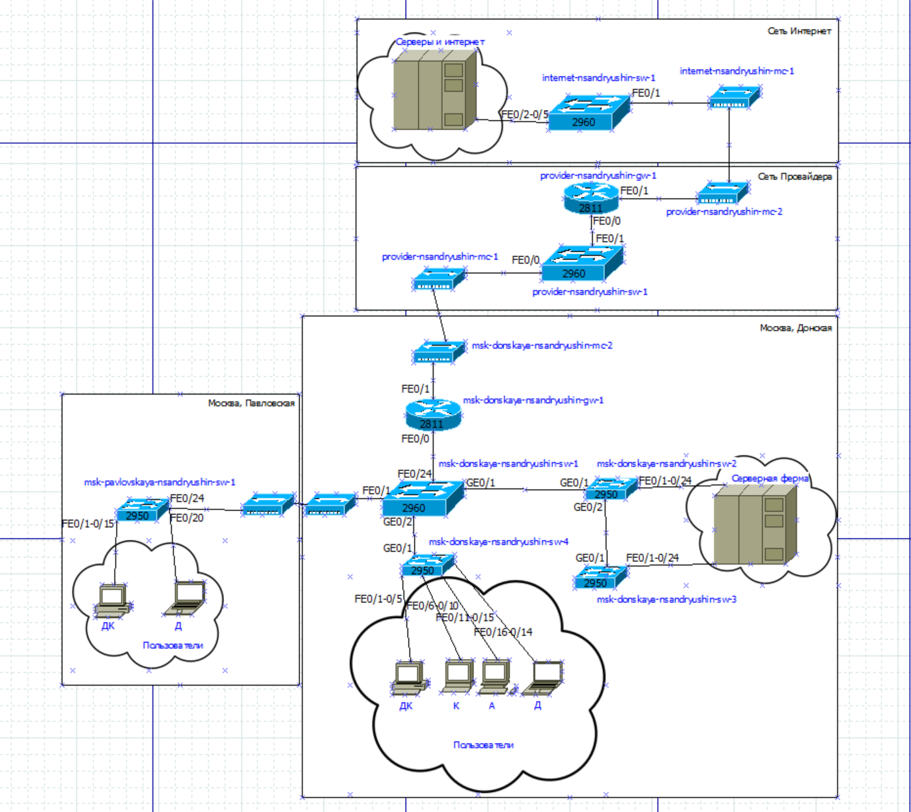
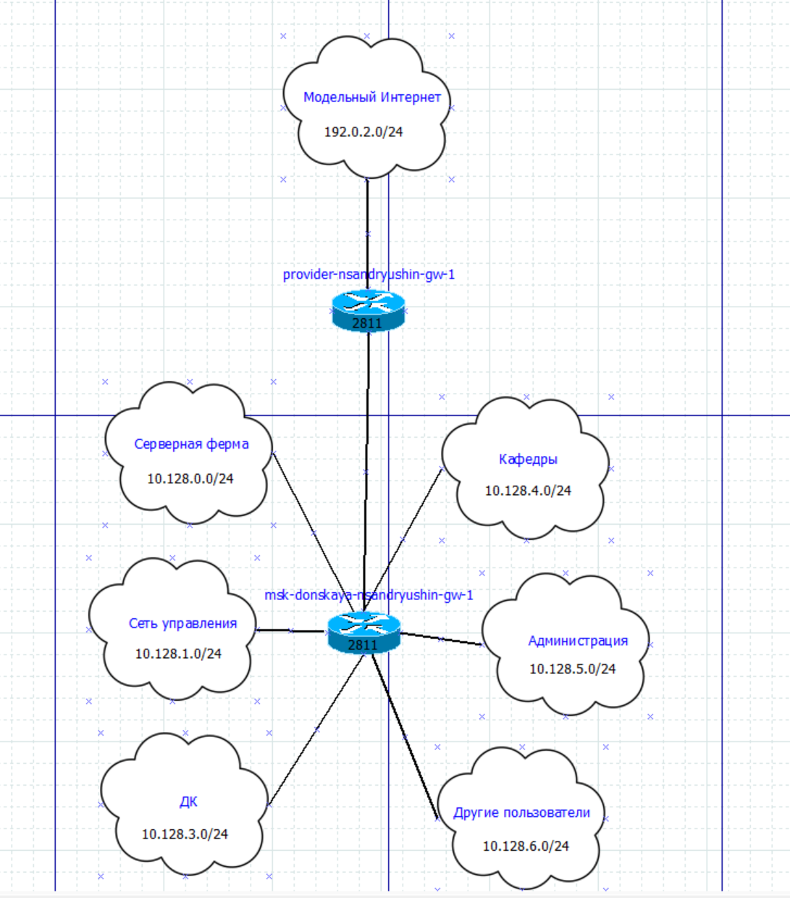
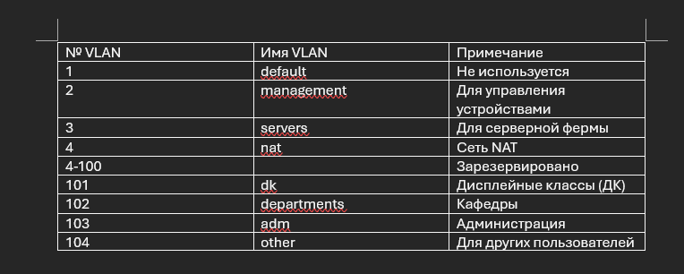
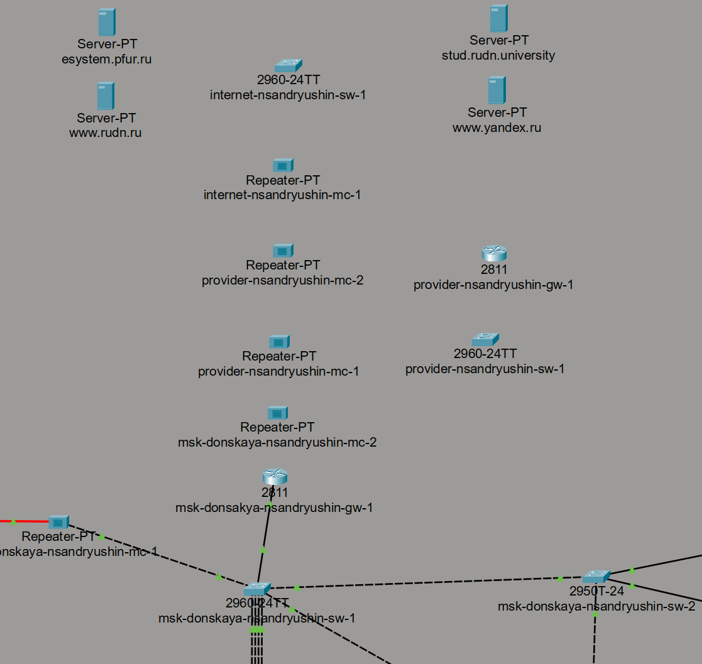
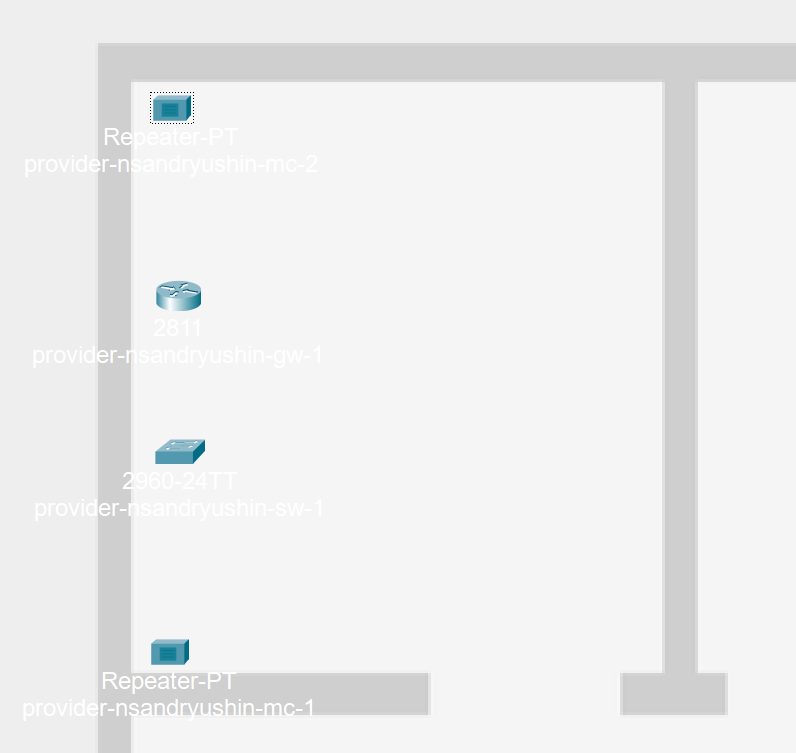
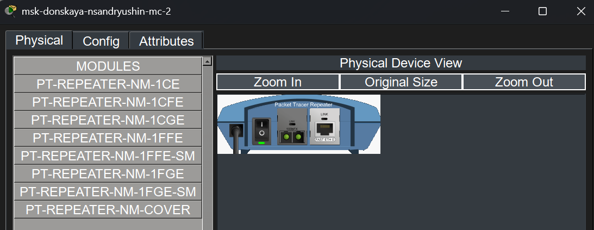
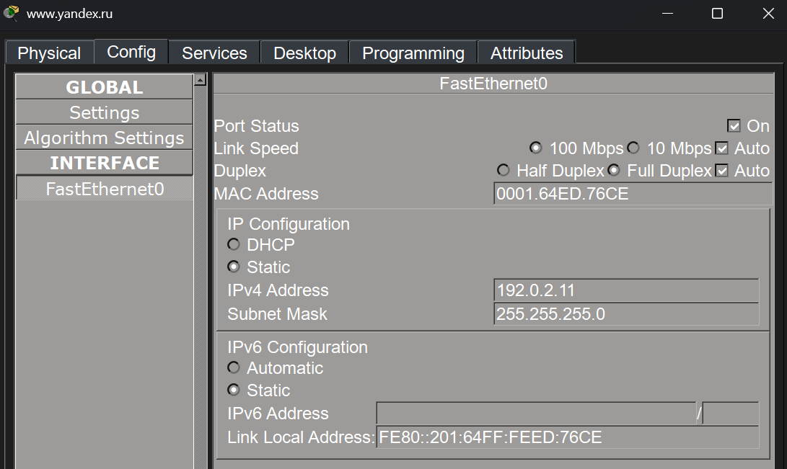

---
## Author
author:
  name: Андрюшин Никита Сергеевич

## Title
title: "Лабораторная работа"
subtitle: "Номер 11"
license: "CC BY"
---

# Цель работы

Провести подготовительные мероприятия по подключению локальной сети организации к Интернету

# Выполнение лабораторной работы

Рассмотрим схему L1 сети, в которую были внесены изменения: добавлены сеть провайдера и сеть модельного Интернета. На схеме видно, что сеть «Москва, Донская» через медиаконвертер msk-donskaya-nsandryushin-mc-2 соединяется с сетью провайдера, в которой располагаются маршрутизатор provider-nsandryushin-gw-1 (Cisco 2811), коммутатор provider-nsandryushin-sw-1 (Cisco 2960-24TT), а также медиаконвертеры provider-nsandryushin-mc-1 и provider-nsandryushin-mc-2. Сеть провайдера, в свою очередь, соединяется с сетью модельного Интернета, где располагаются коммутатор internet-nsandryushin-sw-1 и медиаконвертер internet-nsandryushin-mc-1. Указаны названия портов подключения между устройствами (рис. [-@fig-001]).

{#fig-001}

Посмотрим на схему L2 сети, отражающую распределение VLAN по устройствам. На схеме видно, что между устройствами сети провайдера и модельного Интернета используется VLAN 4 (nat) (рис. [-@fig-002]).

{#fig-002}

Рассмотрим схему L3, отображающую IP-адресацию сети. Маршрутизатор provider-nsandryushin-gw-1 подключён к сети модельного Интернета с адресным пространством 192.0.2.0/24. Маршрутизатор msk-donskaya-nsandryushin-gw-1 обслуживает несколько подсетей: серверную ферму (10.128.0.0/24), сеть управления (10.128.1.0/24), дисплейные классы ДК (10.128.3.0/24), кафедры (10.128.4.0/24), администрацию (10.128.5.0/24) и других пользователей (10.128.6.0/24) (рис. [-@fig-003]).

{#fig-003}

Ознакомимся с таблицей распределения VLAN. В ней зафиксированы следующие изменения VLAN: VLAN 4 (nat) — для сети NAT, то есть для связи с провайдером (рис. [-@fig-004]).

{#fig-004}

Изучим таблицу распределения IP-адресов. Для модельного Интернета выделена подсеть 192.0.2.0/24: шлюз provider-nsandryushin-gw-1 — 192.0.2.1, www.yandex.ru — 192.0.2.11, stud.rudn.university — 192.0.2.12, esystem.pfur.ru — 192.0.2.13, www.rudn.ru — 192.0.2.14 (рис. [-@fig-005]).

{#fig-005}

Рассмотрим таблицу распределения портов оборудования. Убедимся, что для каждого устройства прописаны соответствующие порты и VLAN. Маршрутизатор provider-nsandryushin-gw-1 через порт f0/0 подключён к provider-nsandryushin-sw-1, а через f0/1 — к internet-nsandryushin-sw-1, оба порта в VLAN 4. Коммутатор internet-nsandryushin-sw-1 через порты f0/2–f0/5 подключён к серверам esystem.pfur.ru, www.rudn.ru, stud.rudn.university и www.yandex.ru соответственно (рис. [-@fig-006]).

{#fig-006}

Перейдём к логической схеме проекта в Cisco Packet Tracer. Видим, что в рабочей области размещено оборудование: серверы esystem.pfur.ru, www.rudn.ru, stud.rudn.university и www.yandex.ru; коммутатор internet-nsandryushin-sw-1 (Cisco 2960-24TT); медиаконвертер internet-nsandryushin-mc-1; медиаконвертеры provider-nsandryushin-mc-2 и provider-nsandryushin-mc-1; маршрутизатор provider-nsandryushin-gw-1 (Cisco 2811); коммутатор provider-nsandryushin-sw-1 (Cisco 2960-24TT); медиаконвертер msk-donskaya-nsandryushin-mc-2, а также оборудование сети Донская во главе с маршрутизатором msk-donsakya-nsandryushin-gw-1 и коммутатором msk-donskaya-nsandryushin-sw-1 (рис. [-@fig-007]).

{#fig-007}

Посмотрим на физическую рабочую область Cisco Packet Tracer. Убедимся, что в физической топологии добавлены новые здания: Павловская, центральное здание Донская, а также здания Провайдер и Интернет (рис. [-@fig-008]).

{#fig-008}

Рассмотрим процесс перемещения оборудования в соответствующие здания физической рабочей области. На скриншоте видно контекстное меню, в котором для коммутатора provider-nsandryushin-sw-1 выбирается пункт перемещения: Move to Moscow -> Provider, что позволяет разместить устройство в здании провайдера. Аналогичным образом оборудование модельного Интернета перемещается в соответствующее здание Internet (рис. [-@fig-009]).

{#fig-009}

Разместим оборудование сети провайдера в физической рабочей области Packet Tracer. В здании провайдера расположим два медиаконвертера provider-nsandryushin-mc-1 и provider-nsandryushin-mc-2, маршрутизатор типа Cisco 2811 с именем provider-nsandryushin-gw-1, а также коммутатор типа Cisco 2960-24TT с именем provider-nsandryushin-sw-1 (рис. [-@fig-010]).

{#fig-010}

Разместим оборудование модельной сети Интернет в отдельном здании физической рабочей области. В здании расположим медиаконвертер internet-nsandryushin-mc-1, коммутатор типа Cisco 2960-24TT с именем internet-nsandryushin-sw-1, а также четыре сервера: esystem.pfur.ru, stud.rudn.university, www.rudn.ru и www.yandex.ru (рис. [-@fig-011]).

{#fig-011}

Настроим модули медиаконвертеров. Заменим стандартные модули на PT-REPEATER-NM-1CFE для подключения по оптоволокну и PT-REPEATER-NM-1FFE для подключения витой парой по технологии Fast Ethernet. На скриншоте видно физическое представление устройства с установленными модулями (рис. [-@fig-012]).

{#fig-012}

Убедимся в корректности логической схемы сети. Соединим оборудование согласно схеме L1: серверы esystem.pfur.ru, stud.rudn.university, www.rudn.ru и www.yandex.ru подключены к коммутатору internet-nsandryushin-sw-1, который соединён с медиаконвертером internet-nsandryushin-mc-1. Далее по оптическому каналу связь идёт до provider-nsandryushin-mc-2, который соединён с маршрутизатором provider-nsandryushin-gw-1 и коммутатором provider-nsandryushin-sw-1. Нижний уровень схемы представлен медиаконвертером provider-nsandryushin-mc-1, связанным с медиаконвертером msk-donskaya-nsandryushin-mc-2, за которым находится маршрутизатор msk-donsakya-nsandryushin-gw-1 и коммутатор msk-donskaya-nsandryushin-sw-1 сети «Донская» (рис. [-@fig-013]).

{#fig-013}

Пропишем IP-адреса серверам модельной сети Интернет согласно таблице распределения адресов. Откроем настройки сервера www.yandex.ru и на вкладке Config в разделе Interface — FastEthernet0 укажем статический IPv4-адрес 192.0.2.11 с маской подсети 255.255.255.0 (рис. [-@fig-014]).

{#fig-014}

Пропишем сведения о серверах модельной сети Интернет на DNS-сервере dns-nsandryushin сети Донская. Добавим A-записи для всех серверов: esystem.pfur.ru — 192.0.2.13, stud.rudn.university — 192.0.2.12, www.rudn.ru — 192.0.2.14, www.yandex.ru — 192.0.2.11. Также убедимся, что ранее добавленные записи для внутренних серверов сети «Донская» сохранены: dns.donskaya.ru... — 10.128.0.5, file.donskaya.rud... — 10.128.0.3, mail.donskaya.ru... — 10.128.0.4, www.donskaya.r... — 10.128.0.2 (рис. [-@fig-015]).

{#fig-015}

# Выводы

В результате выполнения лабораторной работы была проведена подготовка для реализации подключения локальной сети к сети интернет