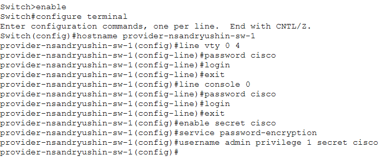
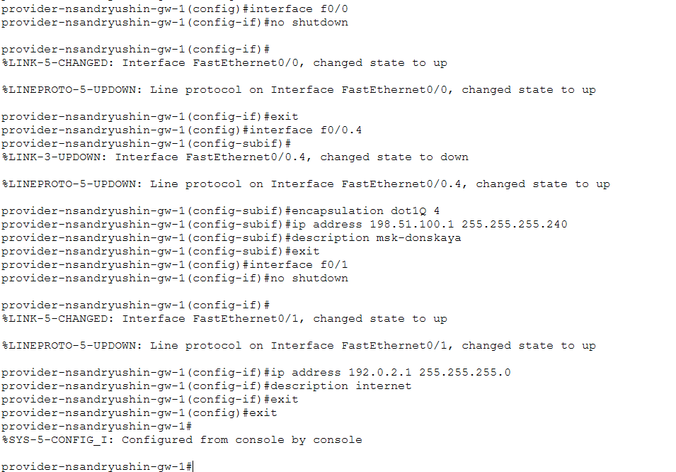
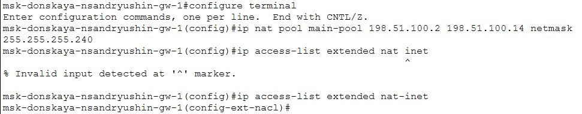
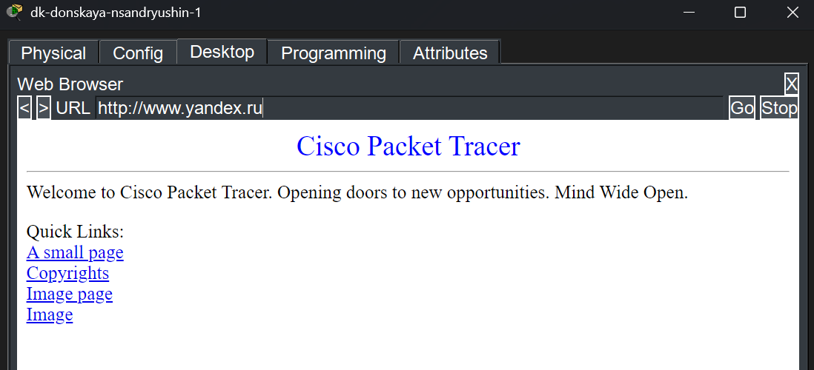
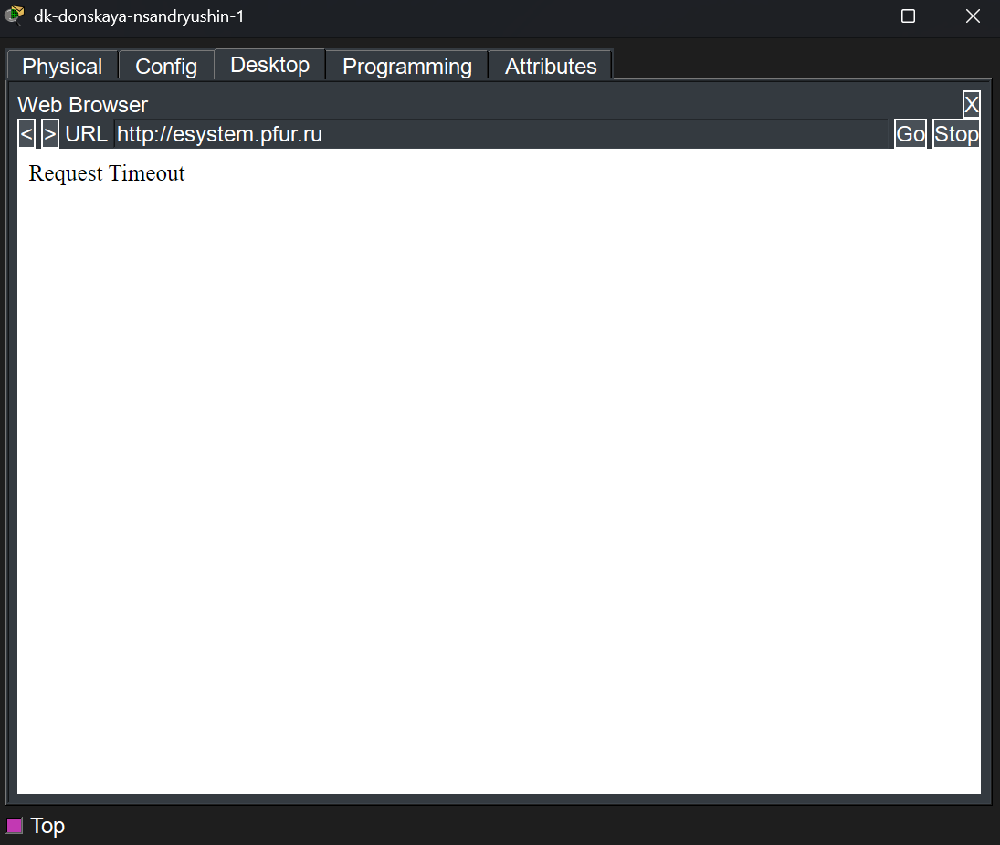
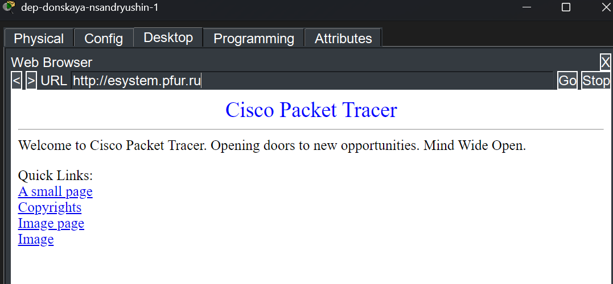

---
## Author
author:
  name: Андрюшин Никита Сергеевич
## Title
title: Лабораторная работа
subtitle: Номер 12
license: CC BY
date: today
date-format: "YYYY-MM-DD" # Example: 2025-09-06
---

# Информация

## Докладчик

:::::::::::::: {.columns align=center height=70%}
::: {.column width="70%" height=70%}

  * Андрюшин Никита Сергеевич
  * Студент
  * Российский университет дружбы народов им. П. Лумумбы

:::
::: {.column width="30%" height=70%}

:::
::::::::::::::

## Цель работы

Приобретение практических навыков по настройке доступа локальной сети к внешней сети посредством NAT

# Выполнение лабораторной работы

## Первоначальная настройка маршрутизатора provider-nsandryushin-gw-1

{height=70%}

## Первоначальная настройка коммутатора provider-nsandryushin-sw-1

{height=70%}

## Настройка интерфейсов маршрутизатора provider-nsandryushin-gw-1

{height=70%}

## Настройка интерфейсов коммутатора provider-nsandryushin-sw-1

{height=70%}

## Настройка интерфейсов и маршрута по умолчанию на msk-donskaya-nsandryushin-gw-1

{height=70%}

## Настройка пула адресов NAT и создание списка доступа nat-inet на msk-donskaya-nsandryushin-gw-1

{height=70%}

## Настройка правил списка доступа nat-inet на msk-donskaya-nsandryushin-gw-1

{height=70%}

## Настройка PAT и назначение направлений NAT на интерфейсах msk-donskaya-nsandryushin-gw-1

{height=60%}

## Настройка статических преобразований NAT на msk-donskaya-nsandryushin-gw-1

{height=70%}

## Успешный доступ с dk-donskaya-nsandryushin-1 к www.yandex.ru

{height=70%}

## Блокировка доступа с dk-donskaya-nsandryushin-1 к esystem.pfur.ru

{height=70%}

## Успешный доступ с dep-donskaya-nsandryushin-1 к esystem.pfur.ru

{height=70%}

## Блокировка доступа с dep-donskaya-nsandryushin-1 к www.yandex.ru

{height=70%}

## Выводы

В результате выполнения лабораторной работы были получены навыки настройки NAT