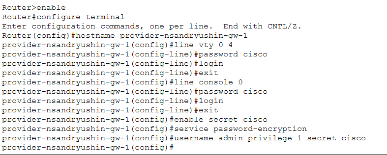
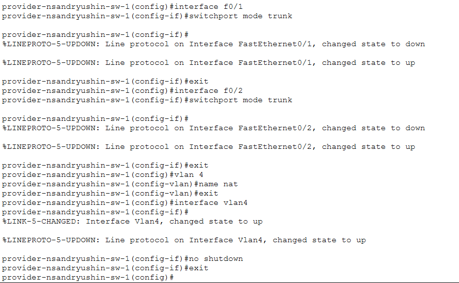
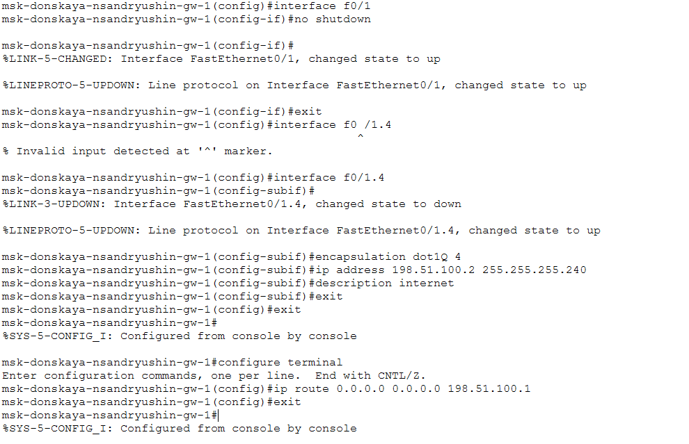
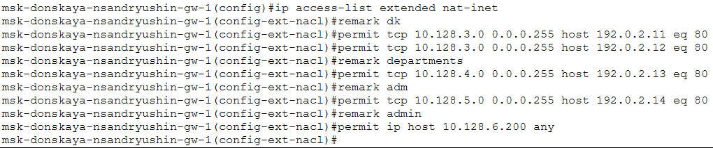
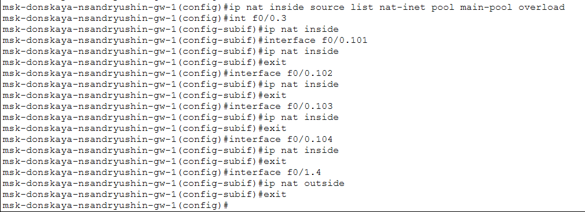
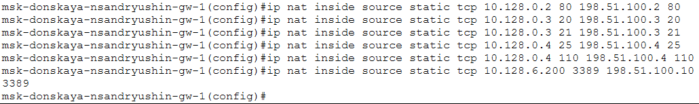
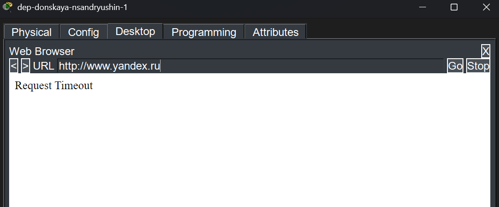

---
## Author
author:
  name: Андрюшин Никита Сергеевич

## Title
title: "Лабораторная работа"
subtitle: "Номер 12"
license: "CC BY"
---

# Цель работы

Приобретение практических навыков по настройке доступа локальной сети к внешней сети посредством NAT

# Выполнение лабораторной работы

Выполним первоначальную настройку маршрутизатора provider-nsandryushin-gw-1: зададим имя устройства, настроим доступ по паролю через линии vty 0–4 и console 0 (пароль cisco), установим секретный пароль enable, включим шифрование паролей и создадим пользователя admin (рис. [-@fig-001]).

{#fig-001}

Выполним первоначальную настройку коммутатора provider-nsandryushin-sw-1: зададим имя устройства, настроим доступ по паролю через линии vty 0–4 и console 0 (пароль cisco), установим секретный пароль enable, включим шифрование паролей и создадим пользователя admin (рис. [-@fig-002]).

{#fig-002}

Настроим интерфейсы маршрутизатора provider-nsandryushin-gw-1: поднимем физический интерфейс f0/0, создадим субинтерфейс f0/0.4 с инкапсуляцией dot1Q для VLAN 4 и назначим ему адрес 198.51.100.1/28 с описанием msk-donskaya, а также поднимем интерфейс f0/1 и назначим ему адрес 192.0.2.1/24 с описанием internet (рис. [-@fig-003]).

{#fig-003}

Настроим интерфейсы коммутатора provider-nsandryushin-sw-1: переведём порты f0/1 и f0/2 в режим trunk, создадим VLAN 4 с именем nat и поднимем интерфейс vlan4 (рис. [-@fig-004]).

{#fig-004}

Настроим интерфейсы маршрутизатора msk-donskaya-nsandryushin-gw-1 для подключения к сети провайдера: поднимем физический интерфейс f0/1, создадим субинтерфейс f0/1.4 с инкапсуляцией dot1Q для VLAN 4 и назначим ему адрес 198.51.100.2/28 с описанием internet, после чего добавим маршрут по умолчанию 0.0.0.0/0 через шлюз провайдера 198.51.100.1 (рис. [-@fig-005]).

{#fig-005}

Настроим пул адресов для NAT на маршрутизаторе msk-donskaya-nsandryushin-gw-1: создадим пул main-pool в диапазоне 198.51.100.2–198.51.100.14 с маской 255.255.255.240. Также создадим расширенный список доступа nat-inet (при первой попытке ввода команды с пробелом в имени была допущена ошибка, которую исправим корректным написанием) (рис. [-@fig-006]).

{#fig-006}

Заполним расширенный список доступа nat-inet на маршрутизаторе msk-donskaya-nsandryushin-gw-1 правилами для каждой подсети: разрешим хостам сети дисплейных классов (10.128.3.0/24) доступ по порту 80 к узлам 192.0.2.11 и 192.0.2.12, хостам сети кафедр (10.128.4.0/24) — к узлу 192.0.2.13 по порту 80, хостам сети администрации (10.128.5.0/24) — к узлу 192.0.2.14 по порту 80, а компьютеру администратора (10.128.6.200) предоставим полный доступ во внешнюю сеть (рис. [-@fig-007]).

{#fig-007}

Настроим PAT на маршрутизаторе msk-donskaya-nsandryushin-gw-1: привяжем список доступа nat-inet к пулу main-pool с ключевым словом overload, затем пометим внутренние субинтерфейсы f0/0.3, f0/0.101, f0/0.102, f0/0.103 и f0/0.104 как ip nat inside, а внешний субинтерфейс f0/1.4 — как ip nat outside (рис. [-@fig-008]).

{#fig-008}

Настроим статические преобразования NAT на маршрутизаторе msk-donskaya-nsandryushin-gw-1 для доступа из внешней сети: пробросим порт 80 WEB-сервера (10.128.0.2) на адрес 198.51.100.2, порты 20 и 21 файлового сервера (10.128.0.3) на адрес 198.51.100.3, порты 25 и 110 почтового сервера (10.128.0.4) на адрес 198.51.100.4, а также порт 3389 компьютера администратора (10.128.6.200) на адрес 198.51.100.10 для доступа по протоколу RDP (рис. [-@fig-009]).

{#fig-009}

Проверим корректность настроек NAT для сети дисплейных классов. Откроем веб-браузер на устройстве dk-donskaya-nsandryushin-1 и убедимся, что доступ к сайту www.yandex.ru (192.0.2.11) по порту 80 успешно разрешён — страница загружается корректно, что подтверждает правильность настроенного правила ACL для VLAN 101 (рис. [-@fig-010]).

{#fig-010}

Также проверим, что устройство dk-donskaya-nsandryushin-1 из сети дисплейных классов не имеет доступа к сайтам, не входящим в список разрешённых. При попытке открыть http://esystem.pfur.ru (192.0.2.13) получаем ответ Request Timeout, что подтверждает корректную блокировку трафика от сети VLAN 101 к данному ресурсу (рис. [-@fig-011]).

{#fig-011}

Перейдём к проверке настроек для сети кафедр. На устройстве dep-donskaya-nsandryushin-1 из VLAN 102 откроем браузер и попробуем открыть http://esystem.pfur.ru (192.0.2.13). Страница успешно загружается, что подтверждает корректную настройку правила ACL, разрешающего пользователям сети кафедр доступ к образовательному сайту esystem.pfur.ru (рис. [-@fig-012]).

{#fig-012}

Наконец, убедимся, что устройство dep-donskaya-nsandryushin-1 из сети кафедр не имеет доступа к ресурсам, выходящим за пределы разрешённого списка. При попытке открыть http://www.yandex.ru (192.0.2.11) браузер возвращает Request Timeout, что подтверждает правильную работу ограничений ACL для VLAN 102 — доступ к данному сайту для кафедр не разрешён (рис. [-@fig-013]).

{#fig-013}

# Выводы

В результате выполнения лабораторной работы были получены навыки настройки NAT