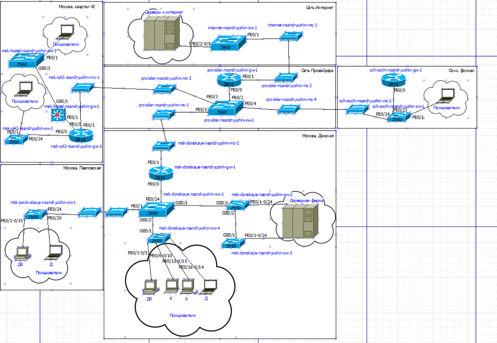
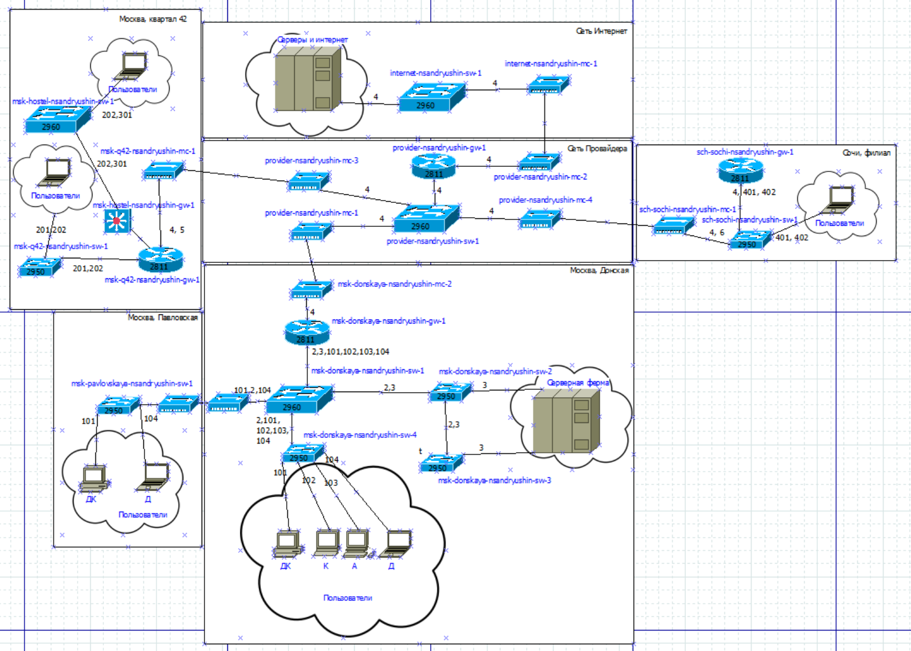
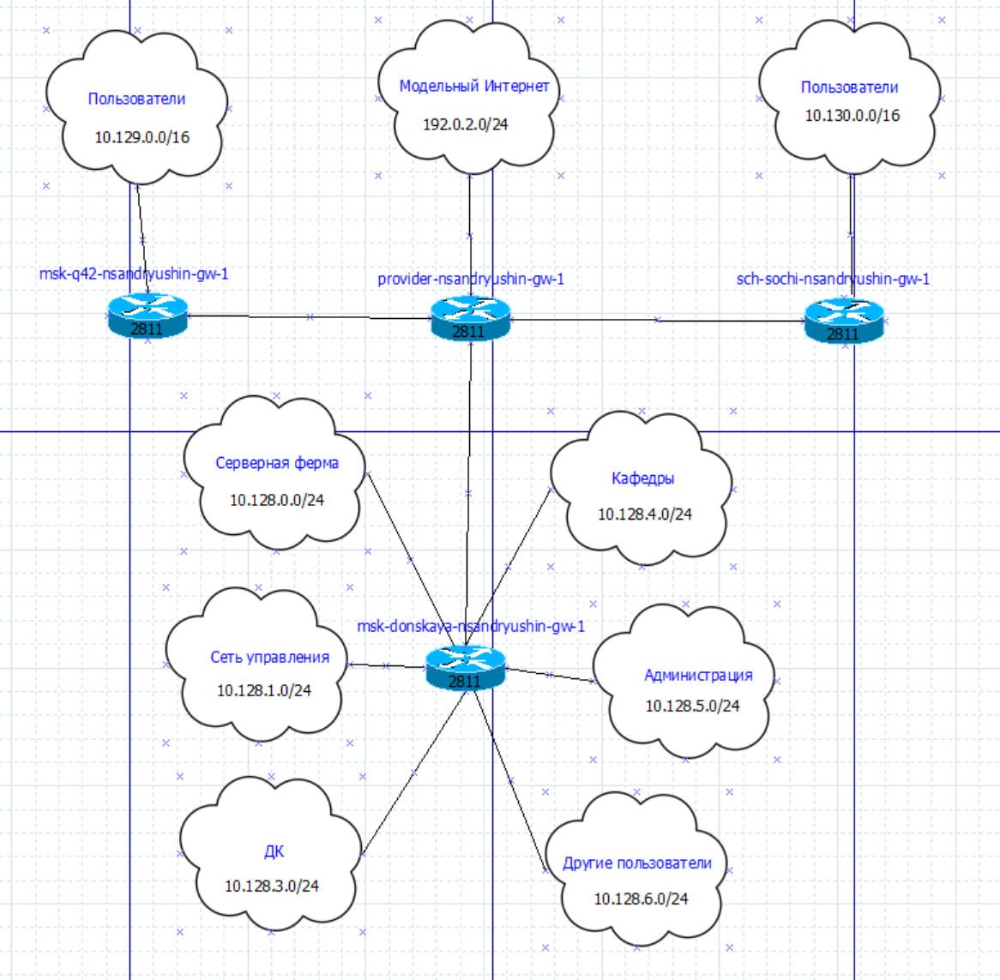
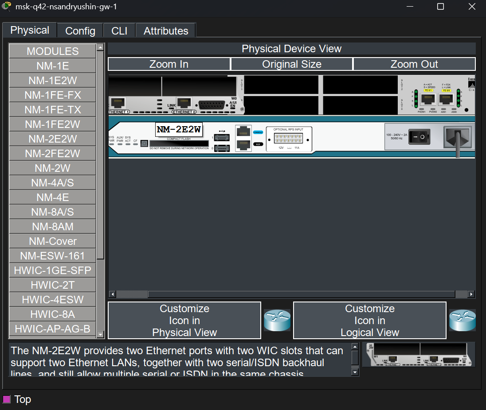
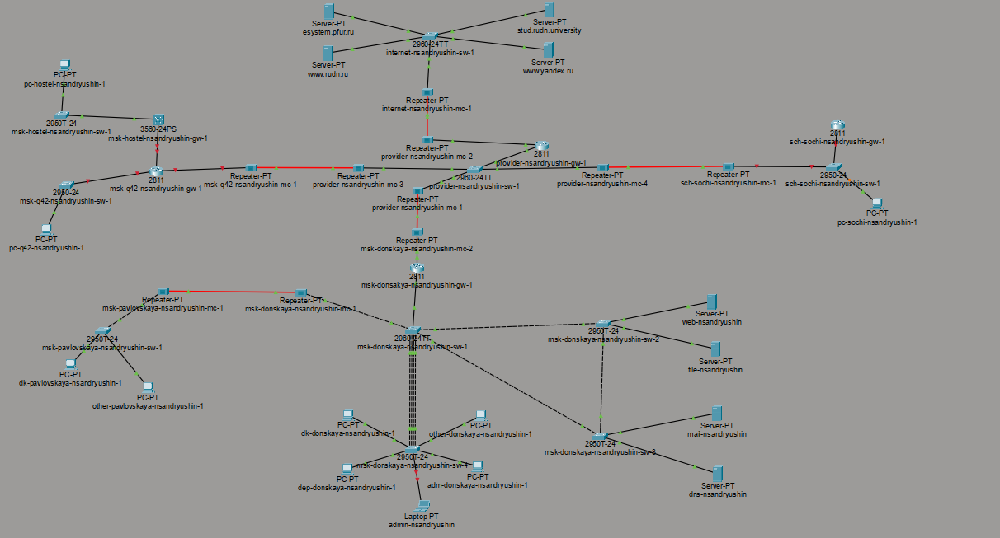
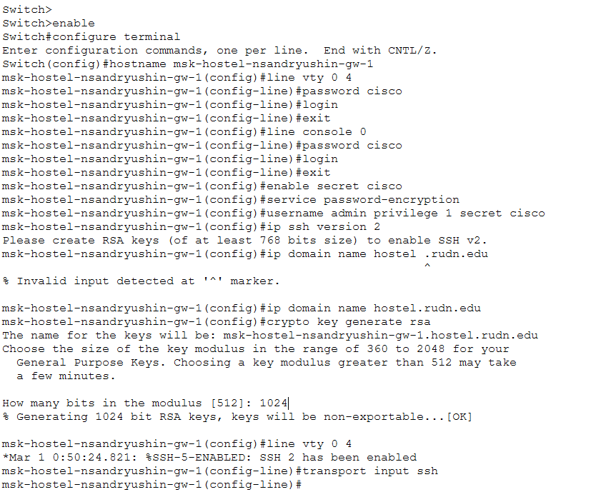
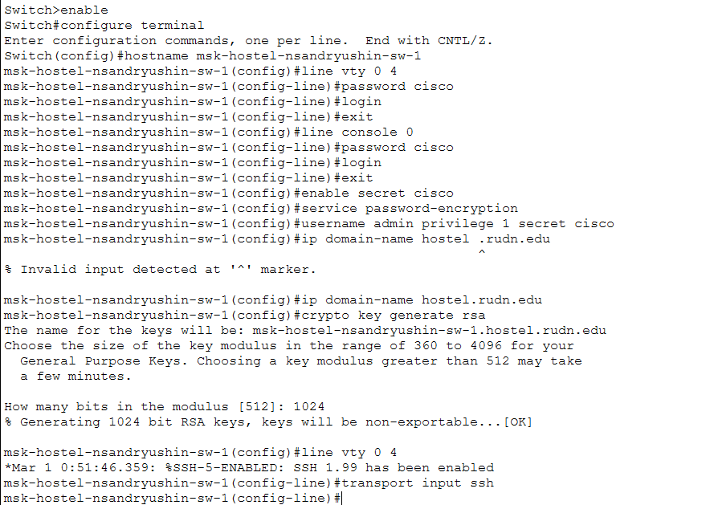
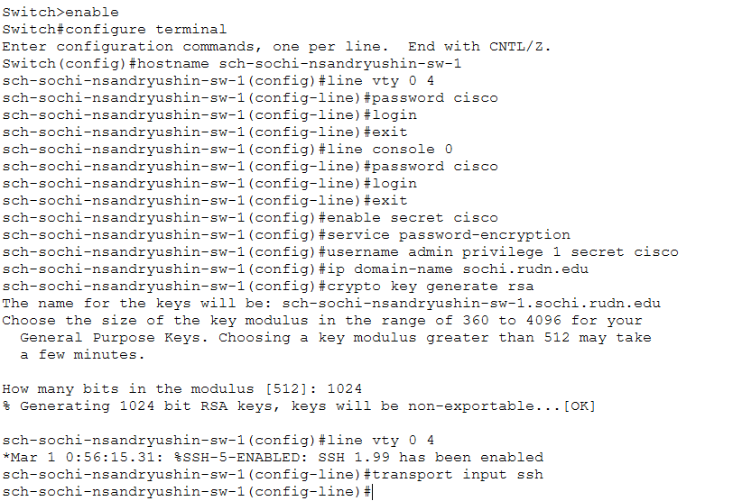
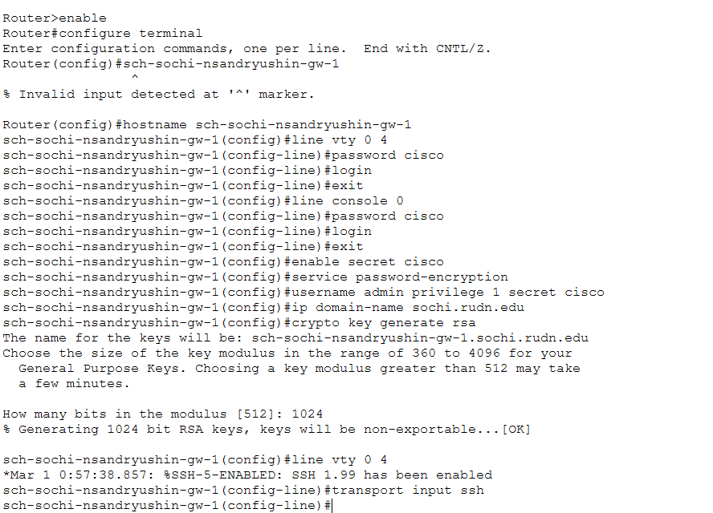

---
## Author
author:
  name: Андрюшин Никита Сергеевич
## Title
title: Лабораторная работа
subtitle: Номер 13
license: CC BY
date: today
date-format: "YYYY-MM-DD" # Example: 2025-09-06
---

# Информация

## Докладчик

:::::::::::::: {.columns align=center height=70%}
::: {.column width="70%" height=70%}

  * Андрюшин Никита Сергеевич
  * Студент
  * Российский университет дружбы народов им. П. Лумумбы

:::
::: {.column width="30%" height=70%}

:::
::::::::::::::

## Цель работы

Провести подготовительные мероприятия по организации взаимодействия через сеть провайдера посредством статической маршрутизации локальной сети с сетью основного здания, расположенного в 42-м квартале в Москве, и сетью филиала, расположенного в г. Сочи.

# Выполнение лабораторной работы

## Схема L1 сети с дополнительными площадками

{height=70%}

## Схема L2 сети с обозначением VLAN

{height=70%}

## Схема L3 сети с IP-адресацией

{height=70%}

## Полная логическая топология сети в Packet Tracer

{height=70%}

## Установка модуля NM-2E2W на маршрутизатор msk-q42-nsandryushin-gw-1

{height=70%}

## Обновлённая логическая топология с новыми площадками

{height=70%}

## Физическая схема Intercity с Москвой и Сочи

{height=70%}

## Города Moscow и Sochi на верхнем уровне физической иерархии

{height=70%}

## Перемещение оборудования филиала в город Sochi в физической иерархии

{height=70%}

## Первоначальная настройка маршрутизатора msk-q42-nsandryushin-gw-1

{height=70%}

## Первоначальная настройка коммутатора msk-q42-nsandryushin-sw-1

{height=70%}

## Первоначальная настройка маршрутизирующего коммутатора msk-hostel-nsandryushin-gw-1

{height=70%}

## Первоначальная настройка коммутатора msk-hostel-nsandryushin-sw-1

{height=70%}

## Первоначальная настройка коммутатора sch-sochi-nsandryushin-sw-1

{height=70%}

## Первоначальная настройка маршрутизатора sch-sochi-nsandryushin-gw-1

{height=70%}

## Выводы

В результате выполнения лабораторной работы были проведены подготовительные мероприятия для дальнейшей работы - добавлен город сочи и квартал 42