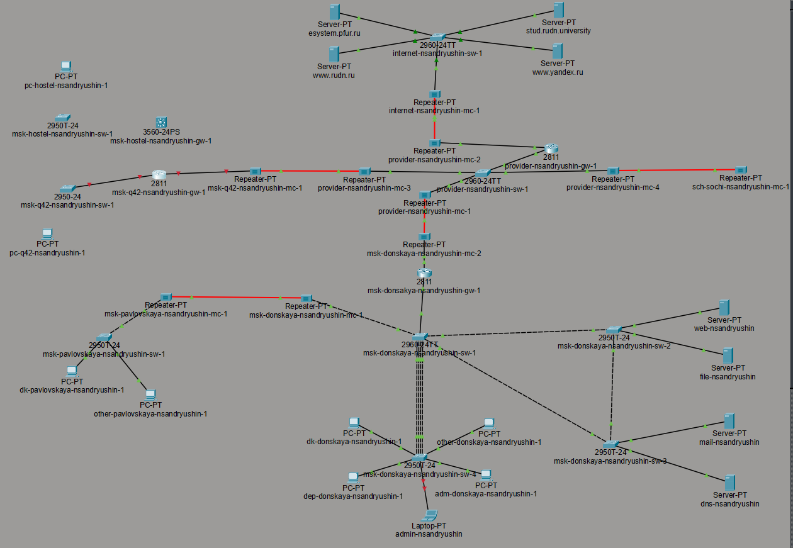
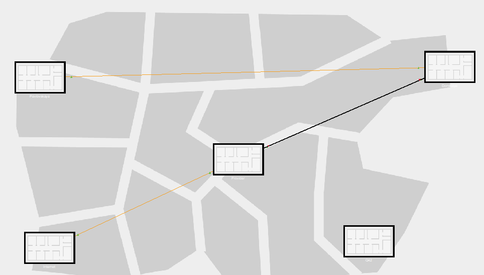
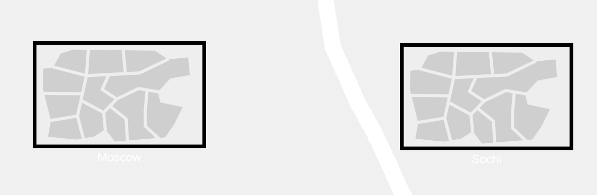
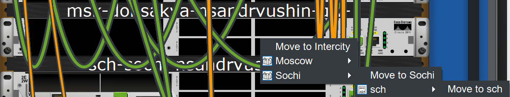
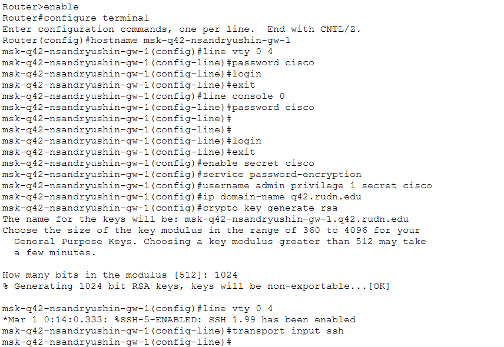
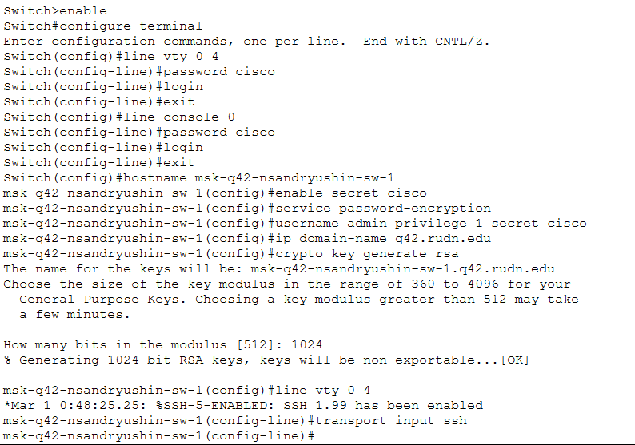

---
## Author
author:
  name: Андрюшин Никита Сергеевич

## Title
title: "Лабораторная работа"
subtitle: "Номер 13"
license: "CC BY"
---

# Цель работы

Провести подготовительные мероприятия по организации взаимодействия через сеть провайдера посредством статической маршрутизации локальной сети с сетью основного здания, расположенного в 42-м квартале в Москве, и сетью филиала, расположенного в г. Сочи.

# Выполнение лабораторной работы

Обновим схему сети, добавив в логическую топологию (схема L1) новые площадки — квартал 42 в Москве и филиал в г. Сочи. На первом скриншоте видна итоговая схема L1 с расставленным оборудованием: в зоне «Москва, квартал 42» размещены коммутатор msk-hostel-nsandryushin-sw-1, маршрутизирующий коммутатор msk-hostel-nsandryushin-gw-1 (Cisco 3560-24PS), маршрутизатор msk-q42-nsandryushin-gw-1 (Cisco 2811), коммутатор msk-q42-nsandryushin-sw-1 (Cisco 2950-24); в зоне «Сочи, филиал» — маршрутизатор sch-sochi-nsandryushin-gw-1 (Cisco 2811), медиаконвертер sch-sochi-nsandryushin-mc-1, коммутатор sch-sochi-nsandryushin-sw-1 (Cisco 2950-24) и оконечное устройство pc-sochi-nsandryushin-1. Все площадки соединены через сеть провайдера (рис. [-@fig-001]).

{#fig-001}

Дополним схему L2, обозначив номера VLAN на каждом канале. Видим, что между msk-q42-nsandryushin-gw-1 и сетью провайдера используются VLAN 4 и 5 (линк в Интернет и линк в квартал 42), на коммутаторе msk-q42-nsandryushin-sw-1 — VLAN 201 и 202 (основная сеть квартала 42 и сеть управления), на msk-hostel-nsandryushin-gw-1 — VLAN 201 и 202, на msk-hostel-nsandryushin-sw-1 — VLAN 202 и 301. В зоне филиала Сочи на sch-sochi-nsandryushin-gw-1 фигурируют VLAN 4, 401 и 402, на sch-sochi-nsandryushin-sw-1 — VLAN 401 и 402. Это соответствует таблицам VLAN из задания (рис. [-@fig-002]).

{#fig-002}

Построим схему L3, отображающую IP-адресацию. Убедимся, что маршрутизатор msk-q42-nsandryushin-gw-1 связан с provider-nsandryushin-gw-1 через подсеть 10.128.255.0/30 (VLAN 5), а маршрутизатор sch-sochi-nsandryushin-gw-1 — через подсеть 10.128.255.4/30 (VLAN 6). Центральный маршрутизатор msk-donskaya-nsandryushin-gw-1 обслуживает подсети: серверную ферму 10.128.0.0/24, сеть управления 10.128.1.0/24, дисплейные классы 10.128.3.0/24, кафедры 10.128.4.0/24, администрацию 10.128.5.0/24 и других пользователей 10.128.6.0/24. Пользователи квартала 42 находятся в пространстве 10.129.0.0/16, а пользователи Сочи — в 10.130.0.0/16 (рис. [-@fig-003]).

{#fig-003}

Разместим всё оборудование в логической рабочей области Packet Tracer согласно схеме L1. Видим полную топологию: в верхней части — серверы и коммутатор internet-nsandryushin-sw-1 (2960-24TT) с медиаконвертером internet-nsandryushin-mc-1; в средней части — сеть провайдера с маршрутизатором provider-nsandryushin-gw-1 (2811) и медиаконвертерами provider-nsandryushin-mc-1 — mc-4; слева — оборудование квартала 42 (msk-q42-nsandryushin-gw-1, msk-hostel-nsandryushin-gw-1 и соответствующие коммутаторы), справа — sch-sochi-nsandryushin-gw-1 и sch-sochi-nsandryushin-sw-1; внизу — сети Донской и Павловской. Оконечные устройства pc-hostel-nsandryushin-1, pc-q42-nsandryushin-1 и pc-sochi-nsandryushin-1 подключены к своим сегментам (рис. [-@fig-004]).

{#fig-004}

Добавим на маршрутизатор msk-q42-nsandryushin-gw-1 дополнительный сетевой модуль NM-2E2W, чтобы обеспечить необходимое количество интерфейсов Fast Ethernet для подключения к коммутатору msk-q42-nsandryushin-sw-1 и к маршрутизирующему коммутатору msk-hostel-nsandryushin-gw-1. На скриншоте видно физическое представление маршрутизатора с установленным модулем NM-2E2W в слоте расширения (рис. [-@fig-005]).

{#fig-005}

После добавления оборудования и модулей убедимся, что все соединения в логической схеме корректны. На скриншоте видна обновлённая топология: красными линиями обозначены неактивные (ещё не сконфигурированные) каналы, чёрными пунктирными — транковые соединения между коммутаторами, зелёными точками — активные порты. Новые устройства — msk-q42-nsandryushin-gw-1, msk-hostel-nsandryushin-gw-1, msk-hostel-nsandryushin-sw-1, sch-sochi-nsandryushin-gw-1, sch-sochi-nsandryushin-sw-1 — присутствуют в топологии и подключены к сети провайдера через соответствующие медиаконвертеры (рис. [-@fig-006]).

{#fig-006}

Перейдём в физическую рабочую область Packet Tracer и убедимся, что в г. Москва добавлено новое здание для квартала 42 (рис. [-@fig-007]).

{#fig-007}

Посмотрим на верхний уровень физической иерархии Packet Tracer, где отображаются два города — Moscow и Sochi. Убедимся, что Сочи успешно добавлен в проект и готов к размещению соответствующего оборудования (рис. [-@fig-008]).

{#fig-008}

Перенесём оборудование филиала в соответствующий город Sochi. На скриншоте видно контекстное меню физической рабочей области: для устройства sch-sochi-nsandryushin-gw-1 выбирается пункт «Move to Intercity → Sochi → Move to Sochi → sch», что позволяет переместить его в здание филиала в г. Сочи. Аналогичным образом перенесём и остальное оборудование сочинской площадки (рис. [-@fig-009]).

{#fig-009}

Выполним первоначальную настройку маршрутизатора msk-q42-nsandryushin-gw-1. Зайдём в привилегированный режим, затем в режим глобальной конфигурации. Зададим имя устройства, настроим пароли для VTY-линий и консоли, зададим секретный пароль enable secret cisco, включим шифрование паролей командой service password-encryption, создадим пользователя admin, укажем доменное имя q42.rudn.edu, сгенерируем RSA-ключ размером 1024 бита и ограничим доступ по VTY только через SSH (рис. [-@fig-010]).

{#fig-010}

Выполним первоначальную настройку коммутатора msk-q42-nsandryushin-sw-1. По аналогии с маршрутизатором настроим пароли для VTY-линий и консоли, зададим имя устройства, включим шифрование паролей, создадим пользователя admin, укажем доменное имя q42.rudn.edu, сгенерируем RSA-ключ размером 1024 бита и разрешим подключение по VTY только через SSH (рис. [-@fig-011]).

{#fig-011}

Выполним первоначальную настройку маршрутизирующего коммутатора msk-hostel-nsandryushin-gw-1. Зададим имя устройства, настроим пароли для VTY-линий и консоли, включим шифрование паролей, создадим пользователя admin, явно укажем версию SSH 2 командой ip ssh version 2. Заметим, что при первой попытке указать доменное имя командой ip domain-name hostel .rudn.edu была допущена ошибка (лишний пробел), которую исправим, повторно выполнив команду ip domain name hostel.rudn.edu. После этого сгенерируем RSA-ключ размером 1024 бита и ограничим доступ по VTY только через SSH (рис. [-@fig-012]).

{#fig-012}

Выполним первоначальную настройку коммутатора msk-hostel-nsandryushin-sw-1. Зададим имя устройства, настроим пароли для VTY-линий и консоли, включим шифрование паролей, создадим пользователя admin. При первой попытке указать доменное имя командой ip domain-name hostel .rudn.edu также была допущена ошибка (лишний пробел), которую исправим повторным вводом корректной команды ip domain-name hostel.rudn.edu. Сгенерируем RSA-ключ размером 1024 бита и ограничим доступ по VTY только через SSH (рис. [-@fig-013]).

{#fig-013}

Выполним первоначальную настройку коммутатора sch-sochi-nsandryushin-sw-1, относящегося к сети филиала в г. Сочи. Зададим имя устройства, настроим пароли для VTY-линий и консоли, включим шифрование паролей, создадим пользователя admin, укажем доменное имя sochi.rudn.edu, сгенерируем RSA-ключ размером 1024 бита и ограничим доступ по VTY только через SSH (рис. [-@fig-014]).

{#fig-014}

Выполним первоначальную настройку маршрутизатора sch-sochi-nsandryushin-gw-1, являющегося шлюзом сети филиала в г. Сочи. При первой попытке задать имя устройства была допущена ошибка синтаксиса, которую исправим, повторно выполнив команду hostname sch-sochi-nsandryushin-gw-1. Настроим пароли для VTY-линий и консоли, включим шифрование паролей, создадим пользователя admin, укажем доменное имя sochi.rudn.edu, сгенерируем RSA-ключ размером 1024 бита и ограничим доступ по VTY только через SSH (рис. [-@fig-015]).

{#fig-015}

# Выводы

В результате выполнения лабораторной работы были проведены подготовительные мероприятия для дальнейшей работы - добавлен город сочи и квартал 42