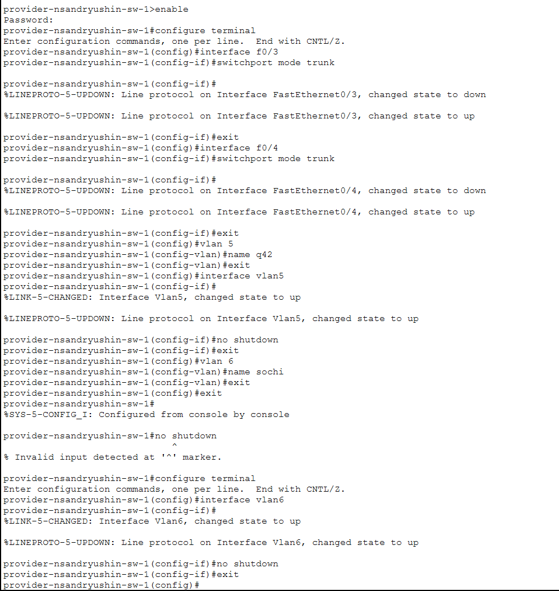
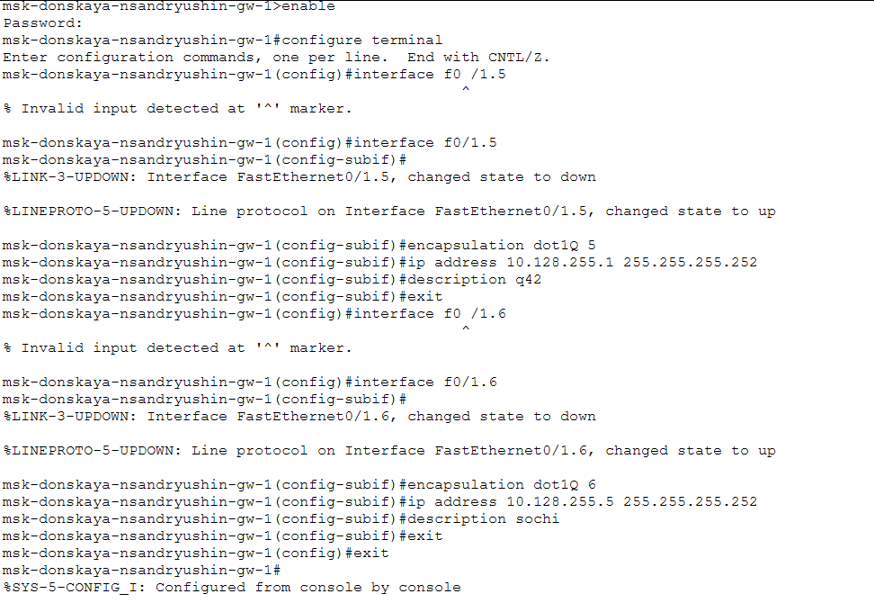
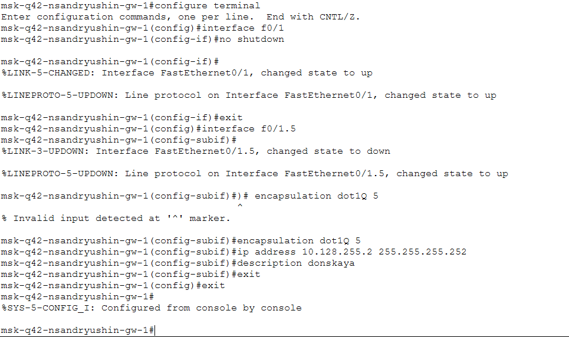
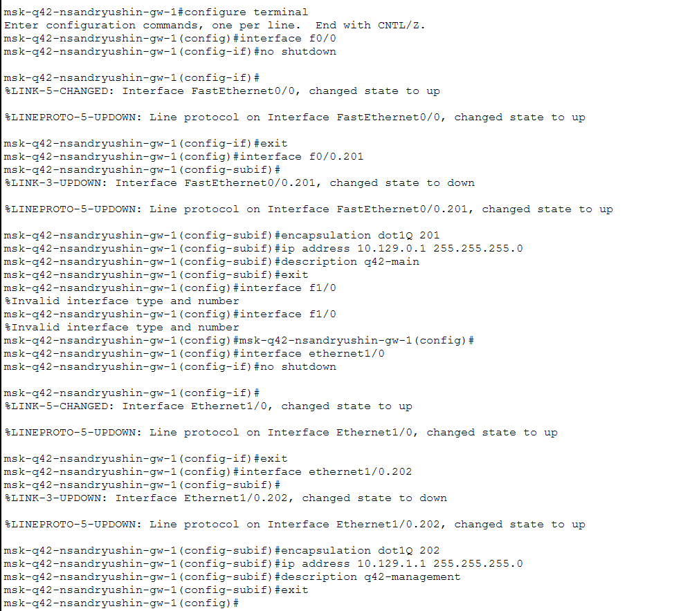
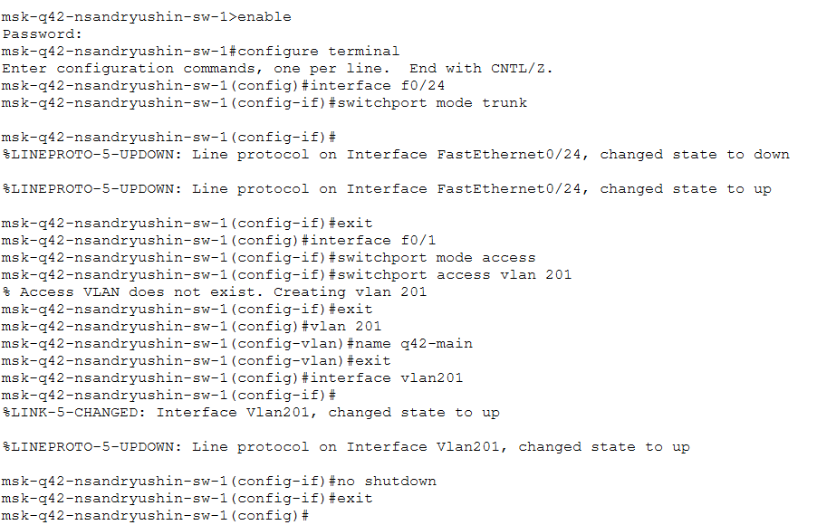
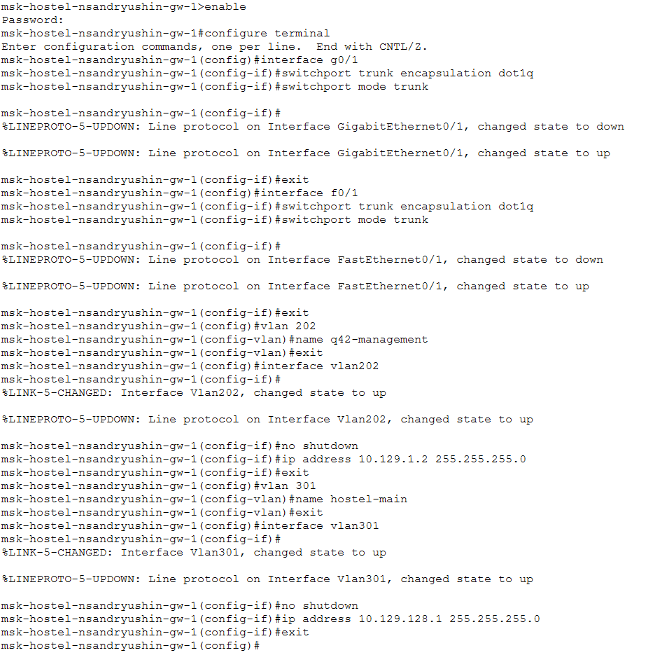
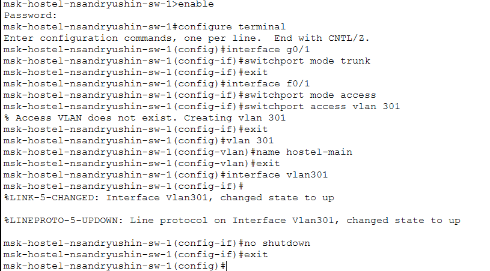
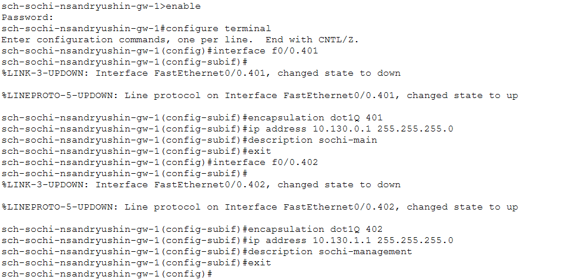
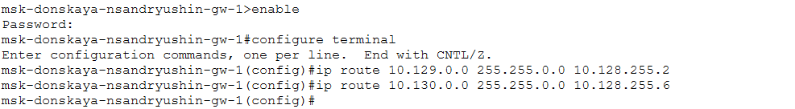

---
## Author
author:
  name: Андрюшин Никита Сергеевич
## Title
title: Лабораторная работа
subtitle: Номер 14
license: CC BY
date: today
date-format: "YYYY-MM-DD" # Example: 2025-09-06
---

# Информация

## Докладчик

:::::::::::::: {.columns align=center height=70%}
::: {.column width="70%" height=70%}

  * Андрюшин Никита Сергеевич
  * Студент
  * Российский университет дружбы народов им. П. Лумумбы

:::
::: {.column width="30%" height=70%}

:::
::::::::::::::

---
## Author
author:
  name: Андрюшин Никита Сергеевич

## Title
title: "Лабораторная работа"
subtitle: "Номер 14"
license: "CC BY"
---

## Цель работы

Настроить взаимодействие через сеть провайдера посредством статической маршрутизации локальной сети организации с сетью основного здания, расположенного в 42-м квартале в Москве, и сетью филиала, расположенного в г. Сочи.

# Выполнение лабораторной работы

## Настройка интерфейсов коммутатора provider-nsandryushin-sw-1

{height=70%}

## Настройка субинтерфейсов маршрутизатора msk-donskaya-nsandryushin-gw-1

{height=70%}

## Настройка интерфейсов маршрутизатора msk-q42-nsandryushin-gw-1

{height=70%}

## Настройка интерфейсов коммутатора sch-sochi-nsandryushin-sw-1

{height=70%}

## Настройка субинтерфейсов маршрутизатора sch-sochi-nsandryushin-gw-1

{height=70%}

## Настройка интерфейсов маршрутизатора msk-q42-nsandryushin-gw-1

{height=70%}

## Настройка интерфейсов коммутатора msk-q42-nsandryushin-sw-1

{height=70%}

## Настройка маршрутизирующего коммутатора msk-hostel-nsandryushin-gw-1

{height=70%}

## Настройка коммутатора msk-hostel-nsandryushin-sw-1

{height=70%}

## Настройка субинтерфейсов маршрутизатора sch-sochi-nsandryushin-gw-1

{height=70%}

## Настройка интерфейсов коммутатора sch-sochi-nsandryushin-sw-1

{height=70%}

## Настройка статических маршрутов на msk-donskaya-nsandryushin-gw-1

{#fig-012}

## Настройка маршрута по умолчанию на msk-q42-nsandryushin-gw-1

{#fig-013}

## Настройка маршрута по умолчанию на sch-sochi-nsandryushin-gw-1

{#fig-014}

## Настройка маршрута до сети хостела на msk-q42-nsandryushin-gw-1

{#fig-015}

## Настройка маршрутизации на msk-hostel-nsandryushin-gw-1

{#fig-016}

## Настройка NAT на msk-donskaya-nsandryushin-gw-1

{#fig-017}

## Выводы

В результате выполнения лабораторной работы была реализована маршрутизация между локациями и настроены основные устройства в сети добавленных в прошлой лабораторной работе локациях