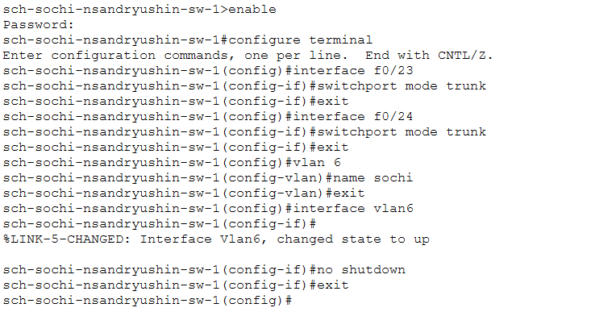
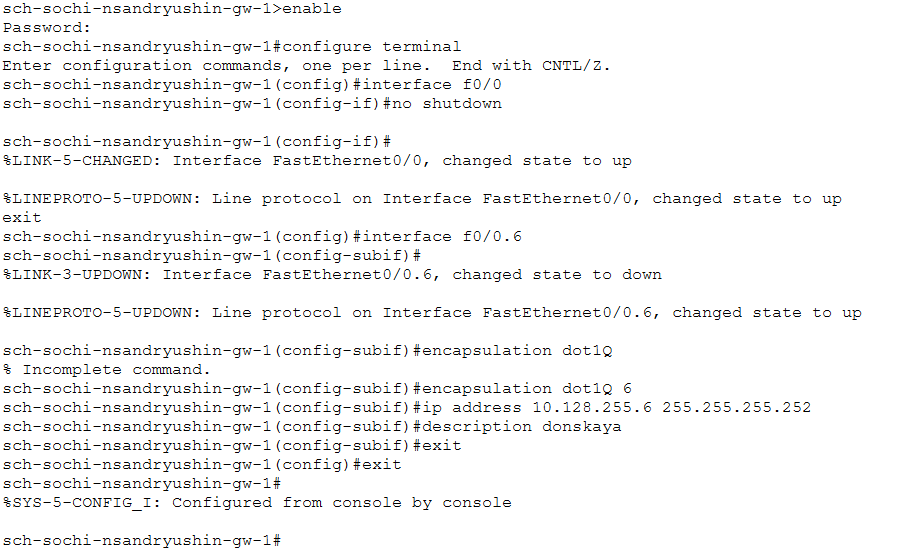
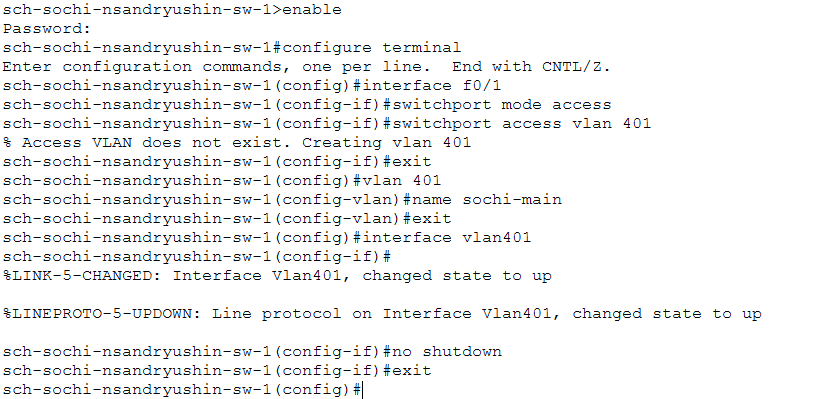
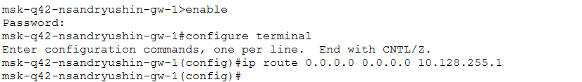
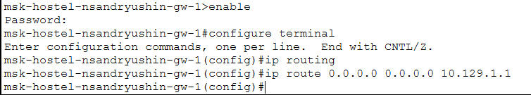
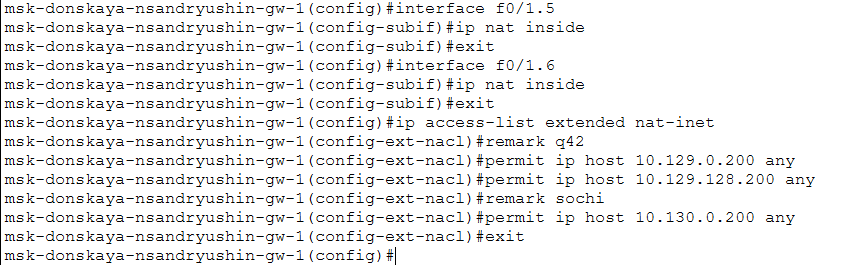

---
## Author
author:
  name: Андрюшин Никита Сергеевич

## Title
title: "Лабораторная работа"
subtitle: "Номер 14"
license: "CC BY"
---

# Цель работы

Настроить взаимодействие через сеть провайдера посредством статической маршрутизации локальной сети организации с сетью основного здания, расположенного в 42-м квартале в Москве, и сетью филиала, расположенного в г. Сочи.

# Выполнение лабораторной работы

Настроим интерфейсы коммутатора provider-nsandryushin-sw-1: переведём порты f0/3 и f0/4 в режим trunk, создадим VLAN 5 с именем q42 и VLAN 6 с именем sochi, после чего активируем соответствующие интерфейсы vlan5 и vlan6 командой no shutdown. Убедимся, что интерфейсы Vlan5 и Vlan6 успешно поднялись — система сообщает об изменении состояния протокола линка на up (рис. [-@fig-001]).

{#fig-001}

Настроим субинтерфейсы маршрутизатора msk-donskaya-nsandryushin-gw-1: для субинтерфейса f0/1.5 зададим инкапсуляцию dot1Q 5, IP-адрес 10.128.255.1/30 и описание q42; для субинтерфейса f0/1.6 — инкапсуляцию dot1Q 6, IP-адрес 10.128.255.5/30 и описание sochi. Убедимся, что оба субинтерфейса успешно поднялись (рис. [-@fig-002]).

{#fig-002}

Настроим интерфейсы маршрутизатора msk-q42-nsandryushin-gw-1: активируем физический интерфейс f0/1 командой no shutdown, затем создадим субинтерфейс f0/1.5 с инкапсуляцией dot1Q 5, IP-адресом 10.128.255.2/30 и описанием donskaya. Убедимся, что интерфейс FastEthernet0/1 и субинтерфейс FastEthernet0/1.5 перешли в состояние up (рис. [-@fig-003]).

{#fig-003}

Настроим интерфейсы коммутатора sch-sochi-nsandryushin-sw-1: переведём порты f0/23 и f0/24 в режим trunk, создадим VLAN 6 с именем sochi и активируем интерфейс vlan6 командой no shutdown. Убедимся, что интерфейс Vlan6 успешно поднялся (рис. [-@fig-004]).

{#fig-004}

Настроим интерфейсы маршрутизатора sch-sochi-nsandryushin-gw-1: активируем физический интерфейс f0/0, затем создадим субинтерфейс f0/0.6 с инкапсуляцией dot1Q 6, IP-адресом 10.128.255.6/30 и описанием donskaya. Убедимся, что интерфейс FastEthernet0/0 и субинтерфейс FastEthernet0/0.6 перешли в состояние up (рис. [-@fig-005]).

{#fig-005}

Настроим интерфейсы маршрутизатора msk-q42-nsandryushin-gw-1 для площадки 42-го квартала: активируем интерфейс f0/0, создадим субинтерфейс f0/0.201 с инкапсуляцией dot1Q 201, IP-адресом 10.129.0.1/24 и описанием q42-main. Так как интерфейс f1/0 оказался недоступен на данном устройстве, используем интерфейс ethernet1/0, который успешно поднимаем, и создаём на нём субинтерфейс ethernet1/0.202 с инкапсуляцией dot1Q 202, IP-адресом 10.129.1.1/24 и описанием q42-management (рис. [-@fig-006]).

{#fig-006}

Настроим интерфейсы коммутатора msk-q42-nsandryushin-sw-1: переведём порт f0/24 в режим trunk, порт f0/1 — в режим access с назначением VLAN 201. Создадим VLAN 201 с именем q42-main и активируем интерфейс vlan201 командой no shutdown. Убедимся, что интерфейс Vlan201 успешно перешёл в состояние up (рис. [-@fig-007]).

{#fig-007}

Настроим маршрутизирующий коммутатор msk-hostel-nsandryushin-gw-1: переведём интерфейсы g0/1 и f0/1 в режим trunk с инкапсуляцией dot1q. Создадим VLAN 202 с именем q42-management и назначим интерфейсу vlan202 IP-адрес 10.129.1.2/24. Создадим VLAN 301 с именем hostel-main и назначим интерфейсу vlan301 IP-адрес 10.129.128.1/24. Убедимся, что оба интерфейса Vlan202 и Vlan301 успешно поднялись (рис. [-@fig-008]).

{#fig-008}

Настроим коммутатор msk-hostel-nsandryushin-sw-1: переведём интерфейс g0/1 в режим trunk, интерфейс f0/1 — в режим access с назначением VLAN 301. Создадим VLAN 301 с именем hostel-main и активируем интерфейс vlan301 командой no shutdown. Убедимся, что интерфейс Vlan301 успешно перешёл в состояние up (рис. [-@fig-009]).

{#fig-009}

Настроим площадку в Сочи, начав с маршрутизатора sch-sochi-nsandryushin-gw-1. Создадим субинтерфейс f0/0.401 с инкапсуляцией dot1Q 401, назначим ему IP-адрес 10.130.0.1/24 и описание sochi-main, затем создадим субинтерфейс f0/0.402 с инкапсуляцией dot1Q 402, назначим IP-адрес 10.130.1.1/24 и описание sochi-management (рис. [-@fig-010]).

{#fig-010}

Настроим коммутатор sch-sochi-nsandryushin-sw-1: переведём порт f0/1 в режим access и назначим ему VLAN 401, после чего создадим VLAN 401 с именем sochi-main и активируем интерфейс vlan401 командой no shutdown (рис. [-@fig-011]).

{#fig-011}

Настроим статическую маршрутизацию между площадками на маршрутизаторе msk-donskaya-nsandryushin-gw-1: добавим маршрут до сети 10.129.0.0/16 через шлюз 10.128.255.2 (квартал 42) и маршрут до сети 10.130.0.0/16 через шлюз 10.128.255.6 (Сочи) (рис. [-@fig-012]).

{#fig-012}

Настроим маршрут по умолчанию на маршрутизаторе msk-q42-nsandryushin-gw-1: добавим маршрут 0.0.0.0/0 через шлюз 10.128.255.1, тем самым направив весь трафик в сторону msk-donskaya-nsandryushin-gw-1 (рис. [-@fig-013]).

{#fig-013}

Настроим маршрут по умолчанию на маршрутизаторе sch-sochi-nsandryushin-gw-1: добавим маршрут 0.0.0.0/0 через шлюз 10.128.255.5, направив весь трафик в сторону msk-donskaya-nsandryushin-gw-1 (рис. [-@fig-014]).

{#fig-014}

Настроим маршрутизацию внутри площадки квартала 42 на маршрутизаторе msk-q42-nsandryushin-gw-1: добавим маршрут до сети 10.129.128.0/255.255.128.0 через шлюз 10.129.1.2, направив трафик в сторону коммутатора msk-hostel-nsandryushin-gw-1 (рис. [-@fig-015]).

{#fig-015}

Настроим маршрутизирующий коммутатор msk-hostel-nsandryushin-gw-1: активируем IP-маршрутизацию командой ip routing и добавим маршрут по умолчанию 0.0.0.0/0 через шлюз 10.129.1.1, направив весь трафик в сторону msk-q42-nsandryushin-gw-1 (рис. [-@fig-016]).

{#fig-016}

Настроим NAT на маршрутизаторе msk-donskaya-nsandryushin-gw-1: пометим субинтерфейсы f0/1.5 и f0/1.6 как ip nat inside, после чего создадим расширенный список доступа nat-inet, разрешив трансляцию для хостов 10.129.0.200 и 10.129.128.200 (квартал 42), а также для хоста 10.130.0.200 (Сочи) (рис. [-@fig-017]).

{#fig-017}

# Выводы

В результате выполнения лабораторной работы была реализована маршрутизация между локациями и настроены основные устройства в сети добавленных в прошлой лабораторной работе локациях