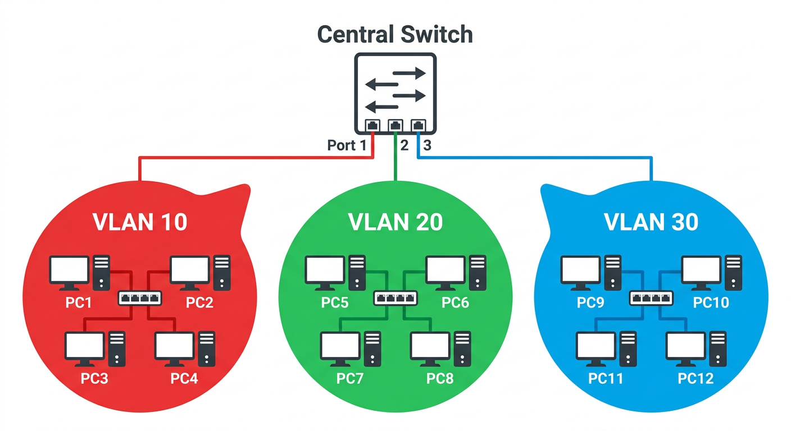
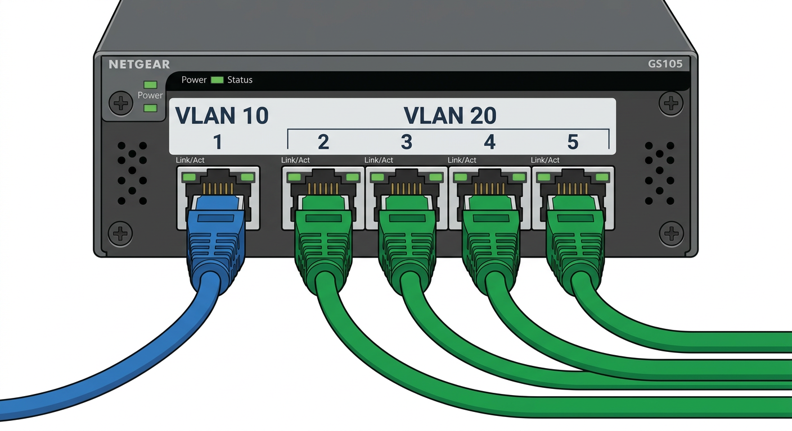
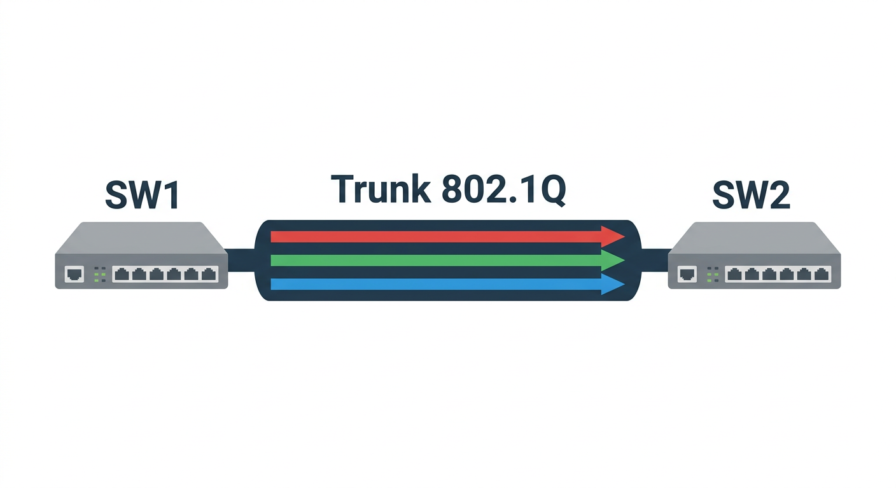
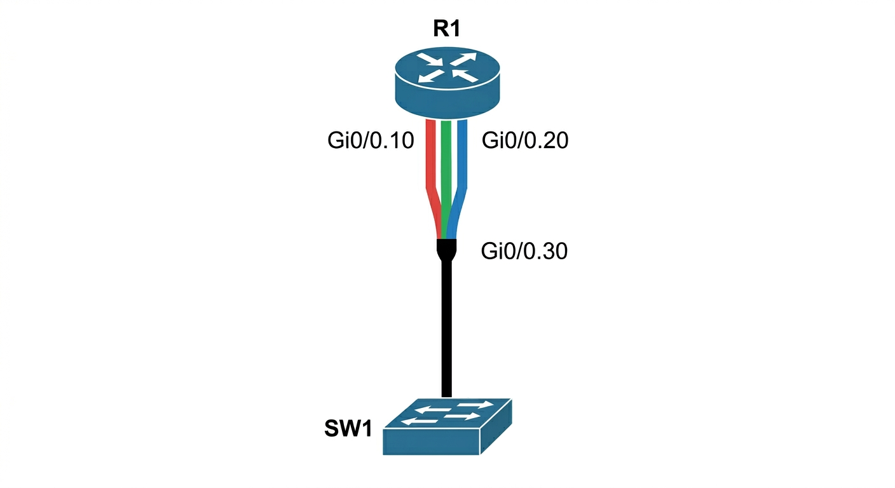
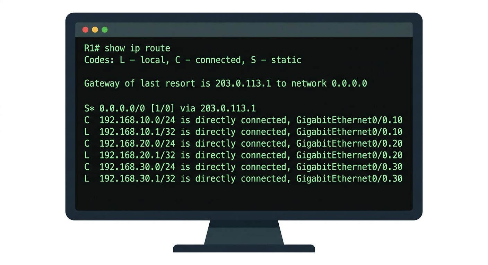
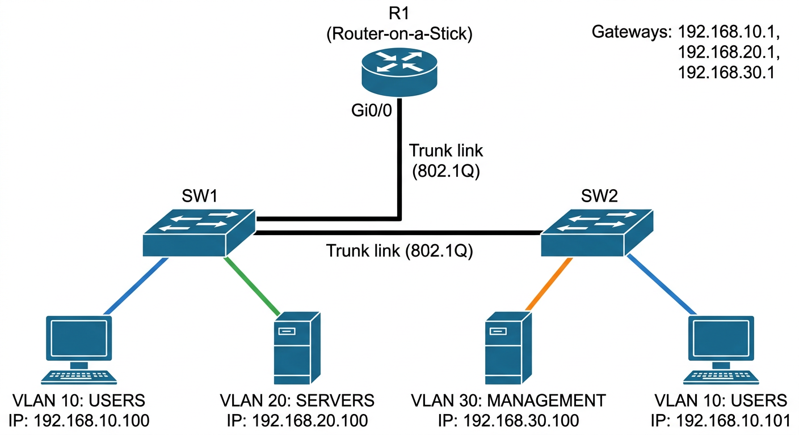

---
## Author
author:
  name: Андрюшин Никита Сергеевич

## Title
title: "Доклад"
subtitle: "Конфигурирование VLAN. Статическая маршрутизация VLAN"
license: "CC BY"
---

## Введение

Современные корпоративные и университетские сети всё реже строятся как
единая плоская (flat) сеть, в которой все устройства находятся в одном
широковещательном домене. Рост числа узлов, повышение требований к
безопасности и необходимость логического разделения трафика различных
подразделений привели к широкому распространению технологии виртуальных
локальных сетей — VLAN (Virtual Local Area Network) [@tanenbaum2021].

VLAN позволяет администратору разделить физическую сетевую
инфраструктуру на несколько изолированных логических сегментов без
прокладки дополнительных кабелей. Каждый такой сегмент функционирует
как независимая сеть: широковещательный трафик одной VLAN не виден
узлам другой VLAN [@cisco_vlan_guide].

Вместе с тем изоляция VLAN порождает закономерный вопрос: каким
образом хосты из разных виртуальных сетей могут обмениваться данными,
если это необходимо? Ответом служит маршрутизация между VLAN —
механизм, при котором сетевое устройство уровня 3 (маршрутизатор или
многоуровневый коммутатор) принимает пакеты из одной VLAN и
перенаправляет их в другую [@lammle2019].

Целью данного реферата является рассмотрение:

- базовых концепций технологии VLAN;
- практических шагов по конфигурированию VLAN на оборудовании класса
  Cisco Catalyst;
- принципов и способов организации статической маршрутизации между
  VLAN.

## Основные понятия VLAN

VLAN — это логическая группа сетевых устройств, объединённых в
единый широковещательный домен независимо от их физического
расположения в сети [@ieee8021q]. По существу, VLAN эмулирует
поведение отдельного физического сегмента Ethernet: устройства внутри
одной VLAN «видят» широковещательные кадры друг друга, тогда как
устройства из разных VLAN изолированы на канальном уровне (уровень 2
модели OSI).

Стандарт IEEE 802.1Q [@ieee8021q] определяет механизм маркировки
(тегирования) кадров Ethernet: в заголовок кадра вставляется
4-байтовый тег, содержащий, в частности, VID (VLAN Identifier) —
12-битное поле, допускающее значения от 1 до 4094. Это поле однозначно
идентифицирует принадлежность кадра к конкретной VLAN.

Ключевые понятия, используемые при работе с VLAN:

- Access-порт — порт коммутатора, принадлежащий ровно одной VLAN
  и передающий кадры без тега (конечное устройство не знает о VLAN).
- Trunk-порт — порт, передающий тегированные кадры сразу
  нескольких VLAN; используется в каналах между коммутаторами или
  между коммутатором и маршрутизатором.
- Native VLAN — VLAN, кадры которой передаются по транку *без
  тега* (по умолчанию VLAN 1); должна совпадать на обоих концах
  транкового канала.
- VTP (VLAN Trunking Protocol) — проприетарный протокол Cisco для
  централизованного распространения информации о VLAN по домену
  коммутаторов [@cisco_vtp].



На рисунке 1 схематично показано, как три VLAN (VLAN 10, VLAN 20,
VLAN 30) сосуществуют на одних и тех же физических коммутаторах,
образуя при этом изолированные широковещательные домены.

## Типы VLAN

В практике сетевого администрирования принято выделять несколько
функциональных типов VLAN [@lammle2019; @cisco_vlan_guide]:

| Тип VLAN              | Назначение                                                                 | Типичный VID    |
|-----------------------|---------------------------------------------------------------------------|-----------------|
| Default VLAN          | VLAN по умолчанию; все порты принадлежат ей после сброса настроек        | 1               |
| Data VLAN             | Пользовательский трафик (рабочие станции, серверы)                        | 2–1001          |
| Voice VLAN            | Трафик VoIP-телефонии; требует приоритизации QoS                         | 2–1001          |
| Management VLAN       | Трафик управления сетевым оборудованием (SSH, SNMP, Telnet)              | Любой (не 1)    |
| Native VLAN           | Нетегированный трафик на trunk-порту                                      | 1 (по умолчанию)|

*Таблица 1 — Функциональные типы VLAN*

Разделение на функциональные типы является логическим: с точки зрения
протокола каждая VLAN идентифицируется только своим VID. Тем не менее
такая классификация (см. таблицу 1) помогает структурировать
проектирование сети и упрощает документирование [@tanenbaum2021].

Рекомендуется не использовать VLAN 1 в качестве управляющей или
пользовательской, поскольку это повышает риски безопасности (атаки
типа VLAN Hopping) [@cisco_security_guide].

## Конфигурирование VLAN

### Создание VLAN на коммутаторе

Все дальнейшие примеры приведены для оборудования Cisco IOS. Перед
назначением портов в VLAN необходимо создать саму VLAN в базе данных
коммутатора. Это выполняется из режима глобальной конфигурации
[@cisco_vlan_guide]:

```text
Switch# configure terminal
Switch(config)# vlan 10
Switch(config-vlan)# name USERS
Switch(config-vlan)# exit
Switch(config)# vlan 20
Switch(config-vlan)# name SERVERS
Switch(config-vlan)# exit
Switch(config)# vlan 30
Switch(config-vlan)# name MANAGEMENT
Switch(config-vlan)# exit
Switch(config)# end
Switch# show vlan brief
```

Команда `show vlan brief` позволяет убедиться, что VLAN созданы и
отображаются в базе данных. Созданные VLAN сохраняются в файле
`vlan.dat` во флэш-памяти коммутатора и не зависят от файла
`startup-config`.

### Назначение портов в VLAN

После создания VLAN необходимо назначить физические порты
коммутатора в соответствующие VLAN. Порты, подключённые к конечным
устройствам, конфигурируются как access-порты:

```text
Switch(config)# interface fastEthernet 0/1
Switch(config-if)# switchport mode access
Switch(config-if)# switchport access vlan 10
Switch(config-if)# exit

Switch(config)# interface range fastEthernet 0/2 - 5
Switch(config-if-range)# switchport mode access
Switch(config-if-range)# switchport access vlan 20
Switch(config-if-range)# exit
```

Команда `interface range` позволяет применить одинаковую конфигурацию
к диапазону интерфейсов одновременно, что значительно ускоряет
настройку [@lammle2019].



На рисунке 2 проиллюстрировано, как порты Fa0/1–Fa0/5 разнесены по
двум VLAN: первый порт принадлежит VLAN 10, порты со второго по пятый
— VLAN 20.

### Транковые каналы (Trunk)

Для передачи трафика нескольких VLAN между коммутаторами или от
коммутатора к маршрутизатору настраивается trunk-порт:

```text
Switch(config)# interface gigabitEthernet 0/1
Switch(config-if)# switchport trunk encapsulation dot1q
Switch(config-if)# switchport mode trunk
Switch(config-if)# switchport trunk allowed vlan 10,20,30
Switch(config-if)# switchport trunk native vlan 99
Switch(config-if)# exit
```

Параметр `encapsulation dot1q` задаёт использование стандарта IEEE
802.1Q [@ieee8021q] для тегирования кадров. Ключевое слово `allowed
vlan` ограничивает список VLAN, которым разрешено передавать трафик
по данному транку; это хорошая практика безопасности. Native VLAN
устанавливается в 99 (не в 1), что снижает риск атак VLAN Hopping
[@cisco_security_guide].

Проверка состояния транка:

```text
Switch# show interfaces gigabitEthernet 0/1 trunk
```



Рисунок 3 демонстрирует типовую топологию: два коммутатора соединены
trunk-каналом (Gi0/1 — Gi0/1), по которому одновременно передаётся
трафик VLAN 10, 20 и 30 в тегированном виде.

## Статическая маршрутизация VLAN

### Маршрутизация между VLAN: общие принципы

Поскольку устройства из разных VLAN находятся в разных логических
сетях (разные IP-подсети), для обмена данными между ними необходим
маршрутизатор или устройство уровня 3 [@tanenbaum2021]. Существуют
три основных подхода:

1. Отдельный физический интерфейс маршрутизатора на каждую VLAN —
   простое, но дорогостоящее решение, требующее большого количества
   физических портов.
2. Router-on-a-Stick (RoaS) — один физический интерфейс
   маршрутизатора, разделённый на логические подынтерфейсы.
3. Многоуровневый (Layer 3) коммутатор — маршрутизация
   выполняется средствами самого коммутатора через SVI-интерфейсы.

В данном реферате основное внимание уделяется статической
маршрутизации: маршруты задаются администратором вручную, без
использования динамических протоколов (OSPF, EIGRP и т.д.)
[@cisco_routing_guide].

### Router-on-a-Stick

Router-on-a-Stick (RoaS) — наиболее распространённый способ
организации межвлановой маршрутизации в небольших и средних сетях,
когда маршрутизатор имеет ограниченное число физических интерфейсов
[@lammle2019]. Физический интерфейс маршрутизатора подключается к
trunk-порту коммутатора, а затем делится на логические
подынтерфейсы (subinterface), каждый из которых ассоциируется с
отдельной VLAN.

Конфигурация маршрутизатора:

```text
Router(config)# interface gigabitEthernet 0/0
Router(config-if)# no ip address
Router(config-if)# no shutdown
Router(config-if)# exit

Router(config)# interface gigabitEthernet 0/0.10
Router(config-subif)# encapsulation dot1q 10
Router(config-subif)# ip address 192.168.10.1 255.255.255.0
Router(config-subif)# exit

Router(config)# interface gigabitEthernet 0/0.20
Router(config-subif)# encapsulation dot1q 20
Router(config-subif)# ip address 192.168.20.1 255.255.255.0
Router(config-subif)# exit

Router(config)# interface gigabitEthernet 0/0.30
Router(config-subif)# encapsulation dot1q 30
Router(config-subif)# ip address 192.168.30.1 255.255.255.0
Router(config-subif)# exit
```

Команда `encapsulation dot1q <vlan-id>` «привязывает» подынтерфейс к
конкретной VLAN: маршрутизатор будет принимать тегированные кадры с
данным VID на этом подынтерфейсе и отправлять ответные кадры с тем же
тегом [@cisco_routing_guide].

IP-адрес каждого подынтерфейса становится шлюзом по умолчанию для
хостов соответствующей VLAN. Например, узлы в VLAN 10 получают
адреса из подсети 192.168.10.0/24 и используют 192.168.10.1 в
качестве шлюза.



Рисунок 4 иллюстрирует топологию RoaS: маршрутизатор R1 подключён
одним портом к trunk-порту коммутатора SW1; трафик VLAN 10, 20 и 30
мультиплексируется по этому единственному физическому каналу.

### Маршрутизация через Layer 3 коммутатор

Многоуровневые коммутаторы (например, Cisco Catalyst 3560/3750/9300)
поддерживают SVI (Switched Virtual Interface) — виртуальные
интерфейсы уровня 3, ассоциированные с VLAN. Это позволяет
выполнять маршрутизацию без внешнего маршрутизатора [@cisco_l3_switch]:

```text
Switch(config)# ip routing

Switch(config)# interface vlan 10
Switch(config-if)# ip address 192.168.10.1 255.255.255.0
Switch(config-if)# no shutdown
Switch(config-if)# exit

Switch(config)# interface vlan 20
Switch(config-if)# ip address 192.168.20.1 255.255.255.0
Switch(config-if)# no shutdown
Switch(config-if)# exit

Switch(config)# interface vlan 30
Switch(config-if)# ip address 192.168.30.1 255.255.255.0
Switch(config-if)# no shutdown
Switch(config-if)# exit
```

Команда `ip routing` включает функцию маршрутизации на коммутаторе.
SVI-интерфейс (`interface vlan <id>`) поднимается в состояние UP
только при наличии хотя бы одного активного access-порта в данной
VLAN [@cisco_l3_switch].

По сравнению с RoaS, маршрутизация через Layer 3 коммутатор обеспечивает
более высокую производительность (маршрутизация выполняется аппаратно),
лучшую масштабируемость и отсутствие «узкого места» в виде одного
физического канала между коммутатором и маршрутизатором.

### Настройка статических маршрутов

Статический маршрут — это запись в таблице маршрутизации,
введённая администратором вручную. В отличие от динамических
протоколов маршрутизации, статические маршруты не изменяются
автоматически при изменении топологии сети [@cisco_routing_guide].

Синтаксис добавления статического маршрута в Cisco IOS:

```text
Router(config)# ip route <destination-network> <mask> <next-hop | outgoing-interface> [administrative-distance]
```

Пример 1. Маршрут к удалённой сети через IP-адрес следующего узла:

```text
Router(config)# ip route 10.0.0.0 255.0.0.0 192.168.1.2
```

Пример 2. Маршрут по умолчанию (default route):

```text
Router(config)# ip route 0.0.0.0 0.0.0.0 203.0.113.1
```

Пример 3. Плавающий статический маршрут (резервный, с большим
административным расстоянием):

```text
Router(config)# ip route 10.0.0.0 255.0.0.0 192.168.2.2 200
```

В контексте межвлановой маршрутизации статические маршруты применяются
в следующих сценариях [@lammle2019]:

- Маршрут к конкретной подсети VLAN — явная запись о том, через
  какой интерфейс или шлюз доступна та или иная VLAN.
- Маршрут по умолчанию — весь трафик, не совпавший с более
  конкретными маршрутами, направляется к шлюзу провайдера или
  основному маршрутизатору.
- Резервные маршруты — обеспечение отказоустойчивости при наличии
  альтернативных путей.

Для просмотра таблицы маршрутизации используется команда:

```text
Router# show ip route
```

Коды в выводе команды: `S` — статический маршрут, `C` — напрямую
подключённая сеть, `L` — адрес локального интерфейса,
`*` — маршрут по умолчанию.



*Рисунок 5 — Пример вывода команды `show ip route`: таблица
маршрутизации с статическими маршрутами и непосредственно
подключёнными VLAN-подсетями*

На рисунке 5 видно, что маршрутизатор знает о трёх непосредственно
подключённых сетях (VLAN 10, 20, 30) и имеет один статический маршрут
по умолчанию к провайдеру.

## Пример практической конфигурации

Рассмотрим полный пример конфигурации небольшой сети, включающей два
коммутатора, один маршрутизатор и три VLAN.

Исходные данные:

| VLAN | Название   | Подсеть          | Шлюз          |
|------|------------|------------------|---------------|
| 10   | USERS      | 192.168.10.0/24  | 192.168.10.1  |
| 20   | SERVERS    | 192.168.20.0/24  | 192.168.20.1  |
| 30   | MANAGEMENT | 192.168.30.0/24  | 192.168.30.1  |

*Таблица 2 — Адресный план VLAN для практического примера*

В таблице 2 представлен адресный план: каждой VLAN выделена отдельная
подсеть /24, первый адрес каждой подсети используется как шлюз
(подынтерфейс маршрутизатора или SVI).



На рисунке 6 показана топология сети: маршрутизатор R1 подключён к
SW1 через trunk (RoaS), SW1 связан с SW2 через trunk, конечные
устройства подключены к access-портам обоих коммутаторов.

Конфигурация коммутатора SW1:

```text
SW1# configure terminal
SW1(config)# vlan 10
SW1(config-vlan)# name USERS
SW1(config-vlan)# exit
SW1(config)# vlan 20
SW1(config-vlan)# name SERVERS
SW1(config-vlan)# exit
SW1(config)# vlan 30
SW1(config-vlan)# name MANAGEMENT
SW1(config-vlan)# exit

! Uplink to R1
SW1(config)# interface gigabitEthernet 0/1
SW1(config-if)# switchport trunk encapsulation dot1q
SW1(config-if)# switchport mode trunk
SW1(config-if)# switchport trunk allowed vlan 10,20,30
SW1(config-if)# switchport trunk native vlan 99
SW1(config-if)# exit

! Uplink to SW2
SW1(config)# interface gigabitEthernet 0/2
SW1(config-if)# switchport trunk encapsulation dot1q
SW1(config-if)# switchport mode trunk
SW1(config-if)# switchport trunk allowed vlan 10,20,30
SW1(config-if)# switchport trunk native vlan 99
SW1(config-if)# exit

! Access-ports
SW1(config)# interface fastEthernet 0/1
SW1(config-if)# switchport mode access
SW1(config-if)# switchport access vlan 10
SW1(config-if)# exit

SW1(config)# interface fastEthernet 0/2
SW1(config-if)# switchport mode access
SW1(config-if)# switchport access vlan 20
SW1(config-if)# exit

SW1(config)# end
SW1# write memory
```

Конфигурация маршрутизатора R1 (Router-on-a-Stick):

```text
R1# configure terminal
R1(config)# interface gigabitEthernet 0/0
R1(config-if)# no ip address
R1(config-if)# no shutdown
R1(config-if)# exit

R1(config)# interface gigabitEthernet 0/0.10
R1(config-subif)# encapsulation dot1q 10
R1(config-subif)# ip address 192.168.10.1 255.255.255.0
R1(config-subif)# exit

R1(config)# interface gigabitEthernet 0/0.20
R1(config-subif)# encapsulation dot1q 20
R1(config-subif)# ip address 192.168.20.1 255.255.255.0
R1(config-subif)# exit

R1(config)# interface gigabitEthernet 0/0.30
R1(config-subif)# encapsulation dot1q 30
R1(config-subif)# ip address 192.168.30.1 255.255.255.0
R1(config-subif)# exit

R1(config)# ip route 0.0.0.0 0.0.0.0 203.0.113.1

R1(config)# end
R1# write memory
```

После завершения конфигурации хост в VLAN 10 (например,
192.168.10.100) может успешно установить соединение с хостом в
VLAN 20 (192.168.20.100): пакет пройдёт путь:
хост VLAN 10 → SW1 (access) → trunk → R1 (Gi0/0.10) →
R1 (Gi0/0.20) → trunk → SW1 → хост VLAN 20.

Для проверки связности используются команды:

```text
# host (Windows/Linux):
ping 192.168.20.100

# Switch:
R1# show ip route
R1# show interfaces gigabitEthernet 0/0.10
R1# ping 192.168.10.100 source gigabitEthernet 0/0.10
```

## Заключение

В ходе написания данного реферата были рассмотрены теоретические
основы и практические аспекты технологии VLAN, а также методы
организации статической маршрутизации между виртуальными сетями.

Технология VLAN, стандартизованная в IEEE 802.1Q, является мощным
инструментом сегментации сети, позволяющим повысить безопасность,
управляемость и производительность корпоративных сетей без
значительных инвестиций в физическую инфраструктуру. Правильное
разделение трафика по VLAN (пользовательский, серверный, голосовой,
управляющий) позволяет применять дифференцированные политики
безопасности и качества обслуживания к каждому сегменту.

Статическая маршрутизация между VLAN — простой и надёжный способ
обеспечить взаимодействие между сегментами, не требующий сложной
настройки динамических протоколов. Метод Router-on-a-Stick
оптимален для небольших сетей с ограниченным числом физических
интерфейсов, тогда как использование Layer 3 коммутатора со SVI
предпочтительно в более крупных инсталляциях благодаря аппаратной
скорости коммутации и лучшей масштабируемости.

Практические навыки конфигурирования VLAN и статической
маршрутизации являются базовыми компетенциями сетевого инженера и
служат фундаментом для изучения более сложных технологий: динамической
маршрутизации, STP, EtherChannel и программно-определяемых сетей (SDN).
